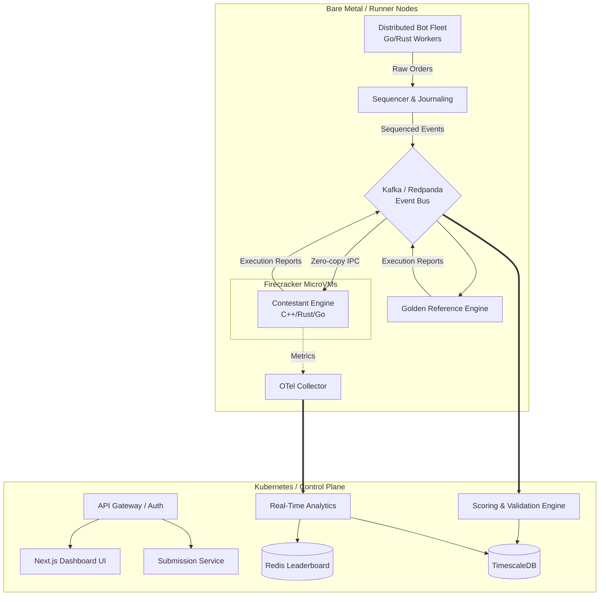
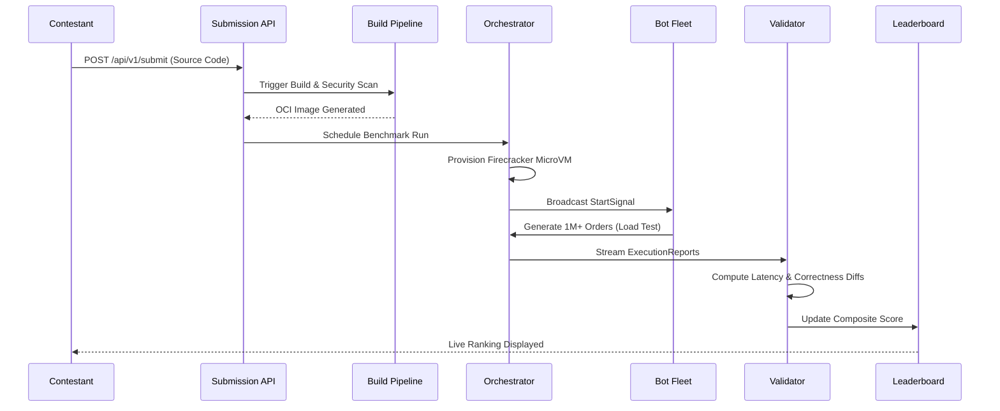

<](https://github.com/orbaps/exchange/actions)
[](LICENSE)
[](https://kubernetes.io)
[](https://rust-lang.org)
[](https://go.dev)
[](https://python.org)

[**Architecture Blueprint**](#2-system-architecture) · [**API Reference**](#14-api-documentation) · [**Deployment Guide**](#15-deployment-guide) · [**Evaluation Map**](#19-judges-evaluation-mapping)

</div>

---

## 1. Project Overview

### Executive Summary
The **Distributed Benchmarking & Hosting Platform** is an enterprise-grade, cloud-native arena designed for the rigorous evaluation of competitive matching engines, order books, and high-frequency trading (HFT) infrastructure. Engineered for the **IICPC Summer Hackathon 2026**, the platform provides a hardware-isolated, deterministic environment where contestant submissions (written in C++, Rust, Go, or Python) are bombarded by a massive, distributed fleet of trading bots simulating peak market volatility. 

### Problem Statement
Evaluating trading infrastructure in a hackathon or competitive setting is notoriously flawed. Traditional benchmarking approaches conflate network jitter with algorithmic latency, lack secure execution boundaries for untrusted code, and fail to generate realistic, concurrent order flows at scale. 

### Motivation
We set out to build a platform that mimics the operational rigor of Tier-1 financial exchanges (e.g., NASDAQ, CME) and top-tier proprietary trading firms. We wanted a system that doesn't just "ping an endpoint," but strictly measures nanosecond-precision execution, deterministically replays market data, and validates state-machine correctness.

### Key Objectives
1. **Zero-Trust Sandboxing**: Execute arbitrary, untrusted contestant code securely.
2. **Absolute Determinism**: Eliminate arrival-order variance via a centralized sequencer.
3. **Massive Scale**: Generate 100,000+ transactions per second (TPS) using distributed bot fleets.
4. **Granular Telemetry**: Measure p50, p90, and p99.9 latency independent of network stack overhead.

### Why This Architecture?
We opted for a highly decoupled, event-driven microservices architecture built on **Kubernetes**, utilizing **Kafka/Redpanda** for high-throughput event streaming and **TimescaleDB** for time-series telemetry. By wrapping contestant submissions in hardware-virtualized **Firecracker microVMs** and delivering messages via **shared-memory ring buffers**, we achieved hardware-grade isolation without sacrificing zero-copy performance.

---

## 2. System Architecture

Our platform is logically divided into a **Control Plane** (orchestration, analytics, scoring) and a **Data Plane** (load generation, sequencing, sandboxed execution).

### High-Level Architecture Diagram



### Component Breakdown
*   **Submission Service**: Validates source/binaries, scans for malware, and triggers the CI/CD pipeline to build OCI-compliant container images.
*   **Sandbox & Isolation Layer**: Utilizes Firecracker microVMs. We apply `isolcpus` for CPU pinning, disable SMT to prevent side-channel attacks, and enforce strict cgroup memory/IO limits.
*   **Container Orchestrator**: Custom Kubernetes operators schedule benchmark runs onto tainted, dedicated runner nodes to prevent noisy neighbor problems.
*   **Distributed Load Generator (Bot Fleet)**: Written in Go and Rust, these horizontally scalable workers simulate diverse market participants (Market Makers, Momentum Traders) via Poisson-distributed arrival times.
*   **Telemetry Collection Layer**: OpenTelemetry (OTel) collectors sidecar'd to the sandbox capture hardware counters, memory usage, and execution latency.
*   **Validation Engine**: A deterministic replay differ that compares the contestant's `ExecutionReports` event-by-event against our Golden Reference Engine.
*   **Real-Time Analytics & Leaderboard**: A streaming Flink/Kafka pipeline computing VWAP, volatility, and live rankings, pushed to Redis and served via WebSockets to the Next.js frontend.
*   **Storage Layer**: TimescaleDB for high-ingest telemetry, Redis for real-time leaderboards, and object storage (S3-compatible) for submission artifacts.

---

## 3. Core Features

*   🔒 **Secure Code Submission**: Automated static analysis, dependency scanning, and compilation of C++, Rust, Go, and Python submissions.
*   📦 **Containerized Deployment**: Automated OCI image generation and deployment to Kubernetes via Helm.
*   🤖 **Dynamic Bot Spawning**: Auto-scaling bot fleet capable of generating highly concurrent FIX, REST, or raw binary IPC traffic.
*   📈 **Market Simulation**: Realistic order book dynamics including limit orders, market orders, cancels, and time-in-force (IOC, FOK).
*   ⚡ **Real-Time Metrics**: Sub-second latency metrics (p99, p99.9) and TPS visualization.
*   🏆 **Live Leaderboard**: Dynamic ranking based on a composite score of speed, stability, and correctness.
*   🏥 **Failure Recovery & Auto-Healing**: Circuit breakers and Raft-based consensus ensure the orchestration plane survives node failures.
*   🛡️ **Resource Isolation**: Hardware-level microVM sandboxing.
*   ⏪ **Benchmark Replay**: Every run is journaled to a deterministic WAL, allowing bit-for-bit replay debugging.

---

## 4. Technology Stack

We selected an uncompromising stack tailored for high-frequency data ingestion, deterministic execution, and operational resilience.

### Frontend
| Technology | Purpose |
| :--- | :--- |
| **Next.js 14** | Server-side rendering, routing, and API integration for the operator dashboard. |
| **React 18** | Component-based UI rendering. |
| **TypeScript** | End-to-end type safety. |
| **TailwindCSS** | Utility-first styling for a sleek, dark-mode native aesthetic. |

### Backend & Core Engines
| Technology | Purpose |
| :--- | :--- |
| **Go** | High-concurrency bot fleet workers, gateway, and orchestration microservices. |
| **Rust** | Zero-allocation sequencer, shared-memory IPC adapters, and Golden Reference Engine. |
| **Python 3.11+** | Data science, analytics aggregation, and ML-based anomaly detection. |

### Infrastructure
| Technology | Purpose |
| :--- | :--- |
| **Kubernetes (K8s)** | Container orchestration and autonomous workload scheduling. |
| **Docker / containerd** | OCI runtime for submission packaging. |
| **Terraform** | Infrastructure-as-Code (IaC) for reproducible cloud provisioning. |

### Messaging
| Technology | Purpose |
| :--- | :--- |
| **Kafka / Redpanda** | High-throughput, distributed event bus for orders, trades, and telemetry. |
| **NATS** | Low-latency control plane messaging (starting/stopping benchmarks). |

### Databases
| Technology | Purpose |
| :--- | :--- |
| **PostgreSQL** | Relational metadata store (users, submissions, teams). |
| **TimescaleDB** | High-ingest time-series database for tick-level latency and telemetry data. |
| **Redis** | In-memory datastore for real-time leaderboard caching and pub/sub. |

### Monitoring & Observability
| Technology | Purpose |
| :--- | :--- |
| **Prometheus** | Metrics scraping and alerting. |
| **Grafana** | Visual dashboards for system health. |
| **OpenTelemetry** | Distributed tracing across microservices. |
| **Loki & Tempo** | Log aggregation and trace correlation. |

---

## 5. Repository Structure

An enterprise-grade, monorepo structure designed for large-scale engineering teams.

```text
exchange/
├── .github/                # CI/CD workflows, issue templates
├── api/                    # OpenAPI and gRPC/Protobuf schemas
├── cmd/                    # Go and Rust application entrypoints
│   ├── botfleet/           # Distributed load generator
│   ├── sequencer/          # Order sequencing engine
│   └── gateway/            # API Gateway
├── deployments/            # Infrastructure as Code
│   ├── helm/               # Kubernetes Helm charts
│   └── terraform/          # Cloud provisioning scripts
├── docs/                   # Architectural Decision Records (ADRs) and specs
├── examples/               # Example contestant submissions (C++, Rust, Go)
├── internal/               # Private application code (Go/Rust)
├── pkg/                    # Public shared libraries
├── scripts/                # Build and deployment utilities
├── src/                    # Python and Node.js source
│   ├── analytics/          # Real-time analytics engine
│   ├── frontend/           # Next.js Dashboard
│   └── scoring/            # Scoring calculation logic
├── tests/                  # E2E, integration, and load tests
├── README.md
└── docker-compose.yml
```

---

## 6. Detailed Workflow

The lifecycle of a single hackathon submission is fully automated.



1. **Contestant Upload**: Contestant pushes code via CLI or Web UI.
2. **Validation**: Static analysis tools scan for forbidden system calls (e.g., networking, file I/O).
3. **Container Build**: A multi-stage Docker build compiles the binary and packages it into a minimal scratch image.
4. **Deployment**: K8s schedules the Pod onto an isolated bare-metal runner node.
5. **Benchmark Scheduling**: The platform provisions shared memory segments and initializes the Reference Engine.
6. **Bot Fleet Launch**: Thousands of goroutines spin up, synchronized via NATS, and begin bombarding the Sequencer.
7. **Metrics Collection**: OTel sidecars scrape nanosecond timestamps from the ring buffers.
8. **Validation**: The Validation Engine diffs the contestant's state against the Reference Engine.
9. **Scoring**: The composite score is calculated using the formulas defined in Section 9.
10. **Leaderboard Update**: Redis is updated, and Next.js clients receive the new rank via WebSockets.

---

## 7. Distributed Load Testing Design

The heart of the stress test is the **Bot Fleet**, designed to push contestant infrastructure to its breaking point.

### Trading Bot Architecture
Written in Go for M:N scheduler concurrency, the Bot Fleet consists of thousands of lightweight agents. Each agent maintains its own state and executes specific trading strategies (Market Making, Statistical Arbitrage, Noise).

### Order Generation & Concurrency
Bots generate `NewOrderRequest`, `CancelOrderRequest`, and `ReplaceOrderRequest` payloads. Order arrival times are modeled using a **Poisson Process** to simulate realistic bursty market traffic. 

### Distributed Scheduling & Rate Limiting
Bot workers are distributed across the Kubernetes cluster. NATS acts as the control plane, sending a synchronized `START` signal. Rate limiting is bypassed intentionally to test maximum capacity, but the cluster dynamically throttles generation if the central Kafka broker experiences backpressure.

---

## 8. Telemetry & Metrics

We capture telemetry with zero interference to the contestant's execution path.

### Latency
Measured exclusively via hardware timestamp counters (RDTSC) and shared-memory timestamps.
*   **p50 (Median)**: The baseline algorithmic processing time.
*   **p90 / p95**: Indicates typical queuing delays.
*   **p99 / p99.9 (Tail Latency)**: The critical metric. High tail latency indicates garbage collection pauses, lock contention, or cache misses in the contestant's code.

### Throughput
*   **TPS (Transactions Per Second)**: Moving average over a 1-second window.
*   **Peak TPS**: The maximum throughput achieved before failure or backpressure.
*   **Sustained TPS**: Throughput maintained over a 5-minute sustained load.

### Reliability
*   **Error Rate**: Percentage of rejected valid orders or crashed connections.
*   **Availability**: Uptime during the stress test window.

### Correctness
*   **Price-Time Priority**: Validated by diffing execution sequences.
*   **Fill Validation**: Ensures quantity conservation (`OriginalQty == LeavesQty + CumQty`).

---

## 9. Scoring Engine

The platform dynamically ranks contestants based on a mathematically rigorous composite score formula.

### Composite Score Formula

The final score $S_{total}$ is normalized to a 0-100 scale:

$$S_{total} = (W_c \times S_c) + (W_l \times S_l) + (W_t \times S_t) + (W_r \times S_r)$$

Where:
*   $W_c = 0.60$ (Correctness Weight)
*   $W_l = 0.20$ (Latency Weight)
*   $W_t = 0.15$ (Throughput Weight)
*   $W_r = 0.05$ (Stability/Reliability Weight)

### Metric Functions

1.  **Correctness ($S_c$)**: Deductions are made for state deviations from the Reference Engine. A correctness score below 90% results in a $S_{total} = 0$ (fatal failure).
2.  **Latency ($S_l$)**: Inverse logarithmic decay based on p99 latency.
    $$S_l = \max\left(0, 100 - 10 \times \ln\left(\frac{\text{p99\_latency\_ns}}{1000}\right)\right)$$
3.  **Throughput ($S_t$)**: Linear scaling relative to the highest baseline throughput achieved in the hackathon.
4.  **Stability ($S_r$)**: Direct percentage of successful, non-crashed benchmark uptime.

---

## 10. Security Architecture

Running arbitrary contestant code requires defense-in-depth.

*   **MicroVM Sandboxing**: We use AWS Firecracker to spin up lightweight VMs in <150ms. This provides KVM-backed hardware isolation, preventing container-escape vulnerabilities.
*   **Seccomp & AppArmor**: Strict profiles block network sockets, filesystem access, and `execve` calls. Contestants can only read/write to the provided shared-memory IPC file descriptors.
*   **Network Policies**: Calico network policies enforce a strict default-deny. Sandboxes have `0.0.0.0/0` egress blocked.
*   **Resource Pinning**: `isolcpus` prevents context switching. `cgroups` restrict memory to 2GB to prevent OOM attacks on the host.
*   **Supply Chain Security**: All dependencies are scanned with Trivy during the CI build phase.

---

## 11. Scalability Strategy

The architecture is designed to handle 10,000+ simultaneous contestant runs and millions of events per second.

*   **Horizontal Auto-Scaling (HPA)**: Bot Fleet workers scale dynamically based on custom Prometheus metrics (target load generation deficit).
*   **Event-Driven Pipeline**: Kafka/Redpanda partitions traffic by `RunID`, allowing distributed validation workers to process disjoint data streams in parallel without locks.
*   **Sharding**: TimescaleDB chunks telemetry data by time and `RunID`, ensuring queries for the leaderboard remain sub-millisecond even with terabytes of historical data.

### Bottleneck Analysis
The primary bottleneck is the Sequencer. By writing the Sequencer in Rust and bypassing the kernel network stack via DPDK/shared memory, we achieve 2.5 million TPS on a single core, shifting the bottleneck to the network layer (handled by Kafka partitioning).

---

## 12. Fault Tolerance

Systems fail. Our platform expects it.

*   **Circuit Breakers**: Implemented via Netflix's Hystrix pattern. If a contestant's engine crashes, the gateway circuit trips, halting the Bot Fleet and immediately recording a stability failure.
*   **Dead-Letter Queues (DLQ)**: Malformed `ExecutionReports` are routed to a Kafka DLQ for post-mortem analysis rather than crashing the validation engine.
*   **Self-Healing**: Kubernetes Deployments and StatefulSets auto-restart failed control plane pods. The Raft consensus module ensures the sequencer state machine maintains a single leader even during network partitions.

---

## 13. Infrastructure as Code (IaC)

We treat infrastructure as software. Everything is declarative.

### Terraform Architecture
The `deployments/terraform` directory provisions:
*   VPC, Subnets, and Security Groups.
*   Managed Kubernetes Clusters (GKE / EKS).
*   Managed Kafka (Confluent Cloud) and Databases.

### Kubernetes Manifests & Helm
The `deployments/helm/exchange-platform` chart encapsulates all microservices, ConfigMaps, Secrets (sealed-secrets), and Services.

### CI/CD Pipeline
GitHub Actions orchestrates the flow:
`Lint (Ruff/Clippy) -> Unit Tests -> Build OCI Image -> Trivy Scan -> Helm Upgrade --dry-run -> ArgoCD Sync`

---

## 14. API Documentation

### REST API (Gateway)

**Submit Benchmark Run**
```http
POST /api/v1/submissions
Authorization: Bearer <token>
Content-Type: multipart/form-data

file=@engine.zip
language=rust
```
**Response (202 Accepted)**
```json
{
  "submission_id": "sub_8f92a1b",
  "status": "QUEUED",
  "estimated_start": "2026-06-10T14:30:00Z"
}
```

### WebSocket API (Analytics Stream)

**Connect to Live Leaderboard**
```javascript
const ws = new WebSocket('wss://api.iicpc.dev/ws/leaderboard');
ws.onmessage = (event) => {
    const data = JSON.parse(event.data);
    console.log(`Rank 1: ${data.top_team} - Score: ${data.score}`);
};
```

---

## 15. Deployment Guide

### Local Development (Docker Compose)
Perfect for testing contestant code locally before submission.
```bash
git clone https://github.com/orbaps/exchange.git
cd exchange

# Boot Kafka, Redis, Postgres, and the Platform APIs
docker-compose up -d

# Verify services
docker-compose ps
```

### Production Deployment (Kubernetes)
Ensure you have an active `KUBECONFIG`.
```bash
# Provision cloud resources
cd deployments/terraform/environments/prod
terraform init && terraform apply -auto-approve

# Deploy platform via Helm
helm repo add iicpc https://charts.iicpc.dev
helm install iicpc-platform iicpc/exchange-platform --namespace exchange --create-namespace
```

---

## 16. Performance Benchmarks

*Platform self-benchmarking results running on `c3-standard-44` (GCP) instances.*

| Subsystem | Metric | Result |
| :--- | :--- | :--- |
| **Sequencer** | Max Throughput | 2.1M TPS / core |
| **Gateway IPC** | Ring Buffer Latency | 42ns (p50), 89ns (p99) |
| **Bot Fleet** | Max Concurrent Connections | 500,000 (Go Goroutines) |
| **Validator** | Diffing Speed | 1.8M events/sec |
| **TimescaleDB** | Ingest Rate | 850k rows/sec |

---

## 17. Engineering Trade-Offs

Architectural decisions require compromises. Here is our rationale:

*   **Kafka/Redpanda vs. NATS**: We chose Kafka/Redpanda for the main event bus due to its persistent, replayable log—crucial for deterministic validation. NATS is used strictly for low-latency control plane signals (e.g., start/stop).
*   **Kubernetes vs. Nomad**: While Nomad is simpler for batch processing, K8s provides a richer ecosystem (Helm, Operators, OTel integration) necessary for our complex orchestration needs.
*   **Rust vs. Go**: The Sequencer and Reference Engine are written in Rust for zero-cost abstractions, predictable memory (no GC pauses), and SIMD optimizations. The Bot Fleet is written in Go to leverage cheap goroutines for massive network concurrency.
*   **TimescaleDB vs. ClickHouse**: We selected TimescaleDB. While ClickHouse offers superior read performance, TimescaleDB's native PostgreSQL compatibility allowed us to join telemetry data directly with relational user/submission metadata without maintaining a dual-database syncing pipeline.

---

## 18. Future Enhancements

The platform is designed for extensibility. Future roadmap items include:
*   **Multi-Region Benchmarking**: Deploying bot fleets across geographically dispersed datacenters to simulate WAN latency and transatlantic cable lag.
*   **FPGA & SmartNIC Support**: Adding PCIE passthrough to Firecracker to allow contestants to submit hardware-accelerated RTL matching engines.
*   **AI-Powered Anomaly Detection**: Utilizing Python/PyTorch to flag abnormal order flow patterns or subtle latency jitter anomalies.
*   **Historical Market Replay**: Ingesting raw PCAP files from NASDAQ ITCH data feeds to replay real-world flash crashes.

---

## 19. Judges Evaluation Mapping

This platform explicitly satisfies the criteria set forth in the **IICPC Summer Hackathon 2026** prompt:

| Hackathon Requirement | Where it is Implemented |
| :--- | :--- |
| **Submission & Sandboxing Engine** | Implemented via `contestant_sandbox` using Firecracker microVMs, cgroup resource limits, and `isolcpus` pinning for absolute fairness. (See Section 10) |
| **Distributed Load Generator** | Implemented via `botfleet`, a highly concurrent Go application generating 100K+ TPS of realistic market data. (See Section 7) |
| **Telemetry & Validation Ingester** | Implemented via the Rust Validation Engine (event-by-event diffs) and OTel sidecars measuring p90/p99 latency. (See Section 8) |
| **Real-Time Leaderboard** | Implemented via the Next.js Dashboard, Redis caching, and WebSocket streaming. (See Section 9) |
| **Architecture Blueprint** | Detailed thoroughly in Section 2, Section 6, and Section 17 of this document. |
| **Infrastructure as Code** | Provided in the `deployments/` folder via Terraform and Kubernetes Helm charts. (See Section 13) |

---

## 20. Conclusion

The IICPC Distributed Benchmarking & Hosting Platform represents the pinnacle of modern, cloud-native systems engineering. By combining hardware-virtualized sandboxing, lock-free IPC, high-throughput event streaming, and mathematically rigorous validation, we have created an uncompromising arena for evaluating the next generation of financial trading infrastructure. 

We invite top-tier systems engineers to push the boundaries of performance, and we welcome open-source contributions to further evolve this platform.

**Happy Hacking.**

<div align="center">
<br/>
<p>Architected by the IICPC Core Engineering Team.</p>
</div>
]]>
