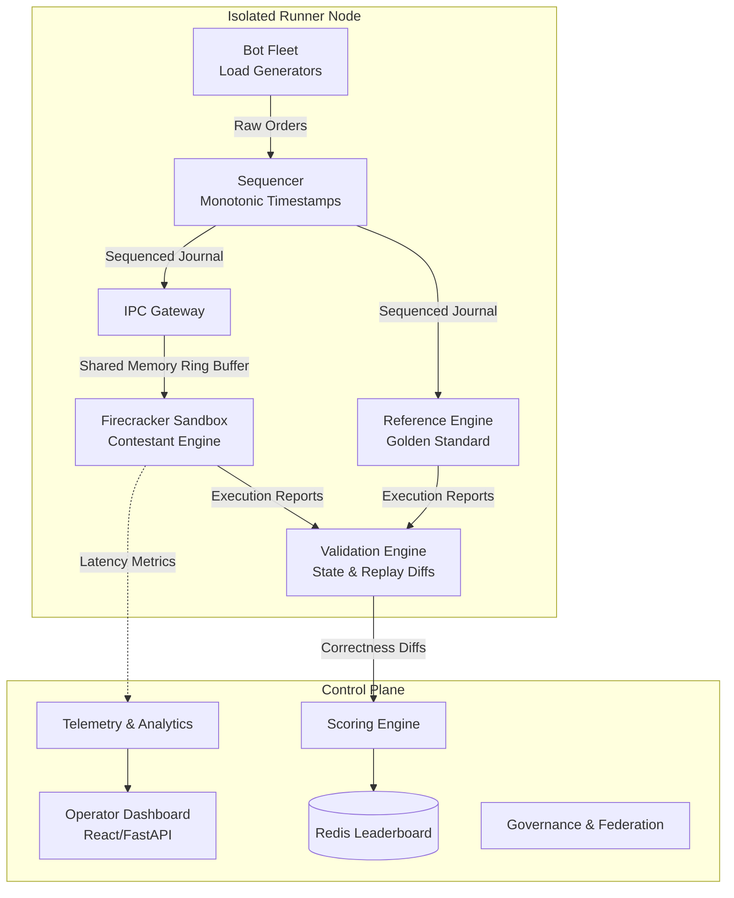

<](https://github.com/orbaps/exchange/actions)
[](https://python.org)
[](https://kubernetes.io)
[](LICENSE)

[**Documentation**](docs/) · [**API Reference**](generated/api_docs.md) · [**SDK Guide**](#-contestant-sdk) · [**Report a Bug**](https://github.com/orbaps/exchange/issues)

</div>

---

## 🚀 The Vision

Traditional benchmarking of trading systems is flawed. It conflates network jitter with engine latency, lacks proper isolation, and fails to simulate realistic, deterministic market conditions.

**IICPC Exchange** changes the game. It is a production-grade, distributed benchmarking arena built for evaluating competitive matching engine implementations. We provide the infrastructure—Firecracker microVMs, a deterministic sequencer, a seeded bot fleet, and event-by-event correctness validation. **You provide the matching logic.**

It’s like competitive programming, but for building high-frequency trading (HFT) exchanges.

---

## ✨ Engineering Marvels

<table width="100%">
<tr>
<td width="50%">

### 🔒 Hardware-Grade Isolation
Untrusted contestant code runs in **Firecracker microVMs** with CPU pinning (`isolcpus`), SMT disabled, and strict cgroup memory/IO limits. No noisy neighbors.

</td>
<td width="50%">

### ⏱️ Absolute Determinism
A centralized **Sequencer** assigns globally monotonic sequence numbers and nanosecond logical timestamps to all incoming orders. Arrival-order variance is mathematically eliminated.

</td>
</tr>
<tr>
<td width="50%">

### ⚡ Zero-Jitter IPC
Network latency is decoupled from engine latency. The platform delivers sequenced events via **wait-free SPSC shared-memory ring buffers**. We measure your engine's true nanosecond performance.

</td>
<td width="50%">

### 🛡️ Event-Level Validation
Every submission is diffed event-by-event against a golden **Reference Engine**. We enforce state machine compliance, quantity conservation, and strict price-time priority.

</td>
</tr>
<tr>
<td width="50%">

### 🤖 Distributed Bot Fleet
Generates **100,000+ orders/second** using seeded PRNGs. Bots execute configurable strategies (Market Making, Momentum, Noise) mapped to realistic market regimes.

</td>
<td width="50%">

### 🌍 Federated Consensus
Multi-node execution powered by a **Raft-inspired consensus protocol**, complete with write-ahead logging (WAL), snapshotting, and autonomous self-healing.

</td>
</tr>
</table>

---

## 🏗️ System Architecture

The platform is divided into a **Control Plane** for orchestration and a **Runner Cluster** for CPU-pinned execution.



---

## 🧩 Core Components

The IICPC monorepo contains over 30 micro-packages. Here are the pillars of the platform:

<details>
<summary><b>1️⃣ Execution & Sequencing (`gateway/`, `sequencer/`, `execution/`)</b></summary>
<br/>
The heart of the runtime. The Sequencer writes an append-only journal of all events. The Gateway reads this journal and bridges it to contestant engines via SBE (Simple Binary Encoding) over shared memory.
</details>

<details>
<summary><b>2️⃣ Validation & Scoring (`validation_engine/`, `scoring/`, `reference_engine/`)</b></summary>
<br/>
The Reference Engine supports FIFO, Pro-Rata, and Threshold Pro-Rata matching. The Validation Engine computes deep replay diffs. The Scoring Engine generates a composite score based on correctness (70%), latency (15%), throughput (10%), and reliability (5%).
</details>

<details>
<summary><b>3️⃣ Distributed Federation (`federation/`, `orchestration/`, `governance/`)</b></summary>
<br/>
Raft-based leader election, distributed scheduling, and an autonomous cluster brain that detects anomalies, predicts capacity limits, and self-heals network partitions.
</details>

<details>
<summary><b>4️⃣ Competition Platform (`tournament/`, `campaign/`, `leaderboard/`)</b></summary>
<br/>
Full bracket tournament management (single/double elimination, Swiss), benchmark campaigns, and a Redis-backed real-time leaderboard with time-series history.
</details>

<details>
<summary><b>5️⃣ Infrastructure & UI (`hosting/`, `dashboard/`, `frontend/`, `iac/`)</b></summary>
<br/>
A React 19 SPA dashboard streaming live WebSocket analytics. Complete Kubernetes Helm charts and Terraform provisioning for GKE/OKE.
</details>

---

## 💻 Contestant SDK

Contestants do not write network servers. They write pure, high-performance algorithms. 

Your submission is compiled as a shared library (`.so` / `.dll`) exposing a strict C ABI. The platform loads it dynamically and communicates via shared memory.

```c
// 1. Initialize your data structures
EngineHandle* engine_init(const InstrumentDefinition* instruments, uint32_t count);

// 2. Process incoming sequenced events (New, Cancel, Replace)
// 3. Write ExecutionReports to the outbound ring buffer
void engine_on_message(
    EngineHandle* handle, 
    const JournalRecord* record, 
    RingBufferWriter* out
);

// 4. Clean up
void engine_destroy(EngineHandle* handle);
```

### Supported Exchange Features
- **Order Types:** Limit, Market, Stop-Limit
- **Time In Force:** GFD (Good for Day), GTC, IOC, FOK
- **Self-Match Prevention:** Cancel Newest, Cancel Oldest, Cancel Both
- **Sessions:** Pre-Open (Auction Uncrossing), Continuous, Halted

> 💡 **Want to see it in action?** Check out the [`examples/`](examples/) directory for a complete template.

---

## 🚦 Getting Started

### Prerequisites
- Python 3.11+
- Docker 24+ & Docker Compose
- (Optional) `kubectl` and `kind` for local Kubernetes deployment

### Option A: The Fast Track (Docker Compose)
Launch the entire platform, including Postgres, Redis, Kafka (KRaft), and the React Dashboard.

```bash
git clone https://github.com/orbaps/exchange.git
cd exchange

# Install Python dependencies and generate gRPC stubs
pip install -r requirements.txt
make proto

# Boot the cluster
docker-compose up -d
```
Access the operator dashboard at **[http://localhost:8080](http://localhost:8080)**.

### Option B: Local Kubernetes (KIND)
Spin up a multi-node Kubernetes cluster locally using KIND.

```bash
# Windows
.\scripts\kind-cluster.ps1

# Linux / macOS
./scripts/kind-cluster.sh
```
*See [KIND_CLUSTER.md](KIND_CLUSTER.md) for ingress and port mappings.*

---

## 🧪 Testing & Validation

The platform tests itself rigorously before it tests contestants.

```bash
make test           # Run 24+ test suites with coverage
make lint           # Ruff linting
make fmt            # Auto-formatting
make mypy           # Static type analysis
```

Our CI/CD pipeline enforces 100% determinism across the platform, running security audits (`pip-audit`, CodeQL) and matrix builds for all 7 microservices.

---

## 🤝 Contributing

We are building the ultimate open-source benchmarking standard for trading systems. PRs are welcome!

1. Fork the repo
2. Create your feature branch (`git checkout -b feature/amazing-engine`)
3. Commit your changes (`git commit -m 'feat: add amazing engine'`)
4. Push to the branch (`git push origin feature/amazing-engine`)
5. Open a Pull Request

---

<div align="center">
<br/>
<p>Distributed under the <strong>MIT License</strong>. See <code>LICENSE</code> for more information.</p>

<p><b>Built for the obsessed. Engineered for fairness.</b> 🏛️</p>

</div>
]]>
