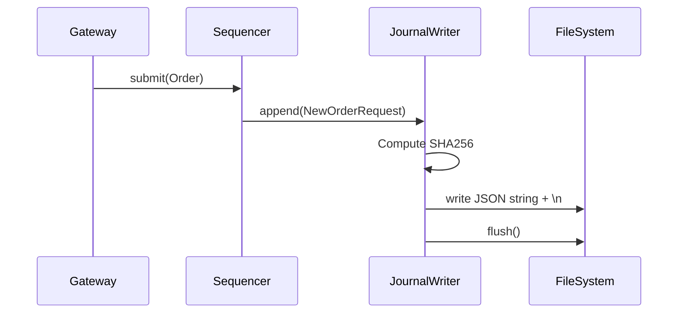

# Journal System

The Journal System acts as the absolute source of truth for the exchange. By recording every state-altering request chronologically, the entire state of the engine can be derived purely from this log.

## JSON Lines Serialization

The `JournalWriter` implements a JSON Lines append-only file structure. Each line corresponds to exactly one `JournalRecord`. 

### `JournalRecord` Structure

- `record_id`: Monotonically increasing ID for the physical file.
- `sequence_id`: The global sequence number assigned by the upstream dispatch tier.
- `timestamp_ns`: The nanosecond wall-clock timestamp of the event.
- `event_type`: The class name of the event (e.g., `NewOrderRequest`).
- `instrument`: The target symbol.
- `payload`: A JSON dictionary containing the exact fields required to reconstruct the dataclass.
- `checksum`: A SHA256 checksum of the sorted `payload` dictionary to detect corruption.

## Flow Diagram

## Resilience
Because the journal relies on append-only JSON lines, incomplete writes (e.g. power failure during a write) will simply result in a malformed JSON string at the end of the file. The `JournalReader` can safely discard this partial line, and `verify_checksum()` guarantees that no corrupted payload is ever replayed.
