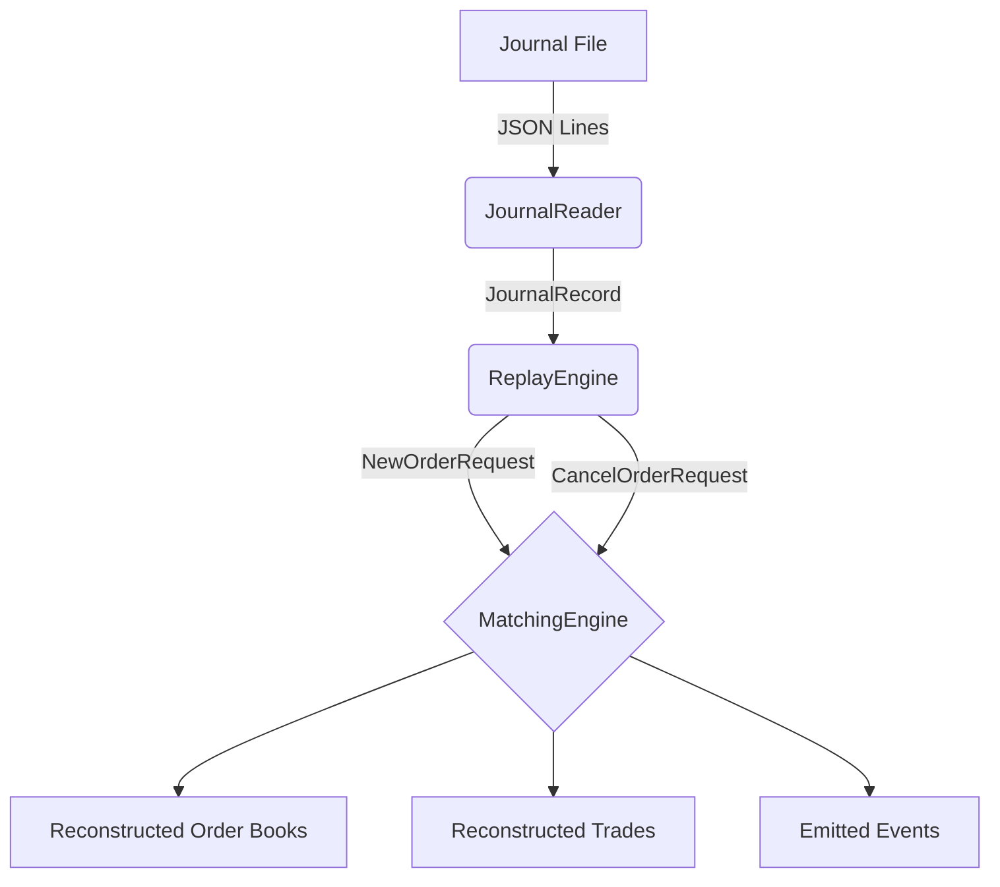

# Replay Engine Architecture

The Replay Engine is a deterministic state reconstructor. Its primary purpose is to take an ordered list of `JournalRecord` objects and inject them into a virgin `MatchingEngine` to perfectly reconstruct the state of the exchange at any given point in time.

## Architecture

## Replay Flow

1. **Initialization:** The `ReplayEngine` is instantiated with a clean `MatchingEngine` containing the appropriate `InstrumentDefinition` instances but completely empty order books.
2. **Decoding:** The engine iterates over `JournalRecord` items. It inspects the `event_type` and deserializes the JSON `payload` back into strongly-typed domain objects (e.g., `NewOrderRequest`, `SessionTransition`).
3. **Execution:** The domain objects are passed sequentially into `MatchingEngine.on_message()`.
4. **Result Extraction:** After all records are processed, the `ReplayEngine` extracts the active limit orders, the chronological trade history, the full order books, and the list of all `ExecutionReport` events emitted during the replay.

## Determinism

The exchange core guarantees bit-for-bit determinism. When replaying a journal, the resulting state—down to the exact iteration order of `dict.values()`—will be perfectly identical across any OS or Python environment, provided Python 3.7+ is used (where dictionaries preserve insertion order).
