# Distributed Trading Benchmarking Platform — Specification v2.0

**Version**: 2.0  
**Status**: Draft  
**Date**: 2026-06-04  
**Authors**: Architecture Review Board  
**Supersedes**: Master Blueprint v1, Research Paper v1  

---

## Table of Contents

1. [Executive Summary](#1-executive-summary)
2. [Problem Statement](#2-problem-statement)
3. [System Goals & Non-Functional Requirements](#3-system-goals--non-functional-requirements)
4. [High-Level Architecture](#4-high-level-architecture)
5. [Component Model](#5-component-model)
6. [Domain Model](#6-domain-model)
7. [Event Model](#7-event-model)
8. [Matching Rules](#8-matching-rules)
9. [State Machines](#9-state-machines)
10. [Replay & Determinism Design](#10-replay--determinism-design)
11. [Sequencer Design](#11-sequencer-design)
12. [IPC & SDK Interface](#12-ipc--sdk-interface)
13. [Validation Engine](#13-validation-engine)
14. [Edge-Case Matrix](#14-edge-case-matrix)
15. [Scenario DSL](#15-scenario-dsl)
16. [Telemetry Pipeline](#16-telemetry-pipeline)
17. [Scoring Model](#17-scoring-model)
18. [Security & Sandboxing](#18-security--sandboxing)
19. [Sequence Diagrams](#19-sequence-diagrams)
20. [Class Diagrams](#20-class-diagrams)
21. [Component Diagrams](#21-component-diagrams)
22. [Directory Structure](#22-directory-structure)
23. [Failure Modes](#23-failure-modes)
24. [Testing Strategy](#24-testing-strategy)
25. [Phased Roadmap](#25-phased-roadmap)
26. [Glossary](#26-glossary)

---

## 1. Executive Summary

This specification defines a production-grade, distributed benchmarking arena for trading infrastructure. Contestants submit matching engine implementations. The platform builds, sandboxes, and stress-tests each submission using a deterministic bot fleet, then validates correctness against a reference engine and publishes live scores to a leaderboard.

### Key V2 Changes from V1

| Area | V1 Problem | V2 Resolution |
|:---|:---|:---|
| Determinism | Non-deterministic network arrival | Centralized Sequencer with global monotonic sequence numbers |
| Latency isolation | Kubernetes/Istio jitter conflated with engine perf | Shared-memory IPC ring buffer between gateway and engine |
| Engine-vs-network conflation | Contestants build entire servers | Platform provides gateway; contestants implement matching core via SDK |
| Exchange states | Continuous trading only | Full session lifecycle: PreOpen → Continuous → Halt → Close |
| Matching algorithms | FIFO assumed | Configurable: FIFO, Pro-Rata, Threshold Pro-Rata |
| Order types | Limit only implied | Limit, Market, Stop-Limit, with IOC/FOK/GFD/GTC time-in-force |
| Self-Match Prevention | Missing | SMP modes: CancelNewest, CancelOldest, CancelBoth |
| Validation | Rule-based spot checks | Full event-level replay diff against reference engine |
| Sandbox isolation | Container-based | MicroVM (Firecracker/Kata) with CPU pinning |

---

## 2. Problem Statement

Modern trading systems are extremely difficult to benchmark fairly. A benchmarking platform must:

- Guarantee every contestant receives **identical compute, memory, and network resources**
- **Prevent malicious code execution** via hardware-grade isolation
- Generate **deterministic, reproducible exchange traffic** from thousands of concurrent bots
- **Accurately measure matching engine latency** without conflating network stack performance
- **Validate correctness** of price-time priority, fill quantities, and state transitions
- **Stream live rankings** to a real-time leaderboard

Traditional benchmarking fails because it is not distributed, lacks sandbox isolation, cannot coordinate large-scale deterministic load generation, and cannot validate matching correctness through replay.

---

## 3. System Goals & Non-Functional Requirements

### Performance Goals

| Metric | Target |
|:---|:---|
| Sustained TPS (bot fleet) | 100,000+ orders/second aggregate |
| Engine latency measurement granularity | Nanosecond (via sequencer timestamps) |
| Telemetry ingestion lag | < 2 seconds end-to-end |
| Leaderboard update frequency | ≤ 1 second |

### Reliability Goals

| Requirement | Target |
|:---|:---|
| Run reproducibility | Bit-identical replays given same journal |
| Sandbox escape probability | MicroVM-grade isolation (Firecracker) |
| Fault tolerance | Auto-restart within run budget; circuit breakers |
| Data durability | Journal persisted before engine delivery |

### Fairness Goals

- CPU pinning via `isolcpus` + `taskset`; SMT disabled on engine cores
- Identical container resource limits (CPU, RAM, I/O bandwidth)
- Deterministic input sequencing eliminates arrival-order variance
- Hardware fingerprint published per run for auditability

---

## 4. High-Level Architecture

### Macro Data Flow

```
Contestant Upload
  → Build Pipeline (compile, scan, image)
  → Sandbox Deployment (Firecracker microVM)
  → Scenario Scheduler assigns seeds + rate plan
  → Bot Fleet generates OrderRequests
  → Sequencer assigns SeqNo + LogicalTimestamp, journals to disk
  → Sequenced stream delivered via IPC ring buffer to:
      ├── Contestant Engine (produces ExecutionReports)
      └── Reference Engine  (produces ExecutionReports)
  → Validation Engine diffs both output streams
  → Telemetry Pipeline (OTel → Kafka → Flink → ClickHouse)
  → Scoring Engine computes composite rank
  → Leaderboard streams live to UI
```

### Cluster Topology

| Cluster | Purpose | Isolation |
|:---|:---|:---|
| Control Plane | Submission API, Orchestrator, Scoring, Leaderboard, Kafka, Postgres, ClickHouse | Service mesh; no contestant traffic |
| Runner Cluster | Sequencer, Gateway, Contestant microVM, Reference Engine, Bot Workers | Bare-metal nodes; CPU-pinned; no internet egress |

---

## 5. Component Model

### Component Diagram (Textual)

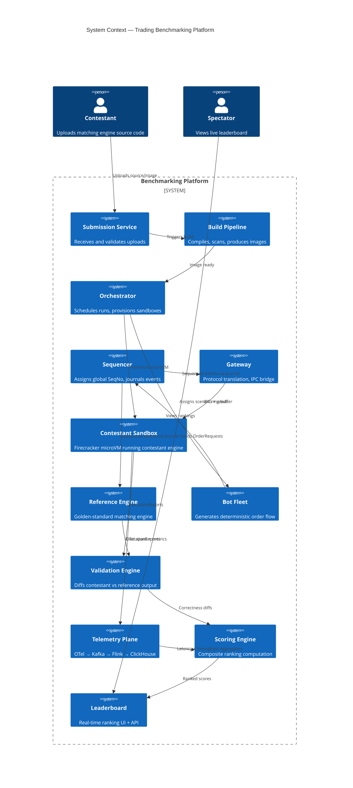

### Subsystem Responsibility Matrix

| Subsystem | Inputs | Outputs | Stateful? |
|:---|:---|:---|:---|
| Submission Service | Artifacts, manifest | Submission record, build job | Yes (Postgres) |
| Build Pipeline | Source/image refs | Docker image, SBOM, scan report | No |
| Orchestrator | Run queue, resources | Run allocations, sandbox configs | Yes (Postgres) |
| Sequencer | Raw OrderRequests from bots | Sequenced + timestamped journal stream | Yes (journal file) |
| Gateway | Sequenced journal stream | IPC messages to contestant engine | No (stateless bridge) |
| Contestant Sandbox | IPC OrderRequests | IPC ExecutionReports | Yes (order book state) |
| Reference Engine | Sequenced journal stream | ExecutionReports | Yes (order book state) |
| Bot Fleet | Scenario DSL, seeds, rate plan | Raw OrderRequests | No |
| Validation Engine | Two ExecutionReport streams | Diffs, correctness score | No |
| Telemetry Plane | OTel spans, Kafka events | Aggregated metrics in ClickHouse | Yes (ClickHouse) |
| Scoring Engine | Correctness diffs, latency metrics | Composite scores | Yes (Postgres) |
| Leaderboard | Scores, metadata | REST API, WebSocket stream | Yes (Redis cache) |

---

## 6. Domain Model

### 6.1 Enumerations

```protobuf
syntax = "proto3";
package exchange.domain;

// ── Order Classification ──

enum Side {
    SIDE_UNSPECIFIED = 0;
    BUY             = 1;
    SELL            = 2;
}

enum OrderType {
    ORDER_TYPE_UNSPECIFIED = 0;
    LIMIT                 = 1;
    MARKET                = 2;
    STOP_LIMIT            = 3;
}

enum TimeInForce {
    TIF_UNSPECIFIED = 0;
    GFD            = 1;   // Good for Day — expires at session close
    GTC            = 2;   // Good till Cancel — persists across sessions
    IOC            = 3;   // Immediate or Cancel — fill what you can, cancel rest
    FOK            = 4;   // Fill or Kill — fill entirely or reject entirely
}

// ── Execution Classification ──

enum ExecType {
    EXEC_TYPE_UNSPECIFIED = 0;
    NEW                   = 1;   // Order accepted and booked
    REJECTED              = 2;   // Order rejected (validation failure)
    PARTIALLY_FILLED      = 3;   // Partial match occurred
    FILLED                = 4;   // Fully matched
    CANCELED              = 5;   // Cancel request honored
    EXPIRED               = 6;   // TIF expiry triggered
    REPLACED              = 7;   // Cancel/Replace honored (price or qty change)
    SMP_CANCELED          = 8;   // Canceled by Self-Match Prevention
}

enum RejectReason {
    REJECT_REASON_UNSPECIFIED  = 0;
    INVALID_PRICE              = 1;   // price <= 0 or exceeds tick table
    INVALID_QUANTITY           = 2;   // qty <= 0
    INVALID_SYMBOL             = 3;   // symbol not listed
    INVALID_SIDE               = 4;
    INVALID_ORDER_TYPE         = 5;
    DUPLICATE_CLIENT_ORDER_ID  = 6;
    SESSION_NOT_ACCEPTING      = 7;   // e.g., Closed or Halted state
    FOK_WOULD_NOT_FILL         = 8;
    UNKNOWN_ORDER_ID           = 9;   // cancel/replace for non-existent order
    ORDER_ALREADY_TERMINAL     = 10;  // cancel on filled/canceled order
    SMP_REJECT                 = 11;  // self-match prevention triggered reject
}

// ── Session States ──

enum SessionState {
    SESSION_STATE_UNSPECIFIED = 0;
    CLOSED                    = 1;
    PRE_OPEN                  = 2;   // Orders accepted, no matching
    NO_CANCEL                 = 3;   // Orders accepted, no cancels, no matching
    CONTINUOUS                = 4;   // Continuous matching active
    HALTED                    = 5;   // Circuit breaker; no new orders or matches
    PRE_CLOSE                 = 6;   // Closing auction accumulation
    MAINTENANCE               = 7;   // Book persistence, GTC carry-forward
}

// ── Matching Algorithm ──

enum MatchingAlgorithm {
    MATCHING_ALGORITHM_UNSPECIFIED = 0;
    PRICE_TIME_FIFO                = 1;   // NASDAQ-style strict FIFO
    PRICE_TIME_PRORATA             = 2;   // CME-style proportional allocation
    THRESHOLD_PRORATA              = 3;   // Hybrid: FIFO up to threshold, then pro-rata
}

// ── Self-Match Prevention ──

enum SmpMode {
    SMP_MODE_UNSPECIFIED = 0;
    SMP_CANCEL_NEWEST    = 1;   // Cancel the incoming (aggressing) order
    SMP_CANCEL_OLDEST    = 2;   // Cancel the resting order
    SMP_CANCEL_BOTH      = 3;   // Cancel both orders
    SMP_DISABLED         = 4;   // No SMP enforcement
}
```

### 6.2 Core Messages

```protobuf
// ── Inbound Messages (Bot → Sequencer → Engine) ──

message NewOrderRequest {
    uint64 sequence_no      = 1;   // Assigned by Sequencer
    uint64 timestamp_ns     = 2;   // Logical timestamp from Sequencer
    uint64 order_id         = 3;   // Platform-assigned unique ID
    string client_order_id  = 4;   // Contestant-facing correlation ID
    string symbol           = 5;
    Side   side             = 6;
    OrderType order_type    = 7;
    int64  price            = 8;   // Scaled integer, tick-aligned. 0 for MARKET orders.
    uint64 quantity         = 9;   // Must be > 0
    TimeInForce tif         = 10;
    string party_id         = 11;  // Firm/MPID for SMP
}

message CancelOrderRequest {
    uint64 sequence_no      = 1;
    uint64 timestamp_ns     = 2;
    uint64 order_id         = 3;   // ID of the order to cancel
    string client_order_id  = 4;
    string symbol           = 5;
}

message ReplaceOrderRequest {
    uint64 sequence_no        = 1;
    uint64 timestamp_ns       = 2;
    uint64 original_order_id  = 3;
    uint64 new_order_id       = 4;   // Assigned by Sequencer
    string client_order_id    = 5;
    string symbol             = 6;
    int64  new_price          = 7;   // 0 = keep original price
    uint64 new_quantity       = 8;   // 0 = keep original quantity
}

message SessionTransition {
    uint64       sequence_no    = 1;
    uint64       timestamp_ns   = 2;
    string       symbol         = 3;
    SessionState from_state     = 4;
    SessionState to_state       = 5;
}

// ── Outbound Messages (Engine → Validator / Telemetry) ──

message ExecutionReport {
    uint64     sequence_no       = 1;   // Engine output sequence
    uint64     timestamp_ns      = 2;   // Engine processing timestamp
    uint64     execution_id      = 3;   // Unique fill/event ID
    uint64     order_id          = 4;
    string     client_order_id   = 5;
    string     symbol            = 6;
    Side       side              = 7;
    ExecType   exec_type         = 8;
    int64      last_price        = 9;   // Price of this fill (0 if no fill)
    uint64     last_qty          = 10;  // Quantity of this fill
    uint64     leaves_qty        = 11;  // Remaining open quantity
    uint64     cumulative_qty    = 12;  // Total filled so far
    uint64     original_qty      = 13;  // Original order quantity
    RejectReason reject_reason   = 14;  // Set only when exec_type = REJECTED
    uint64     match_order_id    = 15;  // Counter-party order ID (for fill reports)
}

message BookSnapshot {
    uint64 sequence_no    = 1;
    uint64 timestamp_ns   = 2;
    string symbol         = 3;
    repeated PriceLevel bids = 4;
    repeated PriceLevel asks = 5;
}

message PriceLevel {
    int64  price       = 1;
    uint64 quantity    = 2;   // Aggregate quantity at this level
    uint32 order_count = 3;   // Number of resting orders
}
```

### 6.3 Instrument Definition

```protobuf
message InstrumentDefinition {
    string             symbol              = 1;
    int64              tick_size           = 2;   // Minimum price increment (scaled)
    uint64             lot_size            = 3;   // Minimum quantity increment
    uint64             max_order_qty       = 4;   // Maximum single-order quantity
    int64              price_band_lower    = 5;   // Circuit breaker lower bound
    int64              price_band_upper    = 6;   // Circuit breaker upper bound
    MatchingAlgorithm  matching_algorithm  = 7;
    SmpMode            smp_mode            = 8;
    uint32             prorata_threshold   = 9;   // For THRESHOLD_PRORATA: min qty for pro-rata
}
```

### 6.4 Quantity Invariant

For every order at all times, the following invariant **MUST** hold:

```
original_qty == cumulative_qty + leaves_qty + canceled_qty
```

Where `canceled_qty` is the quantity removed by Cancel, Expire, or SMP events.

---

## 7. Event Model

### 7.1 Journal Record Format

Every event entering or leaving the system is wrapped in a journal envelope:

```protobuf
message JournalRecord {
    uint64 global_sequence_no  = 1;  // Monotonically increasing, gap-free
    uint64 logical_timestamp   = 2;  // Nanosecond-granularity logical clock
    uint64 wall_clock_ns       = 3;  // Real wall clock at sequencer (for telemetry only)
    string run_id              = 4;
    
    oneof payload {
        NewOrderRequest      new_order       = 10;
        CancelOrderRequest   cancel_order    = 11;
        ReplaceOrderRequest  replace_order   = 12;
        SessionTransition    session_change  = 13;
        ExecutionReport      exec_report     = 14;
        BookSnapshot         book_snapshot   = 15;
    }
}
```

### 7.2 Event Ordering Guarantees

| Property | Guarantee |
|:---|:---|
| Global ordering | All events for a single `run_id` share a single monotonic `global_sequence_no` |
| Gap-free | No gaps in sequence; every integer from 1..N is assigned exactly once |
| Journal-before-delivery | Record persisted to journal **before** delivery to any engine |
| Idempotent replay | Replaying journal from sequence 1 produces identical engine state |
| Per-symbol ordering | Within a run, events for a single symbol are totally ordered by `global_sequence_no` |

### 7.3 Event Categories

| Category | Direction | Examples |
|:---|:---|:---|
| **Command** | Inbound (bot → engine) | `NewOrderRequest`, `CancelOrderRequest`, `ReplaceOrderRequest` |
| **Control** | Inbound (orchestrator → engine) | `SessionTransition` |
| **Report** | Outbound (engine → validator) | `ExecutionReport` |
| **Snapshot** | Outbound (engine → validator) | `BookSnapshot` (emitted at configurable intervals) |

### 7.4 Kafka Topic Layout

| Topic | Partitioning | Producers | Consumers |
|:---|:---|:---|:---|
| `run.{run_id}.commands` | Single partition (preserves total order) | Sequencer | Gateway → Engine |
| `run.{run_id}.reports.contestant` | Single partition | Contestant Engine | Validator, Telemetry |
| `run.{run_id}.reports.reference` | Single partition | Reference Engine | Validator |
| `run.{run_id}.snapshots` | By symbol | Both Engines | Validator |
| `telemetry.spans` | By `run_id` | OTel Collector | Flink |
| `telemetry.metrics` | By `run_id` | OTel Collector | Flink |

---

## 8. Matching Rules

### 8.1 Price-Time FIFO (Default — NASDAQ-style)

1. An incoming order is matched against the **best opposite-side price level** first.
2. Within a price level, orders are filled in **strict arrival-time order** (by `global_sequence_no`).
3. A partial fill reduces `leaves_qty` but does **not** change the order's time priority.
4. A `ReplaceOrderRequest` that changes price or increases quantity **loses time priority** (re-queued at back of new level). Decreasing quantity **preserves priority**.

### 8.2 Pro-Rata (CME-style)

1. An incoming order is matched against the best opposite-side price level.
2. Each resting order at that level receives a fill proportional to its `leaves_qty / total_level_qty`.
3. Fractional lots are rounded down; remainder is allocated to the earliest-arriving order (time sub-priority).
4. Minimum allocation: 1 lot. Orders whose pro-rata share rounds to 0 receive nothing in that pass.

### 8.3 Threshold Pro-Rata (Hybrid)

1. If the incoming quantity is ≤ `prorata_threshold` (from `InstrumentDefinition`), use FIFO.
2. If the incoming quantity exceeds the threshold, allocate the threshold amount via FIFO to the time-priority leader, then distribute the remainder via Pro-Rata across all remaining resting orders at that level.

### 8.4 Order Type Semantics

| Order Type | Matching Behavior |
|:---|:---|
| **LIMIT** | Matches at limit price or better. Unmatched remainder rests on book. |
| **MARKET** | Matches at best available prices until filled. No resting. If book empty or insufficient liquidity, unfilled remainder is **canceled** (not booked). |
| **STOP_LIMIT** | Inactive until stop price is triggered by a trade at or through the stop price. Once triggered, converts to a standard LIMIT order and enters the book. |

### 8.5 Time-in-Force Semantics

| TIF | Behavior |
|:---|:---|
| **GFD** | Expires at `SessionTransition` to `CLOSED` or `MAINTENANCE`. |
| **GTC** | Persists across sessions. Re-entered during `PreOpen → Continuous` transition with original time priority. |
| **IOC** | After initial matching pass, any `leaves_qty > 0` is immediately canceled. |
| **FOK** | Before matching: check if total available opposite liquidity ≥ order qty. If not, reject entirely. If yes, execute atomically. |

### 8.6 Self-Match Prevention (SMP)

When a new order would match against a resting order with the **same `party_id`**:

| SMP Mode | Action |
|:---|:---|
| `SMP_CANCEL_NEWEST` | Cancel the incoming (aggressing) order. Resting order remains. |
| `SMP_CANCEL_OLDEST` | Cancel the resting order. Incoming order continues matching. |
| `SMP_CANCEL_BOTH` | Cancel both orders. |
| `SMP_DISABLED` | Allow the self-match to execute. |

SMP-canceled orders emit an `ExecutionReport` with `exec_type = SMP_CANCELED`.

### 8.7 Auction Uncrossing (PreOpen → Continuous Transition)

1. During `PRE_OPEN`, orders are accepted and booked but **no matching occurs**.
2. On `SessionTransition(PRE_OPEN → CONTINUOUS)`:
   a. Compute the **equilibrium price**: the price that maximizes matched volume. Ties broken by: price closest to last trade, then highest price.
   b. Execute all matchable orders at the single equilibrium price.
   c. Unmatched orders remain on the book.
   d. Switch to continuous matching.

---

## 9. State Machines

### 9.1 Order Lifecycle State Machine

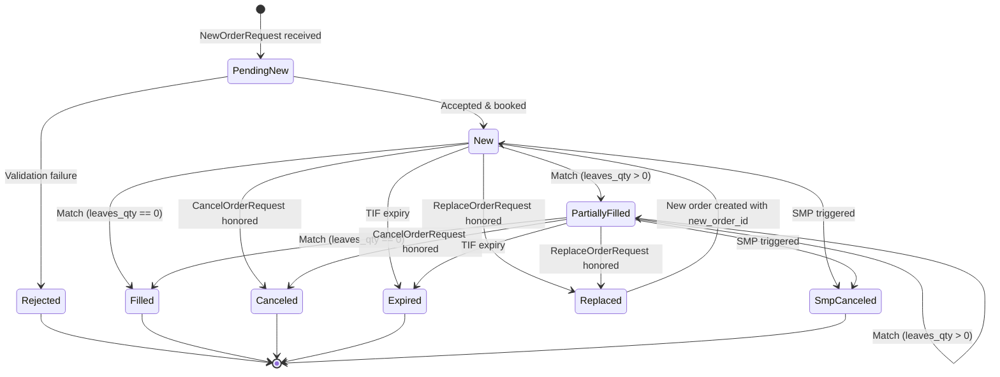

**Terminal states**: `Rejected`, `Filled`, `Canceled`, `Expired`, `SmpCanceled`.

**Invariant at terminal state**: `leaves_qty == 0` AND `original_qty == cumulative_qty + canceled_qty`.

### 9.2 Exchange Session State Machine

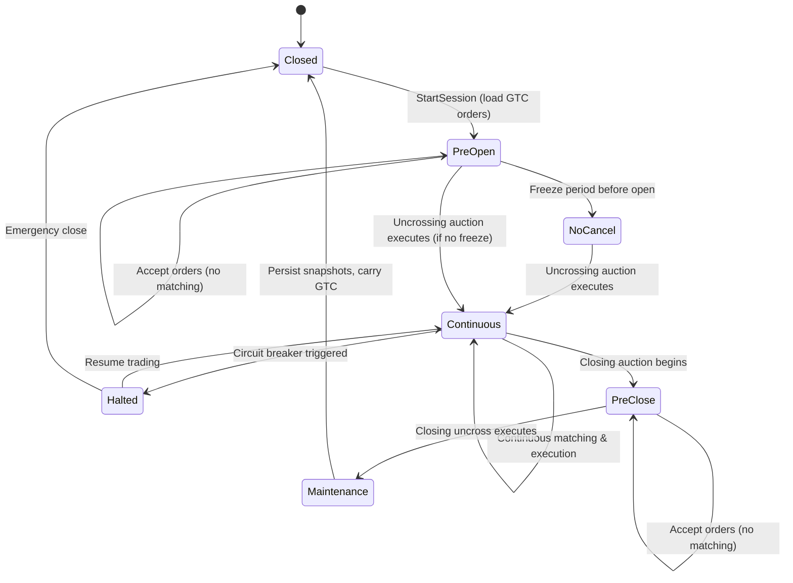

**Allowed operations per state:**

| State | New Orders | Cancels | Replaces | Matching |
|:---|:---|:---|:---|:---|
| Closed | ✗ | ✗ | ✗ | ✗ |
| PreOpen | ✓ | ✓ | ✓ | ✗ |
| NoCancel | ✓ | ✗ | ✗ | ✗ |
| Continuous | ✓ | ✓ | ✓ | ✓ |
| Halted | ✗ | ✓ | ✗ | ✗ |
| PreClose | ✓ | ✓ | ✓ | ✗ |
| Maintenance | ✗ | ✗ | ✗ | ✗ |

### 9.3 Sandbox Run State Machine

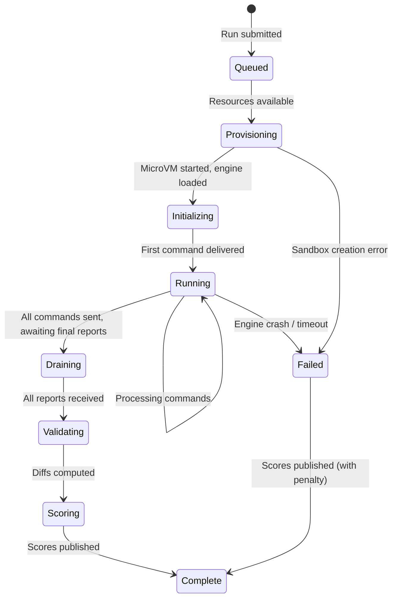

---

## 10. Replay & Determinism Design

### 10.1 Determinism Contract

The matching engine is a **pure state machine**:

```
State(n+1) = f(State(n), JournalRecord(n+1))
```

Given an identical journal (sequence of `JournalRecord` messages), any conforming engine implementation **must** produce the **identical** sequence of `ExecutionReport` messages, in the same order, with the same field values.

### 10.2 Sources of Non-Determinism (Eliminated in V2)

| Source | V1 Risk | V2 Mitigation |
|:---|:---|:---|
| Network arrival order | Different order each run | Sequencer assigns total order before delivery |
| Wall clock timestamps | Varies per run | Logical timestamps from Sequencer; wall clock for telemetry only |
| Thread scheduling | OS-dependent | Single-threaded engine core; CPU-pinned |
| Random number generators | Unseeded | Scenario DSL mandates explicit seeds; bot fleet uses seeded PRNG |
| Floating-point rounding | Platform-dependent | All prices/quantities are scaled 64-bit integers; no floating point |
| HashMap iteration order | Language-dependent | Order book uses sorted tree structures (not hash maps) |

### 10.3 Replay Procedure

```
1. Load journal file for run_id R.
2. Initialize empty engine state.
3. For each JournalRecord in sequence:
   a. If Command: deliver to engine, collect ExecutionReports.
   b. If Control (SessionTransition): deliver to engine.
4. Compare collected ExecutionReports against stored reference output.
5. Assert: reports are identical, field-by-field, in order.
```

### 10.4 Snapshot Checkpointing

At configurable intervals (e.g., every 10,000 events), the engine emits a `BookSnapshot`. This allows:
- **Partial replay**: Start replay from snapshot N instead of journal position 0.
- **Divergence localization**: If full replay diffs at position P, binary search between snapshots to locate the first divergent event.

---

## 11. Sequencer Design

### 11.1 Responsibilities

1. Accept raw `OrderRequest` messages from the bot fleet over a low-latency transport (UDP multicast or TCP).
2. Assign a `global_sequence_no` (monotonically increasing, gap-free) and a `logical_timestamp` (nanosecond-granularity monotonic clock).
3. **Persist** the `JournalRecord` to an append-only journal file on local NVMe storage.
4. **Broadcast** the sequenced record to all consumers (Contestant Engine, Reference Engine) via shared-memory IPC or Kafka.

### 11.2 Performance Constraints

| Metric | Requirement |
|:---|:---|
| Sequencing throughput | ≥ 500,000 messages/second sustained |
| Sequencing latency (ingest to journal write) | < 5 µs p99 |
| Journal write durability | fsync or O_DIRECT; no data loss on process crash |
| Single-writer guarantee | One sequencer instance per run; no coordination needed |

### 11.3 Journal File Format

```
┌────────────────────────────────┐
│ Journal Header (64 bytes)      │
│   magic: "JRNL"               │
│   version: 2                   │
│   run_id: UUID                 │
│   created_at: timestamp        │
├────────────────────────────────┤
│ Record 1: [length][protobuf]   │
│ Record 2: [length][protobuf]   │
│ ...                            │
│ Record N: [length][protobuf]   │
└────────────────────────────────┘
```

Each record: `4-byte little-endian length` + `protobuf-encoded JournalRecord`.

---

## 12. IPC & SDK Interface

### 12.1 Architecture

The platform provides a **Gateway** process that:
1. Reads sequenced `JournalRecords` from the Sequencer.
2. Translates them into a flat binary format (SBE or raw C structs).
3. Writes them into a **shared-memory ring buffer**.
4. The contestant engine reads from the ring buffer, processes, and writes `ExecutionReport` messages to a separate outbound ring buffer.

### 12.2 Ring Buffer Layout

```
┌──────────────────────────────────────────┐
│  Control Header (cache-line aligned)     │
│    write_cursor: uint64  (Gateway)       │
│    read_cursor:  uint64  (Engine)        │
│    capacity:     uint64                  │
│    message_size: uint32                  │
├──────────────────────────────────────────┤
│  Slot 0: [header][payload ...]           │
│  Slot 1: [header][payload ...]           │
│  ...                                     │
│  Slot N-1: [header][payload ...]         │
└──────────────────────────────────────────┘
```

- **Wait-free single-producer, single-consumer** (SPSC) ring buffer.
- Cache-line padding between `write_cursor` and `read_cursor` to prevent false sharing.
- Power-of-2 capacity for modulo via bitmask.

### 12.3 SDK Interface (C ABI)

```c
// Contestant implements these functions:

typedef struct {
    void* engine_state;
} EngineHandle;

// Called once at startup with instrument definitions
EngineHandle* engine_init(
    const InstrumentDefinition* instruments,
    uint32_t instrument_count
);

// Called for each inbound message (NewOrder, Cancel, Replace, SessionTransition)
// Must write ExecutionReports to the outbound ring buffer
void engine_on_message(
    EngineHandle* handle,
    const JournalRecord* record,
    RingBufferWriter* outbound
);

// Called at shutdown for cleanup
void engine_destroy(EngineHandle* handle);
```

Contestants compile their engine as a **shared library** (`.so` / `.dll`) that exports these symbols. The Gateway loads it via `dlopen` / `LoadLibrary`.

---

## 13. Validation Engine

### 13.1 Validation Layers

| Layer | What it checks | Severity |
|:---|:---|:---|
| **Schema validation** | All required fields present, enums in range | Fatal (run invalid) |
| **Sequence validation** | Output sequence numbers are monotonic and gap-free | Fatal |
| **Order state invariant** | `original_qty == cumulative_qty + leaves_qty + canceled_qty` at every report | Fatal |
| **State machine compliance** | No illegal state transitions (e.g., `Filled → PartiallyFilled`) | Fatal |
| **Price-time priority** | Earlier orders at same price fill before later orders | Critical |
| **Quantity conservation** | Sum of all fill quantities == min(buy_total, sell_total) at each price | Critical |
| **Replay diff** | Field-by-field comparison of contestant vs. reference `ExecutionReport` streams | Critical |
| **Book snapshot diff** | Periodic `BookSnapshot` comparison | Warning |

### 13.2 Diff Report Format

```json
{
  "run_id": "abc-123",
  "total_events": 150000,
  "matched_events": 149987,
  "divergent_events": 13,
  "first_divergence_seq": 42103,
  "divergences": [
    {
      "sequence_no": 42103,
      "field": "last_price",
      "expected": 10050,
      "actual": 10051,
      "order_id": 88412
    }
  ]
}
```

---

## 14. Edge-Case Matrix

| # | Edge Case | Expected Engine Behavior | Validation Rule |
|:---|:---|:---|:---|
| EC-01 | **Zero quantity order** | Reject with `INVALID_QUANTITY` | `exec_type == REJECTED`, `reject_reason == INVALID_QUANTITY` |
| EC-02 | **Negative price** | Reject with `INVALID_PRICE` | `exec_type == REJECTED`, `reject_reason == INVALID_PRICE` |
| EC-03 | **Price not tick-aligned** | Reject with `INVALID_PRICE` | `price % tick_size != 0` → reject |
| EC-04 | **Quantity not lot-aligned** | Reject with `INVALID_QUANTITY` | `qty % lot_size != 0` → reject |
| EC-05 | **Quantity exceeds max** | Reject with `INVALID_QUANTITY` | `qty > max_order_qty` → reject |
| EC-06 | **FOK insufficient liquidity** | Reject entire order | No partial fills; `exec_type == REJECTED`, `reject_reason == FOK_WOULD_NOT_FILL` |
| EC-07 | **IOC partial fill** | Fill what is available, cancel remainder | Final report: `exec_type == CANCELED`, `leaves_qty == 0` |
| EC-08 | **Market order on empty book** | Cancel unfilled portion | `exec_type == CANCELED` for remainder |
| EC-09 | **Cancel non-existent order** | Reject cancel | `exec_type == REJECTED`, `reject_reason == UNKNOWN_ORDER_ID` |
| EC-10 | **Cancel already-filled order** | Reject cancel | `exec_type == REJECTED`, `reject_reason == ORDER_ALREADY_TERMINAL` |
| EC-11 | **Duplicate client_order_id** | Reject with `DUPLICATE_CLIENT_ORDER_ID` | Uniqueness enforced per session |
| EC-12 | **Order during CLOSED session** | Reject with `SESSION_NOT_ACCEPTING` | No orders booked |
| EC-13 | **Order during HALTED session** | Reject with `SESSION_NOT_ACCEPTING` | Only cancels allowed |
| EC-14 | **Cancel during NO_CANCEL phase** | Reject cancel | `exec_type == REJECTED` |
| EC-15 | **Self-match (same party_id)** | Apply SMP mode from instrument definition | See §8.6 |
| EC-16 | **Replace with price change** | Cancel original, create new order at back of new price level | Original: `CANCELED`; New: `NEW` with new time priority |
| EC-17 | **Replace with qty decrease** | Modify in-place, preserve time priority | `REPLACED` report; `leaves_qty` reduced |
| EC-18 | **Replace with qty increase** | Cancel original, create new at back of same level | Loses time priority |
| EC-19 | **GTC order across session restart** | Reload with original time priority during PreOpen | Order present in book after `PreOpen → Continuous` |
| EC-20 | **GFD order at session close** | Expire all GFD orders | `exec_type == EXPIRED` for each |
| EC-21 | **Stop-limit trigger** | Trade at/through stop price activates the order as LIMIT | `exec_type == NEW` after trigger; then normal matching |
| EC-22 | **Crossed book during PreOpen** | No execution until uncrossing auction | Orders rest; matching deferred |
| EC-23 | **Auction uncrossing with ties** | Maximize volume; break ties by proximity to last trade | Equilibrium price computed per §8.7 |
| EC-24 | **Price band breach** | Reject order or trigger circuit breaker halt | Configurable per instrument |
| EC-25 | **Burst of 10,000 cancels** | All must be processed; no crash or lost state | All acknowledged; book consistent |
| EC-26 | **Engine crash mid-run** | Run marked as failed; partial results scored with penalty | Sandbox watchdog detects; telemetry captured up to crash |
| EC-27 | **Exactly one lot remaining vs. two IOC orders** | First IOC fills the lot; second IOC gets 0 fill then cancel | Strict time priority |
| EC-28 | **Replace on order in PartiallyFilled state** | Must account for already-filled quantity | `new_quantity` must be ≥ `cumulative_qty`; else reject |

---

## 15. Scenario DSL

### 15.1 Scenario Definition

```yaml
scenario:
  name: "flash_crash_recovery"
  version: 2
  seed: 0xDEADBEEF
  duration_seconds: 300
  symbols:
    - name: "BTC-USD"
      tick_size: 100          # $1.00 in cents
      lot_size: 1
      max_order_qty: 10000
      matching_algorithm: PRICE_TIME_FIFO
      smp_mode: SMP_CANCEL_NEWEST
      price_band_lower: 9000000   # $90,000
      price_band_upper: 11000000  # $110,000

  phases:
    - type: session_transition
      at_seconds: 0
      transition: CLOSED -> PRE_OPEN

    - type: session_transition
      at_seconds: 10
      transition: PRE_OPEN -> CONTINUOUS

    - type: traffic
      from_seconds: 10
      to_seconds: 120
      profile: normal_market
      rate: 5000              # orders/sec
      cancel_ratio: 0.3
      market_order_ratio: 0.05
      price_model: random_walk
      volatility: 0.001

    - type: traffic
      from_seconds: 120
      to_seconds: 130
      profile: flash_crash
      rate: 50000
      cancel_ratio: 0.8
      market_order_ratio: 0.4
      price_model: directional_drop
      magnitude: -0.05

    - type: traffic
      from_seconds: 130
      to_seconds: 300
      profile: recovery
      rate: 10000
      cancel_ratio: 0.2
      market_order_ratio: 0.1
      price_model: mean_reversion

    - type: session_transition
      at_seconds: 300
      transition: CONTINUOUS -> MAINTENANCE

    - type: session_transition
      at_seconds: 300
      transition: MAINTENANCE -> CLOSED
```

### 15.2 Built-in Profiles

| Profile | Description |
|:---|:---|
| `normal_market` | Balanced buy/sell flow with random-walk pricing |
| `flash_crash` | Extreme sell pressure, high cancel rate, large market orders |
| `recovery` | Mean-reverting price with moderate buy pressure |
| `cancel_storm` | 95%+ cancel rate to stress cancel processing |
| `fat_finger` | Occasional extreme-price orders to test price bands |
| `smp_stress` | Many orders from same `party_id` to test SMP logic |

---

## 16. Telemetry Pipeline

### 16.1 Pipeline Architecture

```
Contestant Engine
  → OTel SDK (spans + metrics)
  → OTel Collector (sidecar)
  → Kafka (telemetry.spans, telemetry.metrics)
  → Apache Flink (windowed aggregation)
  → ClickHouse (raw events + materialized aggregates)
  → Grafana / Leaderboard API
```

### 16.2 Metrics Collected

| Metric | Source | Computation |
|:---|:---|:---|
| **Engine latency** (p50/p90/p99/p999) | Sequencer timestamp vs. ExecutionReport timestamp | Per-message delta; windowed percentiles in Flink |
| **Throughput** (TPS) | Count of ExecutionReports | Tumbling 1-second windows |
| **Error rate** | Rejected / Total | Sliding 10-second window |
| **Book depth** | BookSnapshot | Average bid/ask depth per snapshot |
| **Correctness score** | Validation diffs | `matched_events / total_events` |

### 16.3 Latency Measurement

```
Latency = ExecReport.timestamp_ns - JournalRecord.logical_timestamp
```

This measures **pure engine processing time**, excluding:
- Network transit (eliminated by IPC)
- Sequencer overhead (measured separately)
- OS scheduling jitter (minimized by CPU pinning)

---

## 17. Scoring Model

### 17.1 Composite Score Formula

```
Score = w_c * Correctness
      + w_l * LatencyScore
      + w_t * ThroughputScore
      + w_s * StabilityScore
      + w_r * ResilienceScore
```

### 17.2 Component Definitions

| Component | Formula | Weight (default) |
|:---|:---|:---|
| **Correctness** | `matched_events / total_events`. If < 0.95, entire score = 0 (gate). | 0.30 |
| **LatencyScore** | `1 - normalize(p99_latency, min=0, max=reference_p99)` | 0.30 |
| **ThroughputScore** | `normalize(sustained_tps, min=0, max=max_observed_tps)` | 0.20 |
| **StabilityScore** | `1 - (stddev(latency) / mean(latency))` (coefficient of variation) | 0.10 |
| **ResilienceScore** | Fraction of chaos events (halt/resume, crash recovery) handled without data loss | 0.10 |

### 17.3 Correctness Gate

If `Correctness < 0.95`, the contestant receives a **score of 0** regardless of other metrics. This prevents fast-but-wrong engines from ranking.

---

## 18. Security & Sandboxing

### 18.1 Threat Model

| Threat | Attack Vector | Mitigation |
|:---|:---|:---|
| Host escape | Kernel exploit from container | MicroVM (Firecracker) — hardware virtualization boundary |
| Resource abuse | Infinite loop, memory bomb | cgroup limits (CPU, RAM, I/O); watchdog timeout |
| Network exfiltration | Outbound HTTP to leak data | Default-deny egress; no internet access |
| Side-channel | Timing attacks on co-located processes | Dedicated physical cores; no SMT; no shared caches |
| Supply-chain | Malicious dependencies in submission | SBOM scan (Syft); vulnerability scan (Trivy); no network at runtime |

### 18.2 Isolation Stack

```
Layer 1: Kubernetes namespace isolation
Layer 2: Firecracker microVM (hardware virtualization)
Layer 3: seccomp-bpf syscall filter (allowlist-only)
Layer 4: Read-only root filesystem
Layer 5: Dropped Linux capabilities (CAP_NET_RAW, etc.)
Layer 6: CPU pinning + cgroup quotas
```

### 18.3 Resource Quotas (Per Run)

| Resource | Limit |
|:---|:---|
| CPU | 2 dedicated physical cores (no SMT) |
| RAM | 4 GiB |
| Disk I/O | 100 MB/s read, 50 MB/s write |
| Network | IPC only; no TCP/UDP sockets |
| Run timeout | 600 seconds max |

---

## 19. Sequence Diagrams

### 19.1 Submission & Build Flow

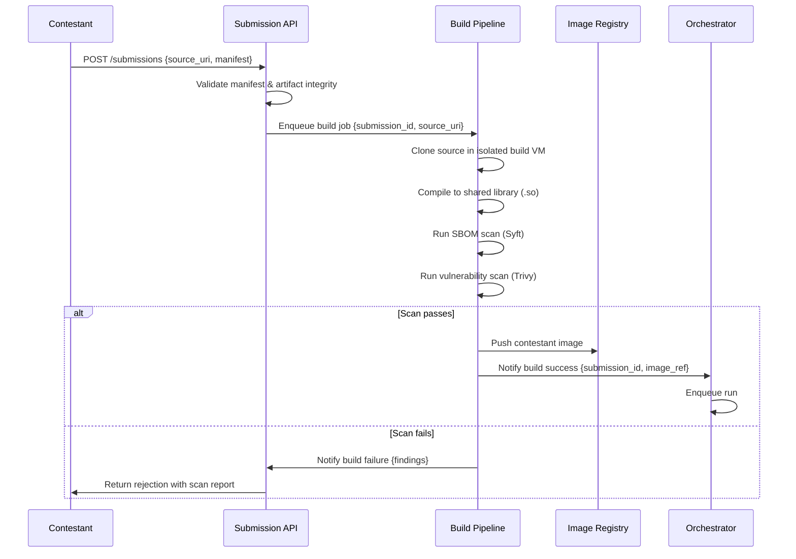

### 19.2 Benchmark Run — Order Processing Flow

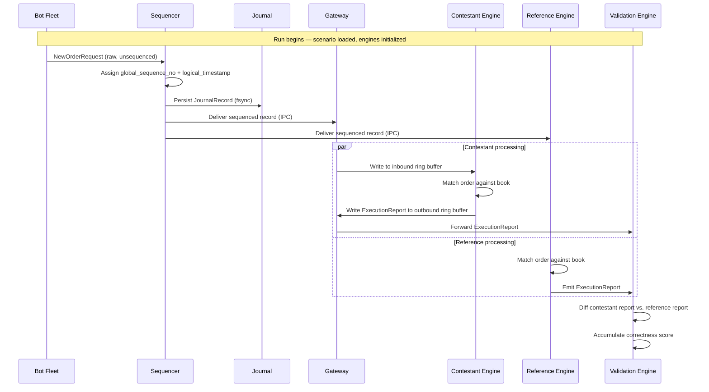

### 19.3 Session Lifecycle Flow

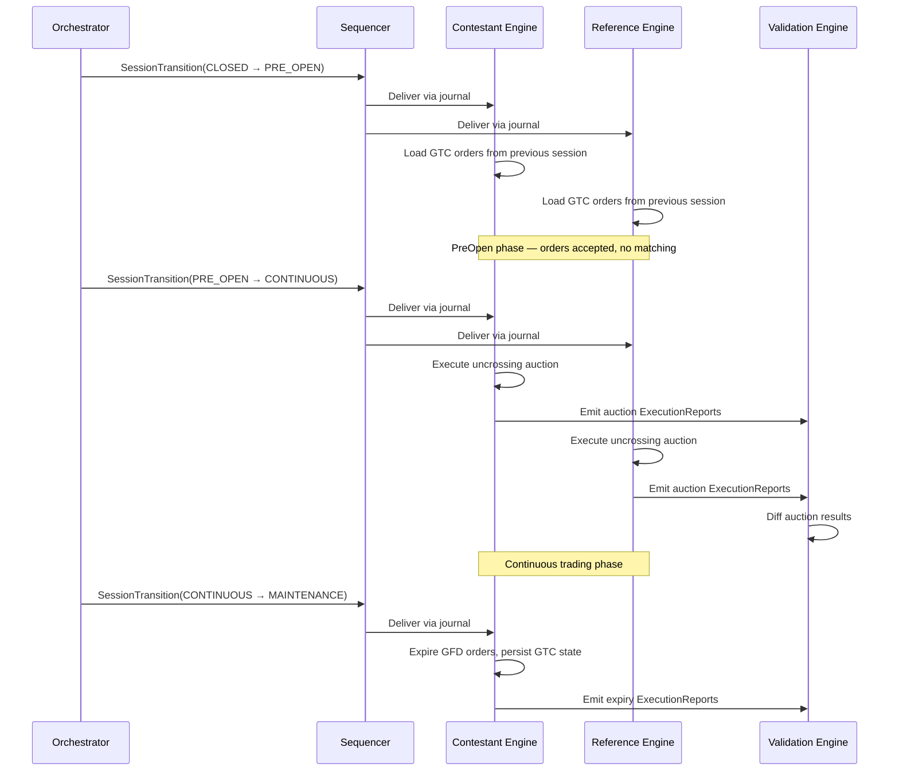

### 19.4 Validation & Scoring Flow

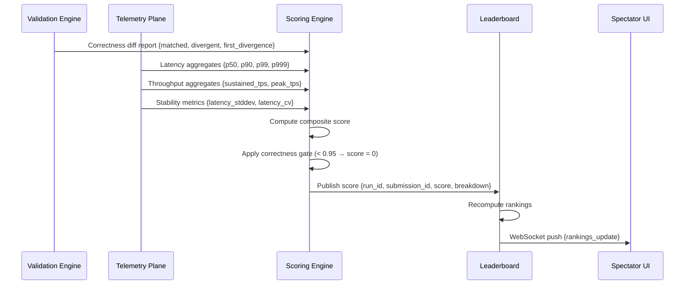

---

## 20. Class Diagrams

### 20.1 Order Book Core

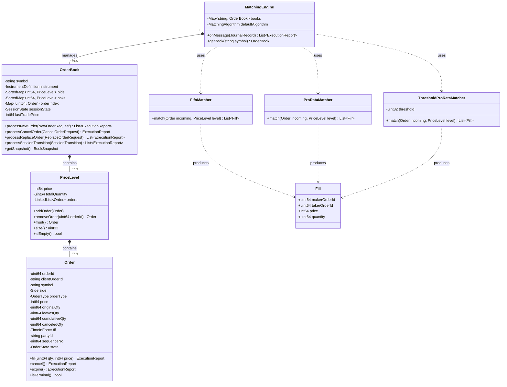

### 20.2 Sequencer & Journal

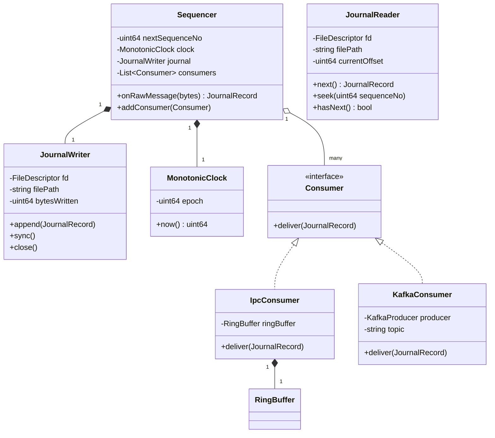

### 20.3 Validation Engine

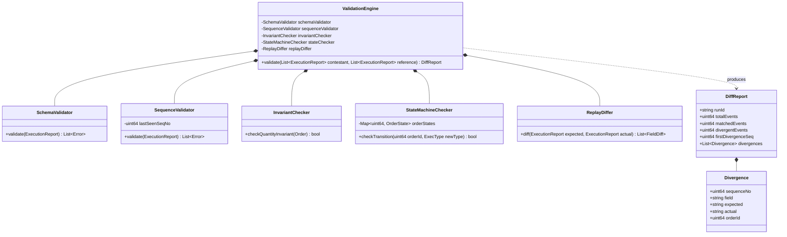

---

## 21. Component Diagrams

### 21.1 Full System Component Diagram

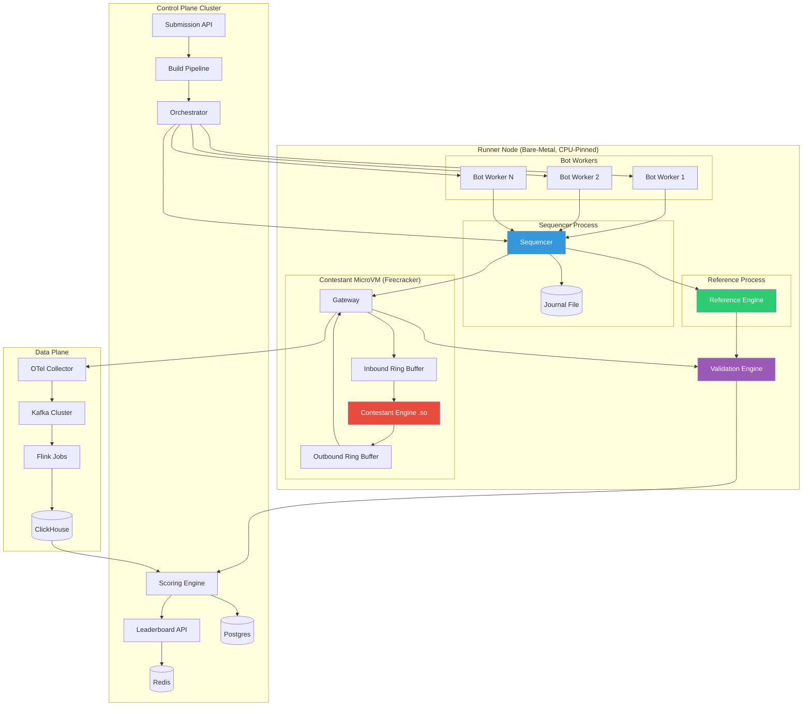

### 21.2 IPC Detail — Gateway ↔ Contestant Engine

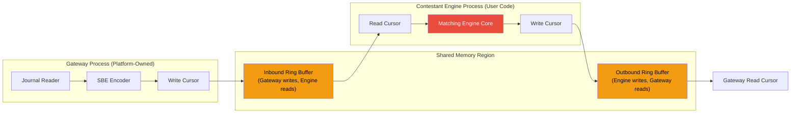

### 21.3 Telemetry Pipeline Detail

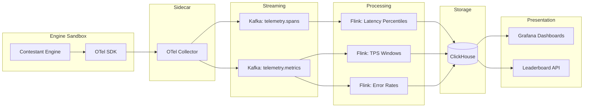

---

## 22. Directory Structure

```
/distributed-trading-platform
│
├── /docs
│   ├── spec_v2.md                    # This specification
│   ├── architecture_review.md        # V1 review findings
│   └── adr/                          # Architecture Decision Records
│       ├── 001-sequencer-design.md
│       ├── 002-ipc-vs-tcp.md
│       └── 003-microvm-isolation.md
│
├── /contracts                         # Shared schema definitions
│   ├── domain.proto                   # Enums, Order, ExecutionReport, etc.
│   ├── events.proto                   # JournalRecord envelope
│   ├── instruments.proto              # InstrumentDefinition
│   ├── control.proto                  # SessionTransition, RunControl
│   └── Makefile                       # Protobuf compilation targets
│
├── /sequencer                         # Global event sequencer & journaler
│   ├── cmd/
│   │   └── sequencer/main.go
│   ├── internal/
│   │   ├── journal/                   # Append-only journal writer/reader
│   │   │   ├── writer.go
│   │   │   ├── reader.go
│   │   │   └── format.go
│   │   ├── clock/                     # Monotonic logical clock
│   │   │   └── clock.go
│   │   └── dispatch/                  # Fan-out to consumers
│   │       └── dispatcher.go
│   ├── go.mod
│   └── Dockerfile
│
├── /sdk                               # Contestant engine SDK
│   ├── /c                             # C ABI header + reference harness
│   │   ├── engine.h                   # engine_init, engine_on_message, engine_destroy
│   │   ├── ringbuffer.h               # SPSC ring buffer primitives
│   │   └── types.h                    # Flat binary message structs
│   ├── /cpp                           # C++ convenience wrappers
│   │   ├── include/
│   │   └── examples/
│   ├── /rust                          # Rust FFI bindings
│   │   ├── src/lib.rs
│   │   └── Cargo.toml
│   └── /go                            # Go CGo bindings
│       └── engine.go
│
├── /gateway                           # Protocol bridge: journal → IPC ring buffer
│   ├── cmd/gateway/main.go
│   ├── internal/
│   │   ├── ipc/                       # Shared memory ring buffer management
│   │   ├── loader/                    # dlopen / .so loading
│   │   └── protocol/                  # SBE encoding/decoding
│   └── Dockerfile
│
├── /reference-engine                  # Golden-standard matching engine
│   ├── src/
│   │   ├── main.cpp
│   │   ├── order_book.cpp
│   │   ├── order_book.h
│   │   ├── matching/
│   │   │   ├── fifo_matcher.cpp
│   │   │   ├── prorata_matcher.cpp
│   │   │   └── matcher.h
│   │   ├── auction/
│   │   │   └── uncrossing.cpp
│   │   └── smp/
│   │       └── self_match.cpp
│   ├── tests/
│   │   ├── test_fifo.cpp
│   │   ├── test_prorata.cpp
│   │   ├── test_auction.cpp
│   │   ├── test_smp.cpp
│   │   ├── test_edge_cases.cpp
│   │   └── test_replay.cpp
│   ├── CMakeLists.txt
│   └── Dockerfile
│
├── /contestant-sandbox                # MicroVM runtime & orchestration
│   ├── cmd/runner/main.go
│   ├── internal/
│   │   ├── firecracker/               # Firecracker VM management
│   │   ├── cgroup/                    # CPU pinning, memory limits
│   │   ├── seccomp/                   # Syscall filter profiles
│   │   └── watchdog/                  # Crash/hang detection
│   └── Dockerfile
│
├── /bot-fleet                         # Distributed load generator
│   ├── /orchestrator
│   │   ├── cmd/main.go
│   │   └── internal/
│   │       ├── scheduler/             # Assigns scenarios, seeds, rate plans
│   │       └── scenario/              # DSL parser
│   ├── /worker
│   │   ├── cmd/main.go
│   │   └── internal/
│   │       ├── generator/             # Order generation from seeded PRNG
│   │       ├── profiles/              # Market behavior models
│   │       └── transport/             # Raw message sender to Sequencer
│   └── /scenarios
│       ├── normal_market.yaml
│       ├── flash_crash.yaml
│       ├── cancel_storm.yaml
│       └── smp_stress.yaml
│
├── /validation-engine                 # Replay diff & correctness checker
│   ├── cmd/validator/main.go
│   ├── internal/
│   │   ├── schema/                    # Schema validation
│   │   ├── sequence/                  # Monotonic sequence checks
│   │   ├── invariant/                 # Quantity invariant checker
│   │   ├── statemachine/              # Order lifecycle state checker
│   │   ├── differ/                    # Field-by-field ExecutionReport diff
│   │   └── report/                    # DiffReport generation
│   └── Dockerfile
│
├── /telemetry-plane                   # Metrics pipeline
│   ├── /otel-collector
│   │   └── config.yaml
│   ├── /flink-jobs
│   │   ├── latency_percentiles.sql
│   │   ├── tps_windows.sql
│   │   └── error_rates.sql
│   └── /clickhouse
│       └── schema.sql
│
├── /scoring                           # Composite score computation
│   ├── cmd/scoring/main.go
│   ├── internal/
│   │   ├── composite/                 # Weighted score formula
│   │   ├── normalization/             # Min-max normalization
│   │   └── gate/                      # Correctness gate logic
│   └── Dockerfile
│
├── /leaderboard                       # Real-time ranking service
│   ├── /backend
│   │   ├── cmd/main.go
│   │   ├── internal/
│   │   │   ├── api/                   # REST + WebSocket handlers
│   │   │   └── ranking/               # Ranking computation
│   │   └── Dockerfile
│   └── /frontend
│       ├── src/
│       ├── public/
│       └── package.json
│
├── /submission-service                # Upload & manifest validation
│   ├── cmd/main.go
│   ├── internal/
│   │   ├── api/
│   │   ├── storage/                   # S3-compatible object store adapter
│   │   └── validation/                # Manifest schema validation
│   └── Dockerfile
│
├── /build-pipeline                    # Compile, scan, image production
│   ├── cmd/builder/main.go
│   ├── internal/
│   │   ├── compiler/                  # Multi-language compilation
│   │   ├── scanner/                   # Trivy + Syft integration
│   │   └── registry/                  # Image push
│   └── Dockerfile
│
├── /infra                             # Infrastructure as Code
│   ├── /terraform
│   │   ├── main.tf
│   │   ├── runner-nodes.tf
│   │   └── variables.tf
│   ├── /helm
│   │   ├── sequencer/
│   │   ├── gateway/
│   │   ├── bot-fleet/
│   │   └── leaderboard/
│   └── /k8s
│       ├── namespace.yaml
│       ├── network-policies.yaml
│       └── resource-quotas.yaml
│
└── README.md
```

---

## 23. Failure Modes

| Failure | Detection | Containment | Recovery | User-Facing |
|:---|:---|:---|:---|:---|
| Contestant engine crash | Process exit code / watchdog | Sandbox boundary (microVM) | Mark run as failed; emit partial scores | "Run failed — logs + journal available for replay" |
| Contestant hang/deadlock | Watchdog timeout (30s no output) | cgroup kill | Same as crash | "Timeout — trace + last snapshot provided" |
| Sequencer crash | Heartbeat failure | Journal is durable; in-flight messages lost | Restart sequencer; replay from last journal position | "Run paused — resuming from checkpoint" |
| Bot worker death | Lease expiry | Reassign remaining timeline to spare worker | Worker restart with same seed + offset | "Run continued — minimal impact" |
| Kafka partition leader failure | ISR monitoring | Partition failover | Automatic leader election | Transparent |
| ClickHouse node failure | Health check | Read replica serves queries | Node rejoin + catch-up | Transparent |
| Network partition (control ↔ runner) | Heartbeat timeout | Pause scoring; continue run locally | Resume scoring after reconnect | "Scoring paused — will reconcile" |
| Reference engine diverges from itself | Canary self-test | Alert; halt scoring | Investigate reference engine bug | "Scoring suspended pending investigation" |

---

## 24. Testing Strategy

### 24.1 Unit Tests

| Target | What is tested |
|:---|:---|
| Scenario DSL parser | All YAML variants parse correctly; invalid YAML rejected |
| Seeded PRNG | Same seed + same sequence → identical output across platforms |
| FIFO matcher | Price-time priority for basic 2-order, 3-order, N-order cases |
| Pro-rata matcher | Proportional allocation; rounding; minimum allocation |
| Auction uncrossing | Equilibrium price computation; tie-breaking |
| SMP logic | All 4 modes with matching and non-matching party_id |
| Order state machine | All valid transitions; all invalid transitions rejected |
| Quantity invariant | Holds after every operation (fill, cancel, expire, replace) |
| Journal writer/reader | Round-trip serialization; corruption detection |

### 24.2 Property-Based Tests

| Property | Generator |
|:---|:---|
| Quantity conservation | Random order sequences; assert total fills ≤ total submitted |
| Monotonic sequence | Random operations; assert output sequence_no always increases |
| Idempotent replay | Generate journal; replay twice; assert identical output |
| No phantom fills | Random cancels interleaved with orders; assert no fill for canceled orders |
| Price improvement | Random aggressive orders; assert fill price ≤ limit price for buys, ≥ for sells |

### 24.3 Integration Tests

| Test | Components involved |
|:---|:---|
| End-to-end single order | Bot → Sequencer → Gateway → Engine → Validator |
| Full scenario replay | Journal → Reference Engine → Contestant stub → Validator |
| Session lifecycle | Orchestrator → Session transitions → Engine state checks |
| Telemetry pipeline | Engine spans → OTel → Kafka → Flink → ClickHouse query |
| Scoring pipeline | Validator diffs + Telemetry → Scoring → Leaderboard API |

### 24.4 Chaos Tests

| Scenario | Injection | Expected behavior |
|:---|:---|:---|
| Engine kill -9 | SIGKILL contestant process mid-run | Watchdog detects; run marked failed; journal intact |
| Memory bomb | Contestant allocates 100 GiB | cgroup OOM kill; run marked failed |
| Infinite loop | Contestant spins without reading ring buffer | Watchdog timeout; cgroup kill |
| Fork bomb | Contestant calls fork() | seccomp blocks; EPERM returned |

---

## 25. Phased Roadmap

### Phase A — Foundations (Weeks 1–4)

- [ ] Define and publish `contracts/*.proto`
- [ ] Implement `Sequencer` with journal writer/reader
- [ ] Implement C ABI SDK (`sdk/c/engine.h`)
- [ ] Implement `Gateway` with shared-memory ring buffer
- [ ] Implement `Reference Engine` (FIFO matching only, LIMIT orders, GFD TIF)
- [ ] Implement `Validation Engine` (schema, sequence, invariant, replay diff)
- [ ] Unit tests for all of the above

### Phase B — Execution Plane (Weeks 5–8)

- [ ] Implement `Bot Fleet` worker with seeded PRNG and scenario DSL parser
- [ ] Implement `Contestant Sandbox` with Firecracker microVM runner
- [ ] Add Market orders, IOC, FOK, GTC time-in-force
- [ ] Add session lifecycle (PreOpen, Continuous, Halted, Maintenance, Closed)
- [ ] Add auction uncrossing logic
- [ ] Add SMP (all 4 modes)
- [ ] Add Cancel/Replace with priority rules
- [ ] Implement edge cases EC-01 through EC-28
- [ ] Integration tests: end-to-end single-node benchmark

### Phase C — Telemetry & Scoring (Weeks 9–12)

- [ ] Deploy OTel Collector + Kafka + Flink + ClickHouse
- [ ] Implement Flink jobs for latency percentiles, TPS, error rates
- [ ] Implement `Scoring Engine` with composite formula and correctness gate
- [ ] Implement `Leaderboard` backend API + WebSocket streaming
- [ ] Implement `Submission Service` and `Build Pipeline`
- [ ] Frontend leaderboard UI

### Phase D — Hardening & Scale (Weeks 13–16)

- [ ] Add Pro-Rata and Threshold Pro-Rata matching algorithms
- [ ] Add Stop-Limit orders
- [ ] Add multiple scenario profiles (flash crash, cancel storm, etc.)
- [ ] Multi-node runner cluster with node autoscaling
- [ ] Chaos testing suite
- [ ] Performance benchmarking of platform itself
- [ ] Security audit of sandbox isolation
- [ ] Documentation and contestant onboarding guide

---

## 26. Glossary

| Term | Definition |
|:---|:---|
| **CLOB** | Central Limit Order Book — the core data structure holding all resting orders |
| **FIFO** | First-In, First-Out — orders at the same price are filled in arrival order |
| **Pro-Rata** | Proportional allocation — orders at the same price are filled proportionally to their size |
| **SMP** | Self-Match Prevention — mechanism to prevent a firm from trading with itself |
| **TIF** | Time-in-Force — policy governing how long an order remains active |
| **IOC** | Immediate-or-Cancel — fill immediately or cancel unfilled portion |
| **FOK** | Fill-or-Kill — fill entirely in one pass or reject entirely |
| **GFD** | Good-for-Day — expires at end of trading session |
| **GTC** | Good-till-Cancel — persists across sessions until explicitly canceled |
| **Uncrossing** | Process of matching accumulated orders at a single equilibrium price during auction close |
| **Sequencer** | Component that assigns global order to all inbound events, ensuring determinism |
| **Journal** | Append-only log of all sequenced events; the source of truth for replay |
| **IPC** | Inter-Process Communication — shared-memory ring buffer between gateway and engine |
| **SBE** | Simple Binary Encoding — zero-copy binary serialization format for financial messages |
| **MicroVM** | Lightweight virtual machine (e.g., Firecracker) providing hardware-level isolation |
| **Ring Buffer** | Fixed-size circular buffer for lock-free single-producer/single-consumer messaging |
| **Circuit Breaker** | Mechanism that halts trading when prices move beyond configured bands |

---

*End of Specification v2.0*
