# Technical Design Package — Distributed Trading Benchmarking Platform

**Derived from**: [spec_v2.md](file:///c:/Users/orbap/OneDrive/Desktop/Open%20Source/IICPC%20Project/docs/spec_v2.md)  
**Version**: 1.0  
**Date**: 2026-06-04  
**Status**: Draft — No implementation code  

---

## Table of Contents

1. [Class Diagrams](#1-class-diagrams)
2. [Module Dependency Diagram](#2-module-dependency-diagram)
3. [Package Structure](#3-package-structure)
4. [Sequence Diagrams](#4-sequence-diagrams)
5. [State Machines](#5-state-machines)
6. [Event Flow Diagrams](#6-event-flow-diagrams)
7. [Replay Flow](#7-replay-flow)
8. [Validation Flow](#8-validation-flow)

---

## 1. Class Diagrams

### 1.1 Domain Value Objects & Enumerations

Every class in the system operates on a common set of domain enumerations and value objects. These are compiled from the `contracts/*.proto` definitions and shared across all modules.


```mermaid
classDiagram
    class Side {
        <<enumeration>>
        SIDE_UNSPECIFIED
        BUY
        SELL
    }

    class OrderType {
        <<enumeration>>
        ORDER_TYPE_UNSPECIFIED
        LIMIT
        MARKET
        STOP_LIMIT
    }

    class TimeInForce {
        <<enumeration>>
        TIF_UNSPECIFIED
        GFD
        GTC
        IOC
        FOK
    }

    class ExecType {
        <<enumeration>>
        EXEC_TYPE_UNSPECIFIED
        NEW
        REJECTED
        PARTIALLY_FILLED
        FILLED
        CANCELED
        EXPIRED
        REPLACED
        SMP_CANCELED
    }

    class RejectReason {
        <<enumeration>>
        REJECT_REASON_UNSPECIFIED
        INVALID_PRICE
        INVALID_QUANTITY
        INVALID_SYMBOL
        INVALID_SIDE
        INVALID_ORDER_TYPE
        DUPLICATE_CLIENT_ORDER_ID
        SESSION_NOT_ACCEPTING
        FOK_WOULD_NOT_FILL
        UNKNOWN_ORDER_ID
        ORDER_ALREADY_TERMINAL
        SMP_REJECT
    }

    class SessionState {
        <<enumeration>>
        SESSION_STATE_UNSPECIFIED
        CLOSED
        PRE_OPEN
        NO_CANCEL
        CONTINUOUS
        HALTED
        PRE_CLOSE
        MAINTENANCE
    }

    class MatchingAlgorithm {
        <<enumeration>>
        MATCHING_ALGORITHM_UNSPECIFIED
        PRICE_TIME_FIFO
        PRICE_TIME_PRORATA
        THRESHOLD_PRORATA
    }

    class SmpMode {
        <<enumeration>>
        SMP_MODE_UNSPECIFIED
        SMP_CANCEL_NEWEST
        SMP_CANCEL_OLDEST
        SMP_CANCEL_BOTH
        SMP_DISABLED
    }

    class OrderState {
        <<enumeration>>
        PENDING_NEW
        NEW
        PARTIALLY_FILLED
        FILLED
        CANCELED
        EXPIRED
        REPLACED
        REJECTED
        SMP_CANCELED
    }
```

### 1.2 Inbound Message Classes

These represent the command messages that flow from the Bot Fleet, through the Sequencer, and into both engines. Each message is assigned a `sequence_no` and `timestamp_ns` by the Sequencer before delivery.

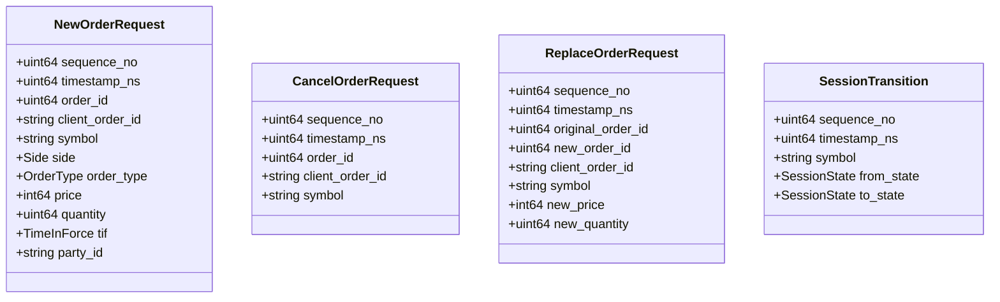
```mermaid
classDiagram
    class NewOrderRequest {
        +uint64 sequence_no
        +uint64 timestamp_ns
        +uint64 order_id
        +string client_order_id
        +string symbol
        +Side side
        +OrderType order_type
        +int64 price
        +uint64 quantity
        +TimeInForce tif
        +string party_id
    }

    class CancelOrderRequest {
        +uint64 sequence_no
        +uint64 timestamp_ns
        +uint64 order_id
        +string client_order_id
        +string symbol
    }

    class ReplaceOrderRequest {
        +uint64 sequence_no
        +uint64 timestamp_ns
        +uint64 original_order_id
        +uint64 new_order_id
        +string client_order_id
        +string symbol
        +int64 new_price
        +uint64 new_quantity
    }

    class SessionTransition {
        +uint64 sequence_no
        +uint64 timestamp_ns
        +string symbol
        +SessionState from_state
        +SessionState to_state
    }
```

### 1.3 Outbound Message Classes

Generated by the matching engine in response to inbound commands.

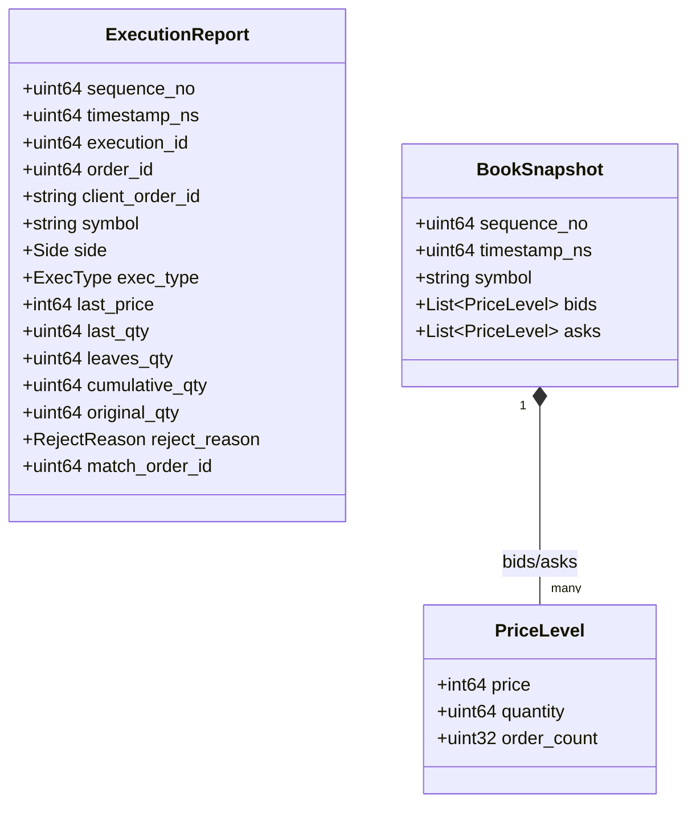
```mermaid
classDiagram
    class ExecutionReport {
        +uint64 sequence_no
        +uint64 timestamp_ns
        +uint64 execution_id
        +uint64 order_id
        +string client_order_id
        +string symbol
        +Side side
        +ExecType exec_type
        +int64 last_price
        +uint64 last_qty
        +uint64 leaves_qty
        +uint64 cumulative_qty
        +uint64 original_qty
        +RejectReason reject_reason
        +uint64 match_order_id
    }

    class BookSnapshot {
        +uint64 sequence_no
        +uint64 timestamp_ns
        +string symbol
        +List~PriceLevel~ bids
        +List~PriceLevel~ asks
    }

    class PriceLevel {
        +int64 price
        +uint64 quantity
        +uint32 order_count
    }

    BookSnapshot "1" *-- "many" PriceLevel : bids/asks
```

### 1.4 Instrument Configuration

Loaded once at engine initialization. Drives validation rules (tick/lot alignment, price bands), matching algorithm selection, and SMP mode.

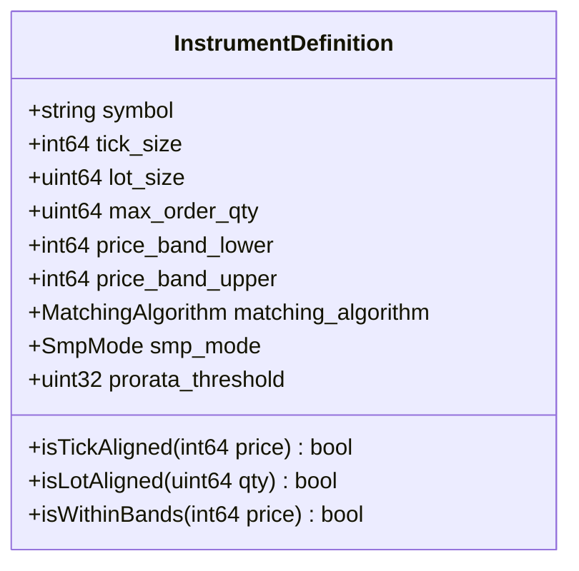
```mermaid
classDiagram
    class InstrumentDefinition {
        +string symbol
        +int64 tick_size
        +uint64 lot_size
        +uint64 max_order_qty
        +int64 price_band_lower
        +int64 price_band_upper
        +MatchingAlgorithm matching_algorithm
        +SmpMode smp_mode
        +uint32 prorata_threshold
        +isTickAligned(int64 price) bool
        +isLotAligned(uint64 qty) bool
        +isWithinBands(int64 price) bool
    }
```

### 1.5 Order (Internal Engine State)

The `Order` object is the internal, mutable representation of an order inside the engine. It is never serialized directly — it is the working state from which `ExecutionReport` messages are constructed.

**Invariant enforced at every state transition:**
```
original_qty == cumulative_qty + leaves_qty + canceled_qty
```

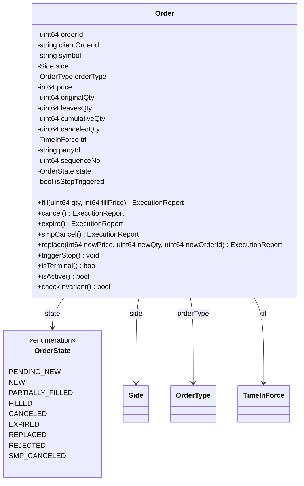
```mermaid
classDiagram
    class Order {
        -uint64 orderId
        -string clientOrderId
        -string symbol
        -Side side
        -OrderType orderType
        -int64 price
        -uint64 originalQty
        -uint64 leavesQty
        -uint64 cumulativeQty
        -uint64 canceledQty
        -TimeInForce tif
        -string partyId
        -uint64 sequenceNo
        -OrderState state
        -bool isStopTriggered
        +fill(uint64 qty, int64 fillPrice) ExecutionReport
        +cancel() ExecutionReport
        +expire() ExecutionReport
        +smpCancel() ExecutionReport
        +replace(int64 newPrice, uint64 newQty, uint64 newOrderId) ExecutionReport
        +triggerStop() void
        +isTerminal() bool
        +isActive() bool
        +checkInvariant() bool
    }

    class OrderState {
        <<enumeration>>
        PENDING_NEW
        NEW
        PARTIALLY_FILLED
        FILLED
        CANCELED
        EXPIRED
        REPLACED
        REJECTED
        SMP_CANCELED
    }

    Order --> OrderState : state
    Order --> Side : side
    Order --> OrderType : orderType
    Order --> TimeInForce : tif
```

### 1.6 Price Level

A doubly-linked list of `Order` objects at a single price, maintaining insertion order to preserve time priority. FIFO matching walks front-to-back; Pro-Rata iterates all nodes.

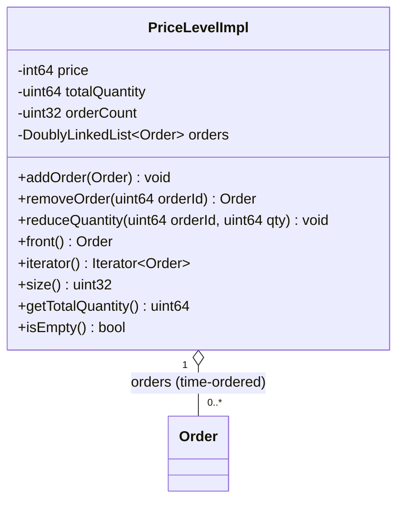
```mermaid
classDiagram
    class PriceLevelImpl {
        -int64 price
        -uint64 totalQuantity
        -uint32 orderCount
        -DoublyLinkedList~Order~ orders
        +addOrder(Order) void
        +removeOrder(uint64 orderId) Order
        +reduceQuantity(uint64 orderId, uint64 qty) void
        +front() Order
        +iterator() Iterator~Order~
        +size() uint32
        +getTotalQuantity() uint64
        +isEmpty() bool
    }

    PriceLevelImpl "1" o-- "0..*" Order : orders (time-ordered)
```

### 1.7 Order Book

One `OrderBook` instance per symbol. Manages the bid and ask sides as sorted maps of `PriceLevel` objects (descending for bids, ascending for asks). Owns the session state for this symbol and delegates matching to a strategy.

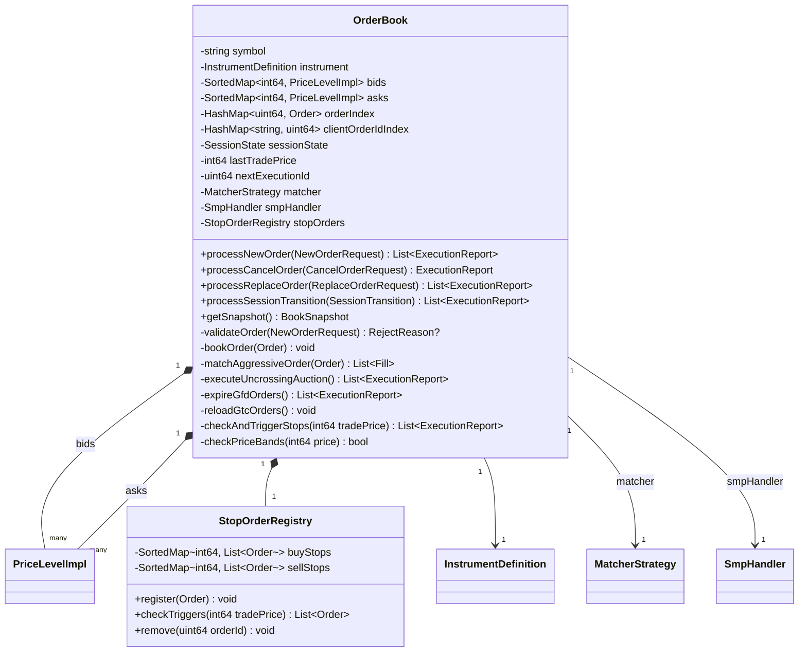
```mermaid
classDiagram
    class OrderBook {
        -string symbol
        -InstrumentDefinition instrument
        -SortedMap~int64, PriceLevelImpl~ bids
        -SortedMap~int64, PriceLevelImpl~ asks
        -HashMap~uint64, Order~ orderIndex
        -HashMap~string, uint64~ clientOrderIdIndex
        -SessionState sessionState
        -int64 lastTradePrice
        -uint64 nextExecutionId
        -MatcherStrategy matcher
        -SmpHandler smpHandler
        -StopOrderRegistry stopOrders
        +processNewOrder(NewOrderRequest) List~ExecutionReport~
        +processCancelOrder(CancelOrderRequest) ExecutionReport
        +processReplaceOrder(ReplaceOrderRequest) List~ExecutionReport~
        +processSessionTransition(SessionTransition) List~ExecutionReport~
        +getSnapshot() BookSnapshot
        -validateOrder(NewOrderRequest) RejectReason?
        -bookOrder(Order) void
        -matchAggressiveOrder(Order) List~Fill~
        -executeUncrossingAuction() List~ExecutionReport~
        -expireGfdOrders() List~ExecutionReport~
        -reloadGtcOrders() void
        -checkAndTriggerStops(int64 tradePrice) List~ExecutionReport~
        -checkPriceBands(int64 price) bool
    }

    class StopOrderRegistry {
        -SortedMap~int64, List~Order~~ buyStops
        -SortedMap~int64, List~Order~~ sellStops
        +register(Order) void
        +checkTriggers(int64 tradePrice) List~Order~
        +remove(uint64 orderId) void
    }

    OrderBook "1" *-- "many" PriceLevelImpl : bids
    OrderBook "1" *-- "many" PriceLevelImpl : asks
    OrderBook "1" *-- "1" StopOrderRegistry
    OrderBook "1" --> "1" InstrumentDefinition
    OrderBook "1" --> "1" MatcherStrategy : matcher
    OrderBook "1" --> "1" SmpHandler : smpHandler
```

### 1.8 Matching Strategy (Strategy Pattern)

The matching algorithm is selected per instrument at initialization time. All three implementations conform to the same interface.

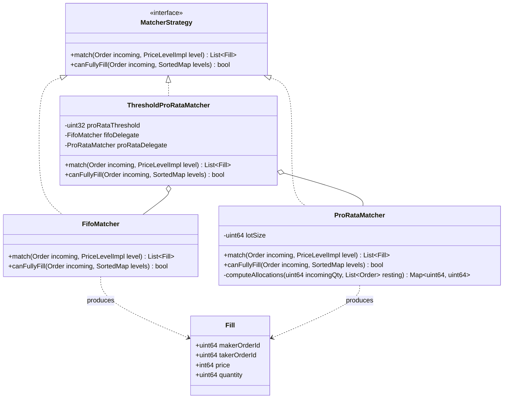
```mermaid
classDiagram
    class MatcherStrategy {
        <<interface>>
        +match(Order incoming, PriceLevelImpl level) List~Fill~
        +canFullyFill(Order incoming, SortedMap levels) bool
    }

    class FifoMatcher {
        +match(Order incoming, PriceLevelImpl level) List~Fill~
        +canFullyFill(Order incoming, SortedMap levels) bool
    }

    class ProRataMatcher {
        -uint64 lotSize
        +match(Order incoming, PriceLevelImpl level) List~Fill~
        +canFullyFill(Order incoming, SortedMap levels) bool
        -computeAllocations(uint64 incomingQty, List~Order~ resting) Map~uint64, uint64~
    }

    class ThresholdProRataMatcher {
        -uint32 proRataThreshold
        -FifoMatcher fifoDelegate
        -ProRataMatcher proRataDelegate
        +match(Order incoming, PriceLevelImpl level) List~Fill~
        +canFullyFill(Order incoming, SortedMap levels) bool
    }

    class Fill {
        +uint64 makerOrderId
        +uint64 takerOrderId
        +int64 price
        +uint64 quantity
    }

    MatcherStrategy <|.. FifoMatcher
    MatcherStrategy <|.. ProRataMatcher
    MatcherStrategy <|.. ThresholdProRataMatcher
    ThresholdProRataMatcher o-- FifoMatcher
    ThresholdProRataMatcher o-- ProRataMatcher
    FifoMatcher ..> Fill : produces
    ProRataMatcher ..> Fill : produces
```

### 1.9 Self-Match Prevention Handler

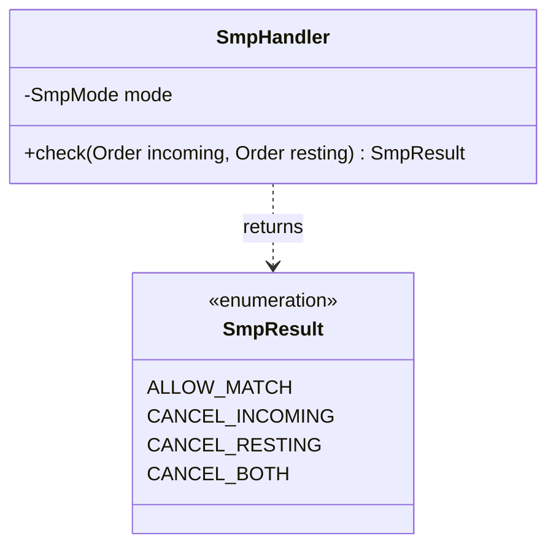
```mermaid
classDiagram
    class SmpHandler {
        -SmpMode mode
        +check(Order incoming, Order resting) SmpResult
    }

    class SmpResult {
        <<enumeration>>
        ALLOW_MATCH
        CANCEL_INCOMING
        CANCEL_RESTING
        CANCEL_BOTH
    }

    SmpHandler ..> SmpResult : returns
```

### 1.10 Auction Uncrossing Engine

Dedicated class for computing the equilibrium price during PreOpen→Continuous and PreClose→Maintenance transitions. Separated from the continuous matching path for clarity and testability.

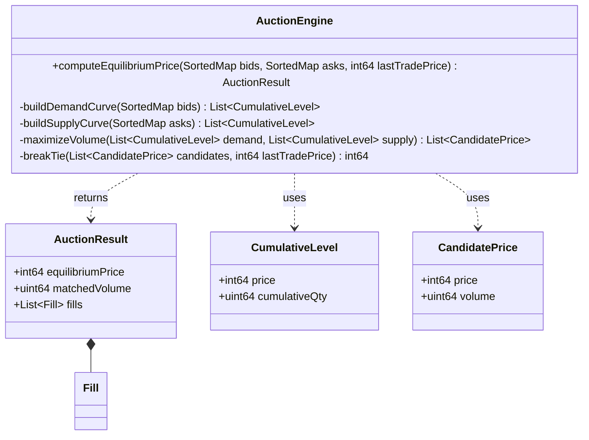
```mermaid
classDiagram
    class AuctionEngine {
        +computeEquilibriumPrice(SortedMap bids, SortedMap asks, int64 lastTradePrice) AuctionResult
        -buildDemandCurve(SortedMap bids) List~CumulativeLevel~
        -buildSupplyCurve(SortedMap asks) List~CumulativeLevel~
        -maximizeVolume(List~CumulativeLevel~ demand, List~CumulativeLevel~ supply) List~CandidatePrice~
        -breakTie(List~CandidatePrice~ candidates, int64 lastTradePrice) int64
    }

    class AuctionResult {
        +int64 equilibriumPrice
        +uint64 matchedVolume
        +List~Fill~ fills
    }

    class CumulativeLevel {
        +int64 price
        +uint64 cumulativeQty
    }

    class CandidatePrice {
        +int64 price
        +uint64 volume
    }

    AuctionEngine ..> AuctionResult : returns
    AuctionEngine ..> CumulativeLevel : uses
    AuctionEngine ..> CandidatePrice : uses
    AuctionResult *-- Fill
```

### 1.11 Matching Engine (Top-Level Orchestrator)

Owns all `OrderBook` instances and routes inbound `JournalRecord` payloads to the correct book. This is the entry point called by `engine_on_message` in the SDK C ABI.

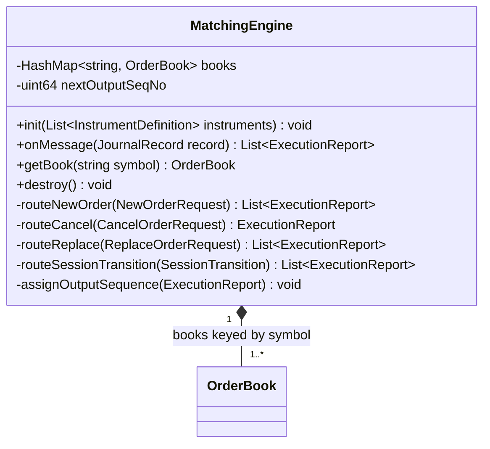
```mermaid
classDiagram
    class MatchingEngine {
        -HashMap~string, OrderBook~ books
        -uint64 nextOutputSeqNo
        +init(List~InstrumentDefinition~ instruments) void
        +onMessage(JournalRecord record) List~ExecutionReport~
        +getBook(string symbol) OrderBook
        +destroy() void
        -routeNewOrder(NewOrderRequest) List~ExecutionReport~
        -routeCancel(CancelOrderRequest) ExecutionReport
        -routeReplace(ReplaceOrderRequest) List~ExecutionReport~
        -routeSessionTransition(SessionTransition) List~ExecutionReport~
        -assignOutputSequence(ExecutionReport) void
    }

    MatchingEngine "1" *-- "1..*" OrderBook : books keyed by symbol
```

### 1.12 Sequencer & Journal Subsystem

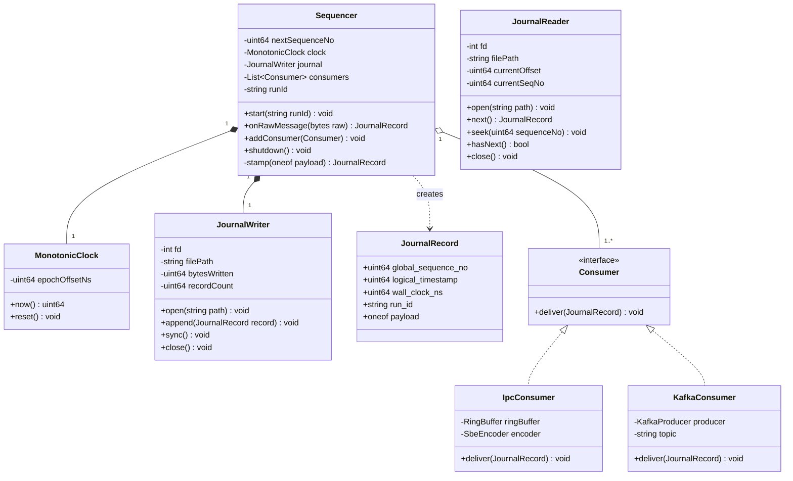
```mermaid
classDiagram
    class Sequencer {
        -uint64 nextSequenceNo
        -MonotonicClock clock
        -JournalWriter journal
        -List~Consumer~ consumers
        -string runId
        +start(string runId) void
        +onRawMessage(bytes raw) JournalRecord
        +addConsumer(Consumer) void
        +shutdown() void
        -stamp(oneof payload) JournalRecord
    }

    class MonotonicClock {
        -uint64 epochOffsetNs
        +now() uint64
        +reset() void
    }

    class JournalWriter {
        -int fd
        -string filePath
        -uint64 bytesWritten
        -uint64 recordCount
        +open(string path) void
        +append(JournalRecord record) void
        +sync() void
        +close() void
    }

    class JournalReader {
        -int fd
        -string filePath
        -uint64 currentOffset
        -uint64 currentSeqNo
        +open(string path) void
        +next() JournalRecord
        +seek(uint64 sequenceNo) void
        +hasNext() bool
        +close() void
    }

    class JournalRecord {
        +uint64 global_sequence_no
        +uint64 logical_timestamp
        +uint64 wall_clock_ns
        +string run_id
        +oneof payload
    }

    class Consumer {
        <<interface>>
        +deliver(JournalRecord) void
    }

    class IpcConsumer {
        -RingBuffer ringBuffer
        -SbeEncoder encoder
        +deliver(JournalRecord) void
    }

    class KafkaConsumer {
        -KafkaProducer producer
        -string topic
        +deliver(JournalRecord) void
    }

    Sequencer "1" *-- "1" MonotonicClock
    Sequencer "1" *-- "1" JournalWriter
    Sequencer "1" o-- "1..*" Consumer
    Consumer <|.. IpcConsumer
    Consumer <|.. KafkaConsumer
    Sequencer ..> JournalRecord : creates
```

### 1.13 Gateway & IPC Ring Buffer

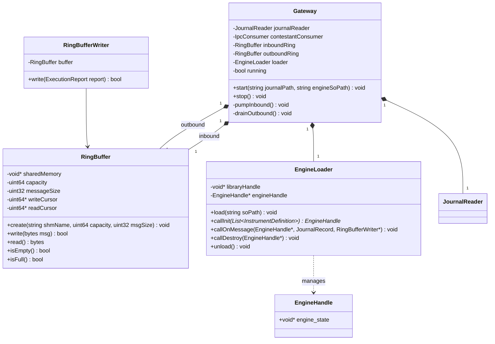
```mermaid
classDiagram
    class Gateway {
        -JournalReader journalReader
        -IpcConsumer contestantConsumer
        -RingBuffer inboundRing
        -RingBuffer outboundRing
        -EngineLoader loader
        -bool running
        +start(string journalPath, string engineSoPath) void
        +stop() void
        -pumpInbound() void
        -drainOutbound() void
    }

    class RingBuffer {
        -void* sharedMemory
        -uint64 capacity
        -uint32 messageSize
        -uint64* writeCursor
        -uint64* readCursor
        +create(string shmName, uint64 capacity, uint32 msgSize) void
        +write(bytes msg) bool
        +read() bytes
        +isEmpty() bool
        +isFull() bool
    }

    class RingBufferWriter {
        -RingBuffer buffer
        +write(ExecutionReport report) bool
    }

    class EngineLoader {
        -void* libraryHandle
        -EngineHandle* engineHandle
        +load(string soPath) void
        +callInit(List~InstrumentDefinition~) EngineHandle*
        +callOnMessage(EngineHandle*, JournalRecord, RingBufferWriter*) void
        +callDestroy(EngineHandle*) void
        +unload() void
    }

    class EngineHandle {
        +void* engine_state
    }

    Gateway "1" *-- "1" RingBuffer : inbound
    Gateway "1" *-- "1" RingBuffer : outbound
    Gateway "1" *-- "1" EngineLoader
    Gateway "1" *-- "1" JournalReader
    RingBufferWriter --> RingBuffer
    EngineLoader ..> EngineHandle : manages
```

### 1.14 Bot Fleet

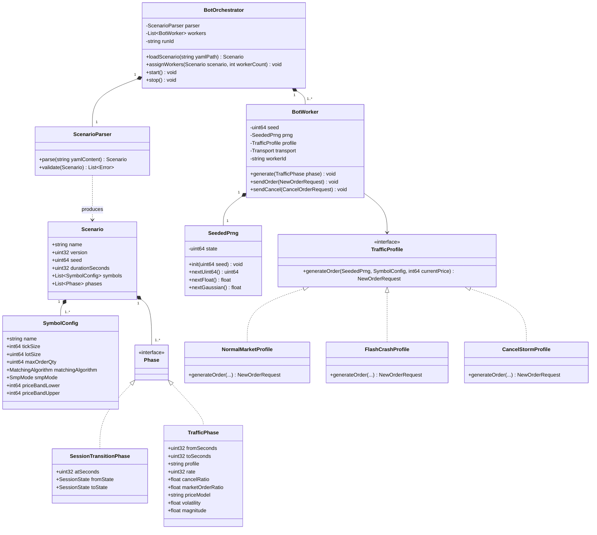
```mermaid
classDiagram
    class BotOrchestrator {
        -ScenarioParser parser
        -List~BotWorker~ workers
        -string runId
        +loadScenario(string yamlPath) Scenario
        +assignWorkers(Scenario scenario, int workerCount) void
        +start() void
        +stop() void
    }

    class ScenarioParser {
        +parse(string yamlContent) Scenario
        +validate(Scenario) List~Error~
    }

    class Scenario {
        +string name
        +uint32 version
        +uint64 seed
        +uint32 durationSeconds
        +List~SymbolConfig~ symbols
        +List~Phase~ phases
    }

    class SymbolConfig {
        +string name
        +int64 tickSize
        +uint64 lotSize
        +uint64 maxOrderQty
        +MatchingAlgorithm matchingAlgorithm
        +SmpMode smpMode
        +int64 priceBandLower
        +int64 priceBandUpper
    }

    class Phase {
        <<interface>>
    }

    class SessionTransitionPhase {
        +uint32 atSeconds
        +SessionState fromState
        +SessionState toState
    }

    class TrafficPhase {
        +uint32 fromSeconds
        +uint32 toSeconds
        +string profile
        +uint32 rate
        +float cancelRatio
        +float marketOrderRatio
        +string priceModel
        +float volatility
        +float magnitude
    }

    class BotWorker {
        -uint64 seed
        -SeededPrng prng
        -TrafficProfile profile
        -Transport transport
        -string workerId
        +generate(TrafficPhase phase) void
        +sendOrder(NewOrderRequest) void
        +sendCancel(CancelOrderRequest) void
    }

    class SeededPrng {
        -uint64 state
        +init(uint64 seed) void
        +nextUint64() uint64
        +nextFloat() float
        +nextGaussian() float
    }

    class TrafficProfile {
        <<interface>>
        +generateOrder(SeededPrng, SymbolConfig, int64 currentPrice) NewOrderRequest
    }

    class NormalMarketProfile {
        +generateOrder(...) NewOrderRequest
    }
    class FlashCrashProfile {
        +generateOrder(...) NewOrderRequest
    }
    class CancelStormProfile {
        +generateOrder(...) NewOrderRequest
    }

    BotOrchestrator "1" *-- "1" ScenarioParser
    BotOrchestrator "1" *-- "1..*" BotWorker
    ScenarioParser ..> Scenario : produces
    Scenario "1" *-- "1..*" SymbolConfig
    Scenario "1" *-- "1..*" Phase
    Phase <|.. SessionTransitionPhase
    Phase <|.. TrafficPhase
    BotWorker "1" *-- "1" SeededPrng
    BotWorker --> TrafficProfile
    TrafficProfile <|.. NormalMarketProfile
    TrafficProfile <|.. FlashCrashProfile
    TrafficProfile <|.. CancelStormProfile
```

### 1.15 Validation Engine


```mermaid
classDiagram
    class ValidationEngine {
        -SchemaValidator schemaValidator
        -SequenceValidator sequenceValidator
        -InvariantChecker invariantChecker
        -StateMachineChecker stateChecker
        -PriorityChecker priorityChecker
        -QuantityConservationChecker qtyChecker
        -ReplayDiffer replayDiffer
        -SnapshotDiffer snapshotDiffer
        +validateRun(Stream~ExecutionReport~ contestant, Stream~ExecutionReport~ reference) DiffReport
        +validateSingle(ExecutionReport report) List~ValidationError~
    }

    class SchemaValidator {
        +validate(ExecutionReport) List~ValidationError~
        -checkRequiredFields(ExecutionReport) List~ValidationError~
        -checkEnumRanges(ExecutionReport) List~ValidationError~
    }

    class SequenceValidator {
        -uint64 lastSeenSeqNo
        +validate(ExecutionReport) List~ValidationError~
        +reset() void
    }

    class InvariantChecker {
        +checkQuantityInvariant(ExecutionReport) bool
        +formula() string
    }

    class StateMachineChecker {
        -HashMap~uint64, OrderState~ orderStates
        -TransitionTable legalTransitions
        +checkTransition(uint64 orderId, ExecType newType) bool
        +reset() void
    }

    class TransitionTable {
        -HashMap~OrderState, Set~OrderState~~ transitions
        +isLegal(OrderState from, OrderState to) bool
    }

    class PriorityChecker {
        -HashMap~string, SortedMap~ bookState
        +checkPriceTimePriority(ExecutionReport fill) bool
    }

    class QuantityConservationChecker {
        -HashMap~int64, FillAccumulator~ fillsByPrice
        +checkConservation(ExecutionReport fill) bool
    }

    class ReplayDiffer {
        +diff(ExecutionReport expected, ExecutionReport actual) List~FieldDiff~
    }

    class SnapshotDiffer {
        +diff(BookSnapshot expected, BookSnapshot actual) List~LevelDiff~
    }

    class DiffReport {
        +string runId
        +uint64 totalEvents
        +uint64 matchedEvents
        +uint64 divergentEvents
        +uint64 firstDivergenceSeq
        +List~Divergence~ divergences
        +float correctnessScore
    }

    class Divergence {
        +uint64 sequenceNo
        +string field
        +string expected
        +string actual
        +uint64 orderId
        +string severity
    }

    class ValidationError {
        +string layer
        +string message
        +string severity
        +uint64 sequenceNo
    }

    ValidationEngine *-- SchemaValidator
    ValidationEngine *-- SequenceValidator
    ValidationEngine *-- InvariantChecker
    ValidationEngine *-- StateMachineChecker
    ValidationEngine *-- PriorityChecker
    ValidationEngine *-- QuantityConservationChecker
    ValidationEngine *-- ReplayDiffer
    ValidationEngine *-- SnapshotDiffer
    StateMachineChecker *-- TransitionTable
    ValidationEngine ..> DiffReport : produces
    DiffReport "1" *-- "0..*" Divergence
```

### 1.16 Scoring Engine

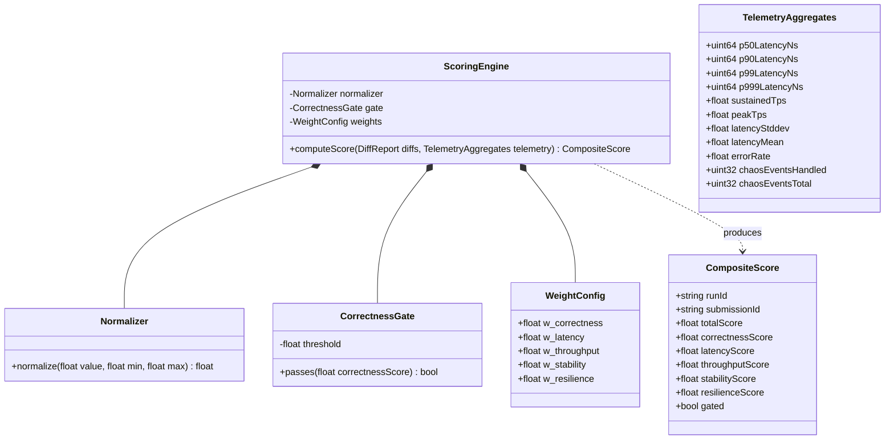
```mermaid
classDiagram
    class ScoringEngine {
        -Normalizer normalizer
        -CorrectnessGate gate
        -WeightConfig weights
        +computeScore(DiffReport diffs, TelemetryAggregates telemetry) CompositeScore
    }

    class WeightConfig {
        +float w_correctness
        +float w_latency
        +float w_throughput
        +float w_stability
        +float w_resilience
    }

    class Normalizer {
        +normalize(float value, float min, float max) float
    }

    class CorrectnessGate {
        -float threshold
        +passes(float correctnessScore) bool
    }

    class TelemetryAggregates {
        +uint64 p50LatencyNs
        +uint64 p90LatencyNs
        +uint64 p99LatencyNs
        +uint64 p999LatencyNs
        +float sustainedTps
        +float peakTps
        +float latencyStddev
        +float latencyMean
        +float errorRate
        +uint32 chaosEventsHandled
        +uint32 chaosEventsTotal
    }

    class CompositeScore {
        +string runId
        +string submissionId
        +float totalScore
        +float correctnessScore
        +float latencyScore
        +float throughputScore
        +float stabilityScore
        +float resilienceScore
        +bool gated
    }

    ScoringEngine *-- Normalizer
    ScoringEngine *-- CorrectnessGate
    ScoringEngine *-- WeightConfig
    ScoringEngine ..> CompositeScore : produces
```

### 1.17 Sandbox Runner

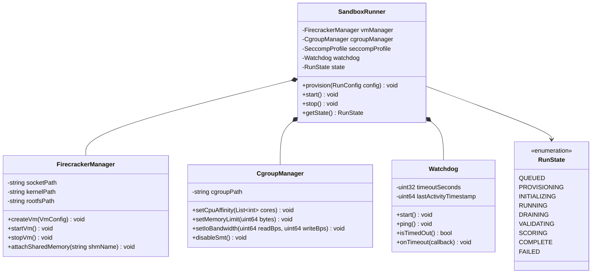
```mermaid
classDiagram
    class SandboxRunner {
        -FirecrackerManager vmManager
        -CgroupManager cgroupManager
        -SeccompProfile seccompProfile
        -Watchdog watchdog
        -RunState state
        +provision(RunConfig config) void
        +start() void
        +stop() void
        +getState() RunState
    }

    class FirecrackerManager {
        -string socketPath
        -string kernelPath
        -string rootfsPath
        +createVm(VmConfig) void
        +startVm() void
        +stopVm() void
        +attachSharedMemory(string shmName) void
    }

    class CgroupManager {
        -string cgroupPath
        +setCpuAffinity(List~int~ cores) void
        +setMemoryLimit(uint64 bytes) void
        +setIoBandwidth(uint64 readBps, uint64 writeBps) void
        +disableSmt() void
    }

    class Watchdog {
        -uint32 timeoutSeconds
        -uint64 lastActivityTimestamp
        +start() void
        +ping() void
        +isTimedOut() bool
        +onTimeout(callback) void
    }

    class RunState {
        <<enumeration>>
        QUEUED
        PROVISIONING
        INITIALIZING
        RUNNING
        DRAINING
        VALIDATING
        SCORING
        COMPLETE
        FAILED
    }

    SandboxRunner *-- FirecrackerManager
    SandboxRunner *-- CgroupManager
    SandboxRunner *-- Watchdog
    SandboxRunner --> RunState
```

---

## 2. Module Dependency Diagram

### 2.1 Build-Time Dependency Graph

This diagram shows which modules depend on which others at **compile time**. Arrows point from dependent → dependency. The `contracts` module is the root of all inter-module type sharing.

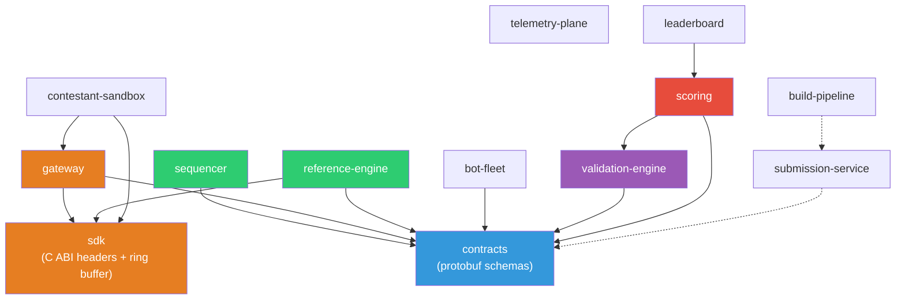
```mermaid
graph TD
    contracts["contracts<br/>(protobuf schemas)"]

    sdk["sdk<br/>(C ABI headers + ring buffer)"]
    sequencer["sequencer"]
    gateway["gateway"]
    reference_engine["reference-engine"]
    bot_fleet["bot-fleet"]
    validation_engine["validation-engine"]
    contestant_sandbox["contestant-sandbox"]
    telemetry_plane["telemetry-plane"]
    scoring["scoring"]
    leaderboard["leaderboard"]
    submission_service["submission-service"]
    build_pipeline["build-pipeline"]

    sequencer --> contracts
    gateway --> contracts
    gateway --> sdk
    reference_engine --> contracts
    reference_engine --> sdk
    bot_fleet --> contracts
    validation_engine --> contracts
    scoring --> contracts
    scoring --> validation_engine
    contestant_sandbox --> sdk
    contestant_sandbox --> gateway
    leaderboard --> scoring

    submission_service -.-> contracts
    build_pipeline -.-> submission_service

    style contracts fill:#3498db,color:#fff
    style sdk fill:#e67e22,color:#fff
    style sequencer fill:#2ecc71,color:#fff
    style gateway fill:#e67e22,color:#fff
    style reference_engine fill:#2ecc71,color:#fff
    style validation_engine fill:#9b59b6,color:#fff
    style scoring fill:#e74c3c,color:#fff
```

### 2.2 Runtime Dependency Graph

This shows runtime data flow dependencies — which services communicate with which at runtime. Solid lines are synchronous/IPC; dashed lines are asynchronous (Kafka).

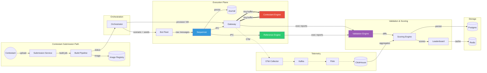
```mermaid
graph LR
    subgraph "Contestant Submission Path"
        CONTESTANT((Contestant))
        SS[Submission Service]
        BP[Build Pipeline]
        REG[(Image Registry)]
    end

    subgraph "Orchestration"
        ORCH[Orchestrator]
    end

    subgraph "Execution Plane"
        BF[Bot Fleet]
        SEQ[Sequencer]
        JRN[(Journal)]
        GW[Gateway]
        CE[Contestant Engine]
        RE[Reference Engine]
    end

    subgraph "Validation & Scoring"
        VE[Validation Engine]
        SE[Scoring Engine]
        LB[Leaderboard]
    end

    subgraph "Telemetry"
        OT[OTel Collector]
        KF[Kafka]
        FL[Flink]
        CH[(ClickHouse)]
    end

    subgraph "Storage"
        PG[(Postgres)]
        RD[(Redis)]
    end

    CONTESTANT -->|upload| SS
    SS -->|build job| BP
    BP -->|image| REG
    BP -->|status| ORCH

    ORCH -->|scenario + seeds| BF
    ORCH -->|provision VM| GW

    BF -->|raw messages| SEQ
    SEQ -->|persist| JRN
    SEQ -->|IPC| GW
    SEQ -->|IPC| RE

    GW ==>|ring buffer| CE
    CE ==>|ring buffer| GW

    GW -->|exec reports| VE
    RE -->|exec reports| VE
    GW -.->|OTel| OT

    OT -.-> KF
    KF -.-> FL
    FL -.-> CH

    VE -->|diffs| SE
    CH -->|aggregates| SE
    SE -->|scores| LB
    SE -->|persist| PG
    LB -->|cache| RD

    style CE fill:#e74c3c,color:#fff
    style RE fill:#2ecc71,color:#fff
    style SEQ fill:#3498db,color:#fff
    style VE fill:#9b59b6,color:#fff
```

### 2.3 Module Coupling Matrix

| Producer ↓ / Consumer → | contracts | sdk | sequencer | gateway | ref-engine | bot-fleet | validation | scoring | leaderboard | telemetry |
|:---|:---:|:---:|:---:|:---:|:---:|:---:|:---:|:---:|:---:|:---:|
| **contracts** | — | ✓ | ✓ | ✓ | ✓ | ✓ | ✓ | ✓ | · | · |
| **sdk** | · | — | · | ✓ | ✓ | · | · | · | · | · |
| **sequencer** | · | · | — | ✓ (IPC) | ✓ (IPC) | · | · | · | · | · |
| **gateway** | · | · | · | — | · | · | ✓ | · | · | ✓ |
| **ref-engine** | · | · | · | · | — | · | ✓ | · | · | · |
| **bot-fleet** | · | · | ✓ | · | · | — | · | · | · | · |
| **validation** | · | · | · | · | · | · | — | ✓ | · | · |
| **telemetry** | · | · | · | · | · | · | · | ✓ | · | — |
| **scoring** | · | · | · | · | · | · | · | — | ✓ | · |

---

## 3. Package Structure

### 3.1 Full Directory Tree with File Purposes

```
/distributed-trading-platform
│
├── /contracts                              ─── SHARED SCHEMA LAYER ───
│   ├── domain.proto                        # Side, OrderType, TIF, ExecType, RejectReason,
│   │                                       # SessionState, MatchingAlgorithm, SmpMode
│   ├── messages.proto                      # NewOrderRequest, CancelOrderRequest,
│   │                                       # ReplaceOrderRequest, ExecutionReport, BookSnapshot
│   ├── events.proto                        # JournalRecord (envelope with oneof payload)
│   ├── instruments.proto                   # InstrumentDefinition
│   ├── control.proto                       # SessionTransition, RunConfig, RunStatus
│   ├── scoring.proto                       # CompositeScore, TelemetryAggregates
│   ├── buf.yaml                            # Buf schema registry config
│   └── Makefile                            # protoc / buf generate targets
│
├── /sdk                                    ─── CONTESTANT INTERFACE LAYER ───
│   ├── /c
│   │   ├── engine.h                        # engine_init, engine_on_message, engine_destroy
│   │   ├── ringbuffer.h                    # SPSC ring buffer: create, write, read, destroy
│   │   └── types.h                         # C struct equivalents of protobuf messages
│   ├── /cpp
│   │   ├── include/
│   │   │   ├── engine.hpp                  # C++ RAII wrapper around C ABI
│   │   │   ├── order_book_base.hpp         # Abstract base for contestant order books
│   │   │   └── ring_buffer.hpp             # C++ ring buffer wrapper
│   │   └── examples/
│   │       └── simple_fifo_engine.cpp      # Minimal working example
│   ├── /rust
│   │   ├── src/
│   │   │   ├── lib.rs                      # FFI bindings + safe Rust wrappers
│   │   │   ├── ring_buffer.rs              # Ring buffer Rust interface
│   │   │   └── types.rs                    # Generated Rust types from protobuf
│   │   └── Cargo.toml
│   └── /go
│       ├── engine.go                       # CGo bindings
│       └── go.mod
│
├── /sequencer                              ─── EVENT SEQUENCING LAYER ───
│   ├── cmd/
│   │   └── sequencer/
│   │       └── main.go                     # Entry point: TCP listener + sequencing loop
│   ├── internal/
│   │   ├── journal/
│   │   │   ├── writer.go                   # Append-only journal file writer (O_DIRECT)
│   │   │   ├── reader.go                   # Sequential journal reader + seek by seqNo
│   │   │   ├── format.go                   # Header struct, length-prefixed record format
│   │   │   └── writer_test.go
│   │   ├── clock/
│   │   │   ├── clock.go                    # Monotonic nanosecond clock
│   │   │   └── clock_test.go
│   │   └── dispatch/
│   │       ├── dispatcher.go               # Fan-out: journal-before-delivery guarantee
│   │       ├── ipc_consumer.go             # Shared-memory ring buffer consumer
│   │       ├── kafka_consumer.go           # Kafka producer consumer (for telemetry topics)
│   │       └── dispatcher_test.go
│   ├── go.mod
│   ├── go.sum
│   └── Dockerfile
│
├── /gateway                                ─── IPC BRIDGE LAYER ───
│   ├── cmd/
│   │   └── gateway/
│   │       └── main.go                     # Entry point: journal reader + IPC pump
│   ├── internal/
│   │   ├── ipc/
│   │   │   ├── shm.go                      # POSIX shared memory creation + mapping
│   │   │   ├── ring_buffer.go              # Go-side SPSC ring buffer impl
│   │   │   └── ring_buffer_test.go
│   │   ├── loader/
│   │   │   ├── engine_loader.go            # dlopen / LoadLibrary .so loading
│   │   │   └── engine_loader_test.go
│   │   └── protocol/
│   │       ├── sbe_encoder.go              # JournalRecord → flat binary encoding
│   │       ├── sbe_decoder.go              # Flat binary → ExecutionReport decoding
│   │       └── sbe_test.go
│   ├── go.mod
│   └── Dockerfile
│
├── /reference-engine                       ─── GOLDEN-STANDARD ENGINE ───
│   ├── src/
│   │   ├── main.cpp                        # Engine harness: init, message loop, destroy
│   │   ├── matching_engine.h               # MatchingEngine class (top-level router)
│   │   ├── matching_engine.cpp
│   │   ├── order_book.h                    # OrderBook class (per-symbol state)
│   │   ├── order_book.cpp
│   │   ├── order.h                         # Order value object with state machine
│   │   ├── order.cpp
│   │   ├── price_level.h                   # PriceLevel (linked list of Orders)
│   │   ├── price_level.cpp
│   │   ├── matching/
│   │   │   ├── matcher.h                   # MatcherStrategy interface
│   │   │   ├── fifo_matcher.h
│   │   │   ├── fifo_matcher.cpp
│   │   │   ├── prorata_matcher.h
│   │   │   ├── prorata_matcher.cpp
│   │   │   ├── threshold_prorata_matcher.h
│   │   │   └── threshold_prorata_matcher.cpp
│   │   ├── auction/
│   │   │   ├── auction_engine.h
│   │   │   └── auction_engine.cpp          # Equilibrium price computation + uncrossing
│   │   ├── smp/
│   │   │   ├── smp_handler.h
│   │   │   └── smp_handler.cpp
│   │   └── stop/
│   │       ├── stop_order_registry.h
│   │       └── stop_order_registry.cpp
│   ├── tests/
│   │   ├── test_fifo_matcher.cpp           # FIFO price-time priority
│   │   ├── test_prorata_matcher.cpp        # Proportional allocation + rounding
│   │   ├── test_threshold_prorata.cpp      # Hybrid: FIFO leader + pro-rata remainder
│   │   ├── test_auction.cpp                # Uncrossing: equilibrium, tie-breaking
│   │   ├── test_smp.cpp                    # All 4 SMP modes
│   │   ├── test_order_lifecycle.cpp        # State machine transitions
│   │   ├── test_session_lifecycle.cpp      # Session state allowed operations
│   │   ├── test_edge_cases.cpp             # EC-01 through EC-28
│   │   ├── test_replay.cpp                 # Journal replay determinism
│   │   └── test_invariant.cpp              # Quantity invariant after every operation
│   ├── CMakeLists.txt
│   └── Dockerfile
│
├── /contestant-sandbox                     ─── MICROVM ISOLATION LAYER ───
│   ├── cmd/
│   │   └── runner/
│   │       └── main.go                     # Orchestrates VM lifecycle + watchdog
│   ├── internal/
│   │   ├── firecracker/
│   │   │   ├── vm_manager.go               # Create, start, stop Firecracker VMs
│   │   │   ├── config.go                   # VM resource configuration
│   │   │   └── vm_manager_test.go
│   │   ├── cgroup/
│   │   │   ├── cpu_pin.go                  # isolcpus + taskset
│   │   │   ├── memory_limit.go             # Memory cgroup quota
│   │   │   └── io_limit.go                 # Block I/O bandwidth cap
│   │   ├── seccomp/
│   │   │   ├── profile.go                  # seccomp-bpf allowlist
│   │   │   └── profiles/
│   │   │       └── engine_default.json     # Default syscall allowlist
│   │   └── watchdog/
│   │       ├── watchdog.go                 # Timeout + crash detection
│   │       └── watchdog_test.go
│   ├── go.mod
│   └── Dockerfile
│
├── /bot-fleet                              ─── LOAD GENERATION LAYER ───
│   ├── /orchestrator
│   │   ├── cmd/
│   │   │   └── main.go                     # Scenario scheduler entry point
│   │   └── internal/
│   │       ├── scheduler/
│   │       │   ├── scheduler.go            # Assigns seeds, rate plans to workers
│   │       │   └── scheduler_test.go
│   │       └── scenario/
│   │           ├── parser.go               # YAML DSL parser
│   │           ├── validator.go            # Scenario schema validation
│   │           └── parser_test.go
│   ├── /worker
│   │   ├── cmd/
│   │   │   └── main.go                     # Bot worker entry point
│   │   └── internal/
│   │       ├── generator/
│   │       │   ├── order_generator.go      # NewOrderRequest construction from PRNG
│   │       │   ├── cancel_generator.go     # CancelOrderRequest construction
│   │       │   └── generator_test.go
│   │       ├── profiles/
│   │       │   ├── profile.go              # TrafficProfile interface
│   │       │   ├── normal_market.go
│   │       │   ├── flash_crash.go
│   │       │   ├── cancel_storm.go
│   │       │   ├── fat_finger.go
│   │       │   ├── smp_stress.go
│   │       │   └── recovery.go
│   │       ├── prng/
│   │       │   ├── seeded_prng.go          # Deterministic PRNG (PCG or xoshiro256)
│   │       │   └── seeded_prng_test.go
│   │       └── transport/
│   │           ├── sequencer_client.go     # Raw message sender to sequencer
│   │           └── sequencer_client_test.go
│   └── /scenarios
│       ├── normal_market.yaml
│       ├── flash_crash.yaml
│       ├── cancel_storm.yaml
│       ├── fat_finger.yaml
│       └── smp_stress.yaml
│
├── /validation-engine                      ─── CORRECTNESS VERIFICATION LAYER ───
│   ├── cmd/
│   │   └── validator/
│   │       └── main.go
│   ├── internal/
│   │   ├── schema/
│   │   │   ├── schema_validator.go
│   │   │   └── schema_validator_test.go
│   │   ├── sequence/
│   │   │   ├── sequence_validator.go
│   │   │   └── sequence_validator_test.go
│   │   ├── invariant/
│   │   │   ├── quantity_checker.go
│   │   │   └── quantity_checker_test.go
│   │   ├── statemachine/
│   │   │   ├── state_checker.go
│   │   │   ├── transition_table.go
│   │   │   └── state_checker_test.go
│   │   ├── priority/
│   │   │   ├── priority_checker.go
│   │   │   └── priority_checker_test.go
│   │   ├── conservation/
│   │   │   ├── qty_conservation.go
│   │   │   └── qty_conservation_test.go
│   │   ├── differ/
│   │   │   ├── replay_differ.go
│   │   │   ├── snapshot_differ.go
│   │   │   └── differ_test.go
│   │   └── report/
│   │       ├── diff_report.go
│   │       └── diff_report_test.go
│   ├── go.mod
│   └── Dockerfile
│
├── /telemetry-plane                        ─── OBSERVABILITY LAYER ───
│   ├── /otel-collector
│   │   ├── config.yaml                     # Receivers, processors, exporters
│   │   └── Dockerfile
│   ├── /flink-jobs
│   │   ├── latency_percentiles.sql         # p50, p90, p99, p999 tumbling windows
│   │   ├── tps_windows.sql                 # Sliding 1s/10s TPS computation
│   │   ├── error_rates.sql                 # Error ratio sliding window
│   │   └── book_depth.sql                  # Average bid/ask depth per snapshot
│   └── /clickhouse
│       ├── schema.sql                      # Raw events table + materialized views
│       └── migrations/
│           └── 001_initial.sql
│
├── /scoring                                ─── RANKING COMPUTATION LAYER ───
│   ├── cmd/
│   │   └── scoring/
│   │       └── main.go
│   ├── internal/
│   │   ├── composite/
│   │   │   ├── scorer.go                   # Weighted composite formula
│   │   │   └── scorer_test.go
│   │   ├── normalization/
│   │   │   ├── min_max.go
│   │   │   └── min_max_test.go
│   │   └── gate/
│   │       ├── correctness_gate.go         # < 0.95 → score = 0
│   │       └── correctness_gate_test.go
│   ├── go.mod
│   └── Dockerfile
│
├── /leaderboard                            ─── PRESENTATION LAYER ───
│   ├── /backend
│   │   ├── cmd/
│   │   │   └── main.go
│   │   ├── internal/
│   │   │   ├── api/
│   │   │   │   ├── rest_handlers.go        # GET /rankings, GET /runs/:id
│   │   │   │   ├── ws_handlers.go          # WebSocket live ranking push
│   │   │   │   └── middleware.go
│   │   │   └── ranking/
│   │   │       ├── ranker.go               # Sort + paginate composite scores
│   │   │       └── ranker_test.go
│   │   ├── go.mod
│   │   └── Dockerfile
│   └── /frontend
│       ├── src/
│       │   ├── App.jsx
│       │   ├── components/
│       │   └── hooks/
│       ├── public/
│       ├── package.json
│       └── Dockerfile
│
├── /submission-service                     ─── INGESTION LAYER ───
│   ├── cmd/
│   │   └── main.go
│   ├── internal/
│   │   ├── api/
│   │   │   ├── handlers.go                 # POST /submissions
│   │   │   └── middleware.go
│   │   ├── storage/
│   │   │   ├── s3_adapter.go               # S3-compatible object store
│   │   │   └── s3_adapter_test.go
│   │   └── validation/
│   │       ├── manifest_validator.go        # Manifest schema + integrity checks
│   │       └── manifest_validator_test.go
│   ├── go.mod
│   └── Dockerfile
│
├── /build-pipeline                         ─── BUILD & SCAN LAYER ───
│   ├── cmd/
│   │   └── builder/
│   │       └── main.go
│   ├── internal/
│   │   ├── compiler/
│   │   │   ├── multi_lang_compiler.go      # C++, Rust, Go compilation
│   │   │   └── compiler_test.go
│   │   ├── scanner/
│   │   │   ├── trivy_scanner.go            # CVE vulnerability scanning
│   │   │   ├── syft_sbom.go                # SBOM generation
│   │   │   └── scanner_test.go
│   │   └── registry/
│   │       ├── image_pusher.go             # Push to container registry
│   │       └── image_pusher_test.go
│   ├── go.mod
│   └── Dockerfile
│
├── /infra                                  ─── INFRASTRUCTURE AS CODE ───
│   ├── /terraform
│   │   ├── main.tf                         # Provider config
│   │   ├── control_plane.tf                # Control plane cluster resources
│   │   ├── runner_nodes.tf                 # Bare-metal runner node pool
│   │   ├── networking.tf                   # VPC, subnets, security groups
│   │   ├── storage.tf                      # S3 buckets, EBS volumes
│   │   └── variables.tf
│   ├── /helm
│   │   ├── sequencer/
│   │   │   ├── Chart.yaml
│   │   │   ├── values.yaml
│   │   │   └── templates/
│   │   ├── gateway/
│   │   ├── bot-fleet/
│   │   ├── validation-engine/
│   │   ├── scoring/
│   │   ├── leaderboard/
│   │   ├── submission-service/
│   │   └── build-pipeline/
│   └── /k8s
│       ├── namespace.yaml
│       ├── network-policies.yaml           # Default-deny egress for runner nodes
│       ├── resource-quotas.yaml            # Per-run CPU/memory/IO limits
│       └── pod-security-policies.yaml      # seccomp + capability drops
│
├── /docs
│   ├── spec_v2.md
│   ├── technical_design.md                 # This document
│   ├── architecture_review.md
│   └── adr/
│       ├── 001-sequencer-design.md
│       ├── 002-ipc-vs-tcp.md
│       ├── 003-microvm-isolation.md
│       ├── 004-matching-algorithm-strategy.md
│       └── 005-journal-file-format.md
│
└── README.md
```

### 3.2 Module Boundary Summary

| Module | Language | Boundary | Exposes |
|:---|:---|:---|:---|
| `contracts` | Protobuf | Schema definitions only | Generated code in Go, C++, Rust |
| `sdk` | C/C++/Rust/Go | C ABI shared library interface | `engine.h`, `ringbuffer.h`, `types.h` |
| `sequencer` | Go | TCP listener + journal file + IPC dispatch | Journal file format, IPC ring buffer writes |
| `gateway` | Go | Journal reader + SBE codec + ring buffer pump | Ring buffer reads/writes via shared memory |
| `reference-engine` | C++ | Compiled as `.so` loaded by Gateway | Same C ABI as contestant engines |
| `bot-fleet` | Go | Scenario YAML → raw order messages → Sequencer | TCP messages to Sequencer |
| `validation-engine` | Go | Two `ExecutionReport` streams → `DiffReport` | `DiffReport` to Scoring Engine |
| `telemetry-plane` | Config + SQL | OTel config + Flink SQL jobs | ClickHouse materialized views |
| `scoring` | Go | `DiffReport` + `TelemetryAggregates` → `CompositeScore` | `CompositeScore` to Leaderboard |
| `leaderboard` | Go + JS | REST + WebSocket API + React frontend | HTTP/WS endpoints |
| `submission-service` | Go | HTTP upload API | Submission records in Postgres |
| `build-pipeline` | Go | Source → `.so` image → registry | Container images, SBOM, scan reports |
| `contestant-sandbox` | Go | Firecracker VM lifecycle + cgroup + watchdog | Provisioned + running microVM |
| `infra` | Terraform/Helm/K8s | Infrastructure provisioning | Cloud resources, Kubernetes manifests |

---

## 4. Sequence Diagrams

### 4.1 End-to-End Submission Lifecycle

From the moment a contestant uploads their code through to the final score appearing on the leaderboard.

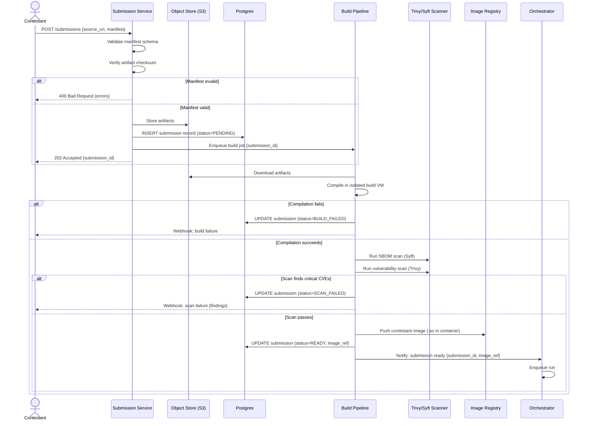
```mermaid
sequenceDiagram
    actor C as Contestant
    participant SS as Submission Service
    participant OS as Object Store (S3)
    participant PG as Postgres
    participant BP as Build Pipeline
    participant TS as Trivy/Syft Scanner
    participant IR as Image Registry
    participant OR as Orchestrator

    C->>SS: POST /submissions {source_uri, manifest}
    SS->>SS: Validate manifest schema
    SS->>SS: Verify artifact checksum
    alt Manifest invalid
        SS-->>C: 400 Bad Request {errors}
    else Manifest valid
        SS->>OS: Store artifacts
        SS->>PG: INSERT submission record (status=PENDING)
        SS->>BP: Enqueue build job {submission_id}
        SS-->>C: 202 Accepted {submission_id}
    end

    BP->>OS: Download artifacts
    BP->>BP: Compile in isolated build VM
    alt Compilation fails
        BP->>PG: UPDATE submission (status=BUILD_FAILED)
        BP-->>C: Webhook: build failure
    else Compilation succeeds
        BP->>TS: Run SBOM scan (Syft)
        BP->>TS: Run vulnerability scan (Trivy)
        alt Scan finds critical CVEs
            BP->>PG: UPDATE submission (status=SCAN_FAILED)
            BP-->>C: Webhook: scan failure {findings}
        else Scan passes
            BP->>IR: Push contestant image (.so in container)
            BP->>PG: UPDATE submission (status=READY, image_ref)
            BP->>OR: Notify: submission ready {submission_id, image_ref}
            OR->>OR: Enqueue run
        end
    end
```

### 4.2 Run Provisioning & Initialization

From orchestrator run dequeue to first command delivery.

```mermaid
sequenceDiagram
    participant OR as Orchestrator
    participant SR as Sandbox Runner
    participant FC as Firecracker
    participant CG as Cgroup Manager
    participant GW as Gateway
    participant SEQ as Sequencer
    participant BO as Bot Orchestrator

    OR->>SR: ProvisionRun {run_id, image_ref, scenario_id}
    SR->>SR: Select bare-metal runner node
    SR->>CG: Pin CPUs [2,3], disable SMT, set mem=4GiB
    SR->>FC: CreateVM {kernel, rootfs, shm_attach}
    FC-->>SR: VM ready (socket path)

    SR->>GW: Start gateway {journal_path, shm_name, engine.so}
    GW->>GW: dlopen(engine.so)
    GW->>GW: engine_init(instruments)
    GW->>GW: Create inbound + outbound ring buffers

    SR->>SEQ: Start sequencer {run_id}
    SEQ->>SEQ: Open journal file, init sequence_no=1

    SR->>BO: Start bots {scenario, seeds, sequencer_addr}
    BO->>BO: Parse scenario YAML
    BO->>BO: Assign seeds to workers

    Note over SR: RunState = INITIALIZING → RUNNING

    BO->>SEQ: First NewOrderRequest
    SEQ->>SEQ: Stamp: seq=1, ts=T0
    SEQ->>GW: Deliver JournalRecord(seq=1)
    GW->>GW: Write to inbound ring buffer
```

### 4.3 Order Lifecycle — New Limit Order with Partial Fill

Traces a single LIMIT BUY order that partially matches against one resting SELL, then rests the remainder on the book.

```mermaid
sequenceDiagram
    participant BF as Bot Worker
    participant SQ as Sequencer
    participant JL as Journal
    participant GW as Gateway
    participant CE as Contestant Engine
    participant RE as Reference Engine
    participant VE as Validation Engine

    BF->>SQ: NewOrderRequest(BUY, price=100, qty=50, LIMIT, GFD)
    SQ->>SQ: Assign seq=42, ts=T42
    SQ->>JL: Persist JournalRecord(seq=42)
    SQ->>GW: Deliver(seq=42)
    SQ->>RE: Deliver(seq=42)

    par Contestant Path
        GW->>CE: ring_buffer.write(seq=42)
        CE->>CE: Validate: price tick-aligned? qty lot-aligned? session=CONTINUOUS?
        CE->>CE: Check best ask: SELL@100, qty=30
        CE->>CE: SMP check: party_id differs → ALLOW_MATCH
        CE->>CE: Fill: BUY gets 30@100. leaves_qty=20
        CE->>CE: Book remainder: BUY@100, qty=20 → bids

        CE->>GW: ExecReport(PARTIALLY_FILLED, last_qty=30, leaves=20)
        CE->>GW: ExecReport(NEW for resting, leaves=20)
        Note over CE: Resting SELL order also gets ExecReport(FILLED)

        GW->>VE: Forward all 3 ExecutionReports
    and Reference Path
        RE->>RE: Identical processing
        RE->>VE: Emit same 3 ExecutionReports
    end

    VE->>VE: Diff reports field-by-field
    VE->>VE: Assert: all 3 match ✓
```

### 4.4 Order Lifecycle — FOK Rejection

A Fill-or-Kill order that cannot be fully satisfied.

```mermaid
sequenceDiagram
    participant BF as Bot Worker
    participant SQ as Sequencer
    participant GW as Gateway
    participant CE as Contestant Engine
    participant VE as Validation Engine

    BF->>SQ: NewOrderRequest(BUY, price=100, qty=500, LIMIT, FOK)
    SQ->>SQ: Assign seq=99

    SQ->>GW: Deliver(seq=99)
    GW->>CE: ring_buffer.write(seq=99)

    CE->>CE: Pre-match check: total ask liquidity at price ≤ 100?
    CE->>CE: Available sell qty = 200 < 500 = order qty
    CE->>CE: FOK cannot fully fill → REJECT

    CE->>GW: ExecReport(REJECTED, reject_reason=FOK_WOULD_NOT_FILL)
    Note over CE: No fills emitted. Book unchanged.

    GW->>VE: Forward rejection report
```

### 4.5 Cancel/Replace Flow — Price Change (Loses Priority)

```mermaid
sequenceDiagram
    participant BF as Bot Worker
    participant SQ as Sequencer
    participant GW as Gateway
    participant CE as Contestant Engine
    participant VE as Validation Engine

    Note over CE: Order #200 resting at BUY@100, qty=50, seq=30 (has time priority)

    BF->>SQ: ReplaceOrderRequest(orig=200, new_id=201, new_price=101, new_qty=0)
    SQ->>SQ: Assign seq=150

    SQ->>GW: Deliver(seq=150)
    GW->>CE: ring_buffer.write(seq=150)

    CE->>CE: Lookup order #200 → found, state=NEW
    CE->>CE: Price changed (100→101) → loses time priority
    CE->>CE: Cancel order #200
    CE->>CE: Create order #201 at BUY@101, qty=50, seq=150

    CE->>GW: ExecReport(order_id=200, exec_type=REPLACED)
    CE->>GW: ExecReport(order_id=201, exec_type=NEW)
    Note over CE: Order #201 has seq=150 → behind any existing orders at price 101

    GW->>VE: Forward 2 reports
```

### 4.6 Self-Match Prevention — Cancel Oldest

```mermaid
sequenceDiagram
    participant BF as Bot Worker
    participant SQ as Sequencer
    participant GW as Gateway
    participant CE as Contestant Engine
    participant VE as Validation Engine

    Note over CE: SELL order #300 resting at price=100, party_id="FirmA"
    Note over CE: Instrument SMP mode = SMP_CANCEL_OLDEST

    BF->>SQ: NewOrderRequest(BUY, price=100, qty=10, party_id="FirmA")
    SQ->>SQ: Assign seq=200

    SQ->>GW: Deliver(seq=200)
    GW->>CE: ring_buffer.write(seq=200)

    CE->>CE: Match BUY@100 against best ask SELL@100 (order #300)
    CE->>CE: SMP check: incoming.party_id == resting.party_id → "FirmA"
    CE->>CE: SMP mode = CANCEL_OLDEST → cancel resting order #300
    CE->>CE: Continue matching BUY against next resting order (if any)

    CE->>GW: ExecReport(order_id=300, exec_type=SMP_CANCELED)
    CE->>GW: ExecReport for BUY order (NEW if booked, or FILLED if matched elsewhere)

    GW->>VE: Forward reports
```

### 4.7 Session Lifecycle — Full Trading Day

```mermaid
sequenceDiagram
    participant OR as Orchestrator
    participant SQ as Sequencer
    participant CE as Contestant Engine
    participant RE as Reference Engine
    participant BF as Bot Fleet
    participant VE as Validation Engine

    rect rgb(40, 40, 60)
        Note over OR,VE: Phase 1 — PRE-OPEN
        OR->>SQ: SessionTransition(CLOSED → PRE_OPEN)
        SQ->>CE: Deliver via journal
        SQ->>RE: Deliver via journal
        CE->>CE: Load GTC orders from last session snapshot
        RE->>RE: Load GTC orders from last session snapshot
        BF->>SQ: Stream of NewOrderRequests (booked, not matched)
        SQ->>CE: Deliver each (sequenced)
        SQ->>RE: Deliver each (sequenced)
    end

    rect rgb(40, 60, 40)
        Note over OR,VE: Phase 2 — UNCROSSING AUCTION
        OR->>SQ: SessionTransition(PRE_OPEN → CONTINUOUS)
        SQ->>CE: Deliver via journal
        CE->>CE: Compute equilibrium price (max volume, tie-break by last trade)
        CE->>CE: Execute all matchable orders at equilibrium price
        CE->>VE: Emit auction fill ExecutionReports
        RE->>RE: Same auction logic
        RE->>VE: Emit auction fill ExecutionReports
        VE->>VE: Diff auction results
    end

    rect rgb(60, 40, 40)
        Note over OR,VE: Phase 3 — CONTINUOUS TRADING
        loop Every order from bot fleet
            BF->>SQ: NewOrder / Cancel / Replace
            SQ->>CE: Deliver (sequenced)
            SQ->>RE: Deliver (sequenced)
            CE->>VE: ExecutionReports
            RE->>VE: ExecutionReports
            VE->>VE: Per-event diff
        end
    end

    rect rgb(60, 60, 40)
        Note over OR,VE: Phase 4 — CIRCUIT BREAKER HALT
        Note over CE: Trade at price outside price_band → halt triggered
        OR->>SQ: SessionTransition(CONTINUOUS → HALTED)
        SQ->>CE: Deliver via journal
        CE->>CE: Reject all new orders. Allow cancels only.
        OR->>SQ: SessionTransition(HALTED → CONTINUOUS)
        SQ->>CE: Deliver via journal
        CE->>CE: Resume matching
    end

    rect rgb(40, 40, 60)
        Note over OR,VE: Phase 5 — SESSION CLOSE
        OR->>SQ: SessionTransition(CONTINUOUS → MAINTENANCE)
        SQ->>CE: Deliver via journal
        CE->>CE: Expire all GFD orders → ExecReport(EXPIRED) for each
        CE->>CE: Persist GTC orders to snapshot
        CE->>VE: Emit expiry reports
        OR->>SQ: SessionTransition(MAINTENANCE → CLOSED)
    end
```

### 4.8 Telemetry Collection & Aggregation

```mermaid
sequenceDiagram
    participant CE as Contestant Engine
    participant SDK as OTel SDK
    participant SC as OTel Collector (Sidecar)
    participant K1 as Kafka (spans)
    participant K2 as Kafka (metrics)
    participant F1 as Flink (Latency Job)
    participant F2 as Flink (TPS Job)
    participant CH as ClickHouse
    participant SE as Scoring Engine
    participant LB as Leaderboard

    CE->>SDK: Record span (order_id, start_ns, end_ns)
    CE->>SDK: Record metric (counter: orders_processed)
    SDK->>SC: Export batch (OTLP/gRPC)

    par Span pipeline
        SC->>K1: Publish to telemetry.spans
        K1->>F1: Consume spans
        F1->>F1: Compute p50/p90/p99/p999 (tumbling 1s window)
        F1->>CH: INSERT INTO latency_percentiles
    and Metric pipeline
        SC->>K2: Publish to telemetry.metrics
        K2->>F2: Consume metrics
        F2->>F2: Compute sustained TPS (sliding 10s window)
        F2->>CH: INSERT INTO throughput_aggregates
    end

    Note over CH: Run complete

    SE->>CH: SELECT latency, throughput, error_rate WHERE run_id=X
    CH-->>SE: TelemetryAggregates
    SE->>SE: Compute composite score
    SE->>LB: Publish score
    LB->>LB: WebSocket push to spectators
```

### 4.9 Validation & Scoring Pipeline

```mermaid
sequenceDiagram
    participant GW as Gateway
    participant RE as Reference Engine
    participant VE as Validation Engine
    participant CH as ClickHouse
    participant SE as Scoring Engine
    participant PG as Postgres
    participant LB as Leaderboard
    participant UI as Spectator UI

    par Collect outputs
        GW->>VE: Stream of contestant ExecutionReports
        RE->>VE: Stream of reference ExecutionReports
    end

    VE->>VE: Schema validation (all fields present, enums valid)
    VE->>VE: Sequence validation (monotonic, gap-free)
    VE->>VE: Quantity invariant (orig = cum + leaves + canceled)
    VE->>VE: State machine compliance (no illegal transitions)
    VE->>VE: Price-time priority check
    VE->>VE: Quantity conservation check
    VE->>VE: Replay diff (field-by-field: contestant vs reference)
    VE->>VE: Snapshot diff (periodic BookSnapshot comparison)

    VE->>SE: DiffReport {total=150000, matched=149987, divergent=13}

    SE->>CH: Query TelemetryAggregates for run_id
    CH-->>SE: {p99=42µs, tps=85000, cv=0.12, chaos_handled=3/3}

    SE->>SE: correctness = 149987/150000 = 0.9999
    SE->>SE: Gate check: 0.9999 ≥ 0.95 → PASS
    SE->>SE: latencyScore = 1 - normalize(42µs)
    SE->>SE: throughputScore = normalize(85000)
    SE->>SE: stabilityScore = 1 - 0.12
    SE->>SE: resilienceScore = 3/3 = 1.0
    SE->>SE: total = 0.30*0.9999 + 0.30*latency + 0.20*throughput + 0.10*stability + 0.10*resilience

    SE->>PG: INSERT score {run_id, submission_id, breakdown}
    SE->>LB: Publish CompositeScore
    LB->>LB: Recompute global rankings
    LB->>UI: WebSocket push {rankings_update}
```

---

## 5. State Machines

### 5.1 Order Lifecycle — Complete State Machine

Every order has exactly one state at any point in time. All transitions are triggered by specific engine operations and emit a corresponding `ExecutionReport`.

```mermaid
stateDiagram-v2
    [*] --> PendingNew : engine receives NewOrderRequest

    state "Validation" as val {
        PendingNew --> Rejected : INVALID_PRICE
        PendingNew --> Rejected : INVALID_QUANTITY
        PendingNew --> Rejected : INVALID_SYMBOL
        PendingNew --> Rejected : DUPLICATE_CLIENT_ORDER_ID
        PendingNew --> Rejected : SESSION_NOT_ACCEPTING
        PendingNew --> Rejected : FOK_WOULD_NOT_FILL
    }

    PendingNew --> New : Validation passes, order booked

    state "Active" as active {
        New --> PartiallyFilled : fill (leaves_qty > 0)
        New --> Filled : fill (leaves_qty == 0)
        New --> Canceled : CancelOrderRequest honored
        New --> Expired : TIF expiry (GFD at session close)
        New --> Replaced : ReplaceOrderRequest (price or qty change)
        New --> SmpCanceled : SMP triggered

        PartiallyFilled --> PartiallyFilled : fill (leaves_qty > 0)
        PartiallyFilled --> Filled : fill (leaves_qty == 0)
        PartiallyFilled --> Canceled : CancelOrderRequest honored
        PartiallyFilled --> Expired : TIF expiry
        PartiallyFilled --> Replaced : ReplaceOrderRequest
        PartiallyFilled --> SmpCanceled : SMP triggered
    }

    state "Replace Fork" as rfork {
        Replaced --> New : New order with new_order_id enters book
    }

    state "Terminal States" as terminal {
        Rejected --> [*]
        Filled --> [*]
        Canceled --> [*]
        Expired --> [*]
        SmpCanceled --> [*]
    }
```

**Transition Table:**

| From State | To State | Trigger | ExecType Emitted |
|:---|:---|:---|:---|
| `PendingNew` | `Rejected` | Validation failure | `REJECTED` |
| `PendingNew` | `New` | Accepted + booked | `NEW` |
| `New` | `PartiallyFilled` | Match, `leaves_qty > 0` | `PARTIALLY_FILLED` |
| `New` | `Filled` | Match, `leaves_qty == 0` | `FILLED` |
| `New` | `Canceled` | Cancel request | `CANCELED` |
| `New` | `Expired` | GFD at close / IOC remainder | `EXPIRED` |
| `New` | `Replaced` | Replace request | `REPLACED` |
| `New` | `SmpCanceled` | SMP triggered | `SMP_CANCELED` |
| `PartiallyFilled` | `PartiallyFilled` | Match, `leaves_qty > 0` | `PARTIALLY_FILLED` |
| `PartiallyFilled` | `Filled` | Match, `leaves_qty == 0` | `FILLED` |
| `PartiallyFilled` | `Canceled` | Cancel request | `CANCELED` |
| `PartiallyFilled` | `Expired` | TIF expiry | `EXPIRED` |
| `PartiallyFilled` | `Replaced` | Replace request | `REPLACED` |
| `PartiallyFilled` | `SmpCanceled` | SMP triggered | `SMP_CANCELED` |
| `Replaced` | `New` | New order ID enters book | `NEW` (on new ID) |

**Terminal state invariant:**
```
leaves_qty == 0
original_qty == cumulative_qty + canceled_qty
```

### 5.2 Stop-Limit Order — Activation Sub-State Machine

Stop-limit orders have an additional dormant state that exists _outside_ the standard order lifecycle. They only enter the main lifecycle upon trigger.

```mermaid
stateDiagram-v2
    [*] --> Dormant : NewOrderRequest(STOP_LIMIT) received

    Dormant --> Dormant : Trade occurs but stop price NOT breached
    Dormant --> Triggered : Trade at or through stop price

    state "Triggered = enters main lifecycle as LIMIT" as trig {
        Triggered --> PendingNew : Re-enter as LIMIT order at limit price
    }

    Dormant --> Canceled : CancelOrderRequest while dormant
    Dormant --> Expired : GFD session close while dormant

    Canceled --> [*]
    Expired --> [*]
```

### 5.3 Exchange Session State Machine — Full Specification

```mermaid
stateDiagram-v2
    [*] --> Closed

    state "Session Startup" as startup {
        Closed --> PreOpen : SessionTransition(CLOSED → PRE_OPEN)
        note right of PreOpen
            Actions on entry:
            - Load GTC orders from last session snapshot
            - Orders accepted, booked (no matching)
            - Cancels and replaces allowed
        end note
    }

    state "Opening Sequence" as opening {
        PreOpen --> NoCancel : SessionTransition(PRE_OPEN → NO_CANCEL)
        note right of NoCancel
            Actions on entry:
            - Freeze: new orders accepted
            - Cancels BLOCKED
            - Replaces BLOCKED
        end note
        NoCancel --> Continuous : Uncrossing auction executes
        PreOpen --> Continuous : Direct uncrossing (no freeze period)
    }

    state "Active Trading" as trading {
        Continuous --> Continuous : Normal matching & execution
        note right of Continuous
            All operations allowed:
            - New orders, cancels, replaces
            - Continuous FIFO/ProRata matching
            - Stop-limit triggers checked after each trade
        end note
    }

    state "Disruption" as disruption {
        Continuous --> Halted : Circuit breaker (price band breach)
        note right of Halted
            Restricted mode:
            - New orders REJECTED
            - Cancels ALLOWED
            - Replaces BLOCKED
            - No matching
        end note
        Halted --> Continuous : Resume trading
        Halted --> Closed : Emergency close
    }

    state "Closing Sequence" as closing {
        Continuous --> PreClose : SessionTransition(CONTINUOUS → PRE_CLOSE)
        note right of PreClose
            Closing auction accumulation:
            - Orders accepted, booked (no matching)
            - Cancels and replaces allowed
        end note
        PreClose --> Maintenance : Closing uncrossing auction executes
    }

    state "End of Day" as eod {
        Maintenance --> Closed : Persist GTC, expire GFD, write snapshot
        note right of Maintenance
            Actions on entry:
            - Expire all GFD orders → ExecReport(EXPIRED)
            - Serialize GTC order state to snapshot file
            - Write final BookSnapshot
        end note
    }
```

**State Transition Matrix — Allowed Operations:**

| Current State | New Orders | Cancel | Replace | Matching | Stop Triggers |
|:---|:---:|:---:|:---:|:---:|:---:|
| `CLOSED` | ✗ | ✗ | ✗ | ✗ | ✗ |
| `PRE_OPEN` | ✓ | ✓ | ✓ | ✗ | ✗ |
| `NO_CANCEL` | ✓ | ✗ | ✗ | ✗ | ✗ |
| `CONTINUOUS` | ✓ | ✓ | ✓ | ✓ | ✓ |
| `HALTED` | ✗ | ✓ | ✗ | ✗ | ✗ |
| `PRE_CLOSE` | ✓ | ✓ | ✓ | ✗ | ✗ |
| `MAINTENANCE` | ✗ | ✗ | ✗ | ✗ | ✗ |

### 5.4 Sandbox Run State Machine — Full Specification

```mermaid
stateDiagram-v2
    [*] --> Queued : Orchestrator enqueues run

    Queued --> Provisioning : Runner node selected, resources reserved

    state "Setup Phase" as setup {
        Provisioning --> Provisioning : Awaiting VM creation
        Provisioning --> Initializing : MicroVM booted, engine .so loaded
        Initializing --> Initializing : engine_init() running
    }

    Initializing --> Running : First JournalRecord delivered

    state "Execution Phase" as exec {
        Running --> Running : Processing JournalRecords
        Running --> Draining : All scenario commands sent
        Draining --> Draining : Awaiting final ExecutionReports
    }

    Draining --> Validating : All reports received (or drain timeout)

    state "Post-Execution" as post {
        Validating --> Validating : Validation layers running
        Validating --> Scoring : DiffReport computed
        Scoring --> Complete : CompositeScore published
    }

    state "Failure Path" as fail {
        Provisioning --> Failed : VM creation error
        Initializing --> Failed : engine_init() crash
        Running --> Failed : Engine crash / watchdog timeout
        Draining --> Failed : Drain timeout exceeded
    }

    Failed --> Complete : Scores published with penalty (correctness = 0)
```

---

## 6. Event Flow Diagrams

### 6.1 Macro Event Flow — System-Wide

Shows the full lifecycle of events from generation through scoring, with each transport mechanism labeled.

```mermaid
graph TB
    subgraph "Event Generation"
        DSL["Scenario DSL<br/>(YAML)"]
        PRNG["Seeded PRNG"]
        BW1["Bot Worker 1"]
        BW2["Bot Worker 2"]
        BWN["Bot Worker N"]
    end

    subgraph "Sequencing & Journaling"
        SEQ["Sequencer<br/>(single-threaded)"]
        JRN[("Journal File<br/>(append-only, fsync)")]
    end

    subgraph "Fan-Out Delivery"
        IPC_CE["IPC Consumer<br/>(Contestant)"]
        IPC_RE["IPC Consumer<br/>(Reference)"]
        KFK_CMD["Kafka Consumer<br/>(commands topic)"]
    end

    subgraph "Engine Execution"
        GW["Gateway"]
        RB_IN["Inbound Ring Buffer"]
        CE["Contestant Engine<br/>(user code)"]
        RB_OUT["Outbound Ring Buffer"]
        RE["Reference Engine<br/>(golden standard)"]
    end

    subgraph "Output Collection"
        VE["Validation Engine"]
        OT["OTel Collector"]
    end

    subgraph "Stream Processing"
        KFK_SPAN["Kafka: spans"]
        KFK_MET["Kafka: metrics"]
        FL_LAT["Flink: Latency"]
        FL_TPS["Flink: TPS"]
        FL_ERR["Flink: Errors"]
    end

    subgraph "Storage & Scoring"
        CH[("ClickHouse")]
        SE["Scoring Engine"]
        PG[("Postgres")]
    end

    subgraph "Presentation"
        LB["Leaderboard API"]
        RD[("Redis")]
        UI["Spectator UI"]
    end

    DSL --> PRNG
    PRNG --> BW1 & BW2 & BWN

    BW1 -->|TCP| SEQ
    BW2 -->|TCP| SEQ
    BWN -->|TCP| SEQ

    SEQ -->|"1. persist"| JRN
    SEQ -->|"2. fan-out"| IPC_CE
    SEQ -->|"2. fan-out"| IPC_RE
    SEQ -->|"2. fan-out"| KFK_CMD

    IPC_CE -->|shm| GW
    GW --> RB_IN --> CE --> RB_OUT --> GW

    IPC_RE -->|shm| RE

    GW -->|exec reports| VE
    RE -->|exec reports| VE
    GW -->|OTel spans| OT

    OT --> KFK_SPAN & KFK_MET
    KFK_SPAN --> FL_LAT
    KFK_MET --> FL_TPS & FL_ERR
    FL_LAT & FL_TPS & FL_ERR --> CH

    VE -->|DiffReport| SE
    CH -->|aggregates| SE

    SE -->|CompositeScore| LB
    SE -->|persist| PG
    LB -->|cache| RD
    LB -->|WebSocket| UI

    style CE fill:#e74c3c,color:#fff
    style RE fill:#2ecc71,color:#fff
    style SEQ fill:#3498db,color:#fff
    style VE fill:#9b59b6,color:#fff
    style JRN fill:#f39c12,color:#000
```

### 6.2 Single-Order Event Flow — Command to Report

Traces a single `NewOrderRequest` event through every transformation layer, annotating message types at each boundary.

```mermaid
graph LR
    subgraph "Bot Worker"
        A1["Generate order from PRNG"]
        A2["Serialize as raw bytes"]
    end

    subgraph "Sequencer"
        B1["Deserialize raw bytes"]
        B2["Assign sequence_no + logical_timestamp"]
        B3["Wrap in JournalRecord envelope"]
        B4["Persist to journal (fsync)"]
        B5["Dispatch to consumers"]
    end

    subgraph "Gateway"
        C1["Receive JournalRecord"]
        C2["Encode to SBE flat binary"]
        C3["Write to inbound ring buffer"]
    end

    subgraph "Contestant Engine"
        D1["Read from ring buffer"]
        D2["Decode SBE to internal struct"]
        D3["Validate order fields"]
        D4["Match against book"]
        D5["Construct ExecutionReport(s)"]
        D6["Encode to SBE"]
        D7["Write to outbound ring buffer"]
    end

    subgraph "Gateway (return path)"
        E1["Read from outbound ring buffer"]
        E2["Decode SBE to protobuf"]
        E3["Forward to Validation Engine"]
        E4["Forward to OTel Collector"]
    end

    A1 --> A2 --> B1 --> B2 --> B3 --> B4 --> B5
    B5 --> C1 --> C2 --> C3
    C3 --> D1 --> D2 --> D3 --> D4 --> D5 --> D6 --> D7
    D7 --> E1 --> E2 --> E3 & E4

    style D3 fill:#f39c12,color:#000
    style D4 fill:#e74c3c,color:#fff
    style B4 fill:#3498db,color:#fff
```

### 6.3 Event Category Flow — Commands vs. Control vs. Reports

```mermaid
graph TB
    subgraph "COMMAND Events (bot → engine)"
        CMD_NEW["NewOrderRequest"]
        CMD_CAN["CancelOrderRequest"]
        CMD_REP["ReplaceOrderRequest"]
    end

    subgraph "CONTROL Events (orchestrator → engine)"
        CTL_SESSION["SessionTransition"]
    end

    subgraph "REPORT Events (engine → validator)"
        RPT_EXEC["ExecutionReport"]
    end

    subgraph "SNAPSHOT Events (engine → validator)"
        SNAP_BOOK["BookSnapshot"]
    end

    BF["Bot Fleet"] --> CMD_NEW & CMD_CAN & CMD_REP
    OR["Orchestrator"] --> CTL_SESSION

    CMD_NEW & CMD_CAN & CMD_REP & CTL_SESSION --> SEQ["Sequencer"]
    SEQ --> JRN["Journal"]
    SEQ --> ENGINE["Engine (contestant + reference)"]

    ENGINE --> RPT_EXEC
    ENGINE --> SNAP_BOOK

    RPT_EXEC --> VE["Validation Engine"]
    SNAP_BOOK --> VE

    style CMD_NEW fill:#3498db,color:#fff
    style CMD_CAN fill:#3498db,color:#fff
    style CMD_REP fill:#3498db,color:#fff
    style CTL_SESSION fill:#e67e22,color:#fff
    style RPT_EXEC fill:#2ecc71,color:#fff
    style SNAP_BOOK fill:#9b59b6,color:#fff
```

### 6.4 Kafka Topic Event Flow

```mermaid
graph LR
    SEQ[Sequencer] -->|produce| T1["run.{id}.commands<br/>(1 partition, total order)"]
    CE[Contestant Engine] -->|produce| T2["run.{id}.reports.contestant<br/>(1 partition)"]
    RE[Reference Engine] -->|produce| T3["run.{id}.reports.reference<br/>(1 partition)"]
    CE & RE -->|produce| T4["run.{id}.snapshots<br/>(partitioned by symbol)"]
    OT[OTel Collector] -->|produce| T5["telemetry.spans<br/>(partitioned by run_id)"]
    OT -->|produce| T6["telemetry.metrics<br/>(partitioned by run_id)"]

    T1 -->|consume| GW[Gateway]
    T2 -->|consume| VE[Validation Engine]
    T2 -->|consume| TP[Telemetry Plane]
    T3 -->|consume| VE
    T4 -->|consume| VE
    T5 -->|consume| FL1[Flink Latency Job]
    T6 -->|consume| FL2[Flink TPS Job]
    T6 -->|consume| FL3[Flink Error Job]

    style T1 fill:#3498db,color:#fff
    style T2 fill:#e74c3c,color:#fff
    style T3 fill:#2ecc71,color:#fff
    style T4 fill:#9b59b6,color:#fff
    style T5 fill:#f39c12,color:#000
    style T6 fill:#f39c12,color:#000
```

---

## 7. Replay Flow

### 7.1 Full Replay Flow Diagram

Replay is the mechanism by which determinism is verified. Given a journal file, replaying it through any conforming engine must produce identical output.

```mermaid
graph TB
    subgraph "Input"
        JRN[("Journal File<br/>run_id=R, seq 1..N")]
        SNAP_DB[("Snapshot Store<br/>(optional, for partial replay)")]
    end

    subgraph "Replay Engine"
        JR["JournalReader"]
        INIT["Initialize empty engine state"]
        SNAP_LOAD["Load snapshot (if partial replay)"]
        LOOP["For each JournalRecord in sequence"]
        ROUTE{"Record type?"}
        CMD_PROC["Deliver Command to engine"]
        CTL_PROC["Deliver SessionTransition to engine"]
        COLLECT["Collect ExecutionReport(s)"]
    end

    subgraph "Comparison"
        REF_OUT[("Stored Reference Output<br/>ExecutionReports from original run")]
        DIFF["Field-by-field diff"]
        RESULT{"All fields match?"}
        PASS["✓ REPLAY PASS<br/>Engine is deterministic"]
        FAIL["✗ REPLAY FAIL<br/>Divergence at seq=P"]
    end

    JRN --> JR
    SNAP_DB -.->|optional| SNAP_LOAD

    JR --> INIT --> LOOP
    SNAP_LOAD -.-> LOOP

    LOOP --> ROUTE
    ROUTE -->|NewOrder/Cancel/Replace| CMD_PROC
    ROUTE -->|SessionTransition| CTL_PROC
    CMD_PROC --> COLLECT
    CTL_PROC --> COLLECT
    COLLECT --> LOOP

    COLLECT --> DIFF
    REF_OUT --> DIFF
    DIFF --> RESULT
    RESULT -->|Yes| PASS
    RESULT -->|No| FAIL

    style JRN fill:#f39c12,color:#000
    style PASS fill:#2ecc71,color:#fff
    style FAIL fill:#e74c3c,color:#fff
```

### 7.2 Replay Procedure — Algorithmic Steps

```
PROCEDURE replay(journal_path, reference_output_path, snapshot_path=None):
    
    journal ← JournalReader.open(journal_path)
    reference ← load_reference_reports(reference_output_path)
    engine ← MatchingEngine.new()
    
    IF snapshot_path IS NOT None:
        snapshot ← load_snapshot(snapshot_path)
        engine.restore_from_snapshot(snapshot)
        journal.seek(snapshot.sequence_no + 1)
    
    output_reports ← []
    ref_index ← 0
    
    WHILE journal.hasNext():
        record ← journal.next()
        
        SWITCH record.payload:
            CASE NewOrderRequest, CancelOrderRequest, ReplaceOrderRequest:
                reports ← engine.onMessage(record)
                output_reports.extend(reports)
            CASE SessionTransition:
                reports ← engine.onMessage(record)
                output_reports.extend(reports)
            CASE BookSnapshot:
                SKIP  (snapshots are not replayed, they are verification checkpoints)
    
    // --- COMPARISON PHASE ---
    
    ASSERT len(output_reports) == len(reference)
    
    FOR i IN 0..len(output_reports):
        actual ← output_reports[i]
        expected ← reference[i]
        
        FOR field IN [sequence_no, execution_id, order_id, exec_type, 
                      last_price, last_qty, leaves_qty, cumulative_qty,
                      original_qty, reject_reason, match_order_id]:
            IF actual[field] != expected[field]:
                REPORT divergence at seq=actual.sequence_no, field=field
                RETURN FAIL
    
    RETURN PASS
```

### 7.3 Partial Replay with Snapshot Bisection

When a replay fails, the divergence localization algorithm uses snapshots to binary-search for the exact first-divergent event.

```mermaid
graph TB
    subgraph "Full Replay"
        FR["Replay seq 1..100000"]
        FR_RESULT{"Diverges?"}
        FR_RESULT -->|No| FR_PASS["✓ PASS"]
        FR_RESULT -->|Yes, at seq=67432| BISECT["Binary search"]
    end

    subgraph "Bisection Algorithm"
        SNAP_LIST["Snapshots: S0(1), S1(10000), S2(20000), ... S9(90000)"]
        MID["Pick midpoint snapshot S5(50000)"]
        PARTIAL["Partial replay: S5(50000)..100000"]
        MID_RESULT{"Diverges?"}
        MID_RESULT -->|Yes| NARROW_LEFT["Search S5..S7"]
        MID_RESULT -->|No| NARROW_RIGHT["Search S0..S5"]
        NARROW_LEFT --> FINAL["First divergence: seq=67432"]
        NARROW_RIGHT --> FINAL
    end

    BISECT --> SNAP_LIST --> MID --> PARTIAL --> MID_RESULT

    style FR_PASS fill:#2ecc71,color:#fff
    style FINAL fill:#e74c3c,color:#fff
```

### 7.4 Determinism Guarantee Chain

Every layer in the system contributes to the determinism guarantee. If any layer breaks, replay fails.

```mermaid
graph LR
    SEED["Scenario Seed<br/>(fixed)"] --> PRNG["Seeded PRNG<br/>(deterministic)"]
    PRNG --> ORDERS["Order Stream<br/>(identical per seed)"]
    ORDERS --> SEQ["Sequencer<br/>(total order + logical clock)"]
    SEQ --> JRN["Journal<br/>(persistent, gap-free)"]
    JRN --> ENGINE["Engine<br/>(pure state machine)"]
    ENGINE --> OUTPUT["ExecutionReports<br/>(deterministic)"]

    subgraph "Determinism Guarantees"
        G1["No floating point"]
        G2["No wall clock dependency"]
        G3["No HashMap iteration"]
        G4["No thread scheduling"]
        G5["No network arrival order"]
        G6["Scaled 64-bit integers only"]
    end

    G1 & G2 & G3 & G4 & G5 & G6 -.-> ENGINE

    style JRN fill:#f39c12,color:#000
    style ENGINE fill:#e74c3c,color:#fff
```

---

## 8. Validation Flow

### 8.1 Validation Pipeline — Layer-by-Layer

The validation engine processes every `ExecutionReport` through a chain of independent validators. Each layer can produce errors of different severities. Fatal errors halt scoring; Critical errors penalize; Warning errors are logged.

```mermaid
graph TB
    subgraph "Input Streams"
        CS["Contestant Reports<br/>(Stream)"]
        RS["Reference Reports<br/>(Stream)"]
    end

    subgraph "Layer 1 — Schema Validation (FATAL)"
        SV["SchemaValidator"]
        SV_CHECK["All required fields present?<br/>Enums within defined range?<br/>sequence_no > 0?"]
    end

    subgraph "Layer 2 — Sequence Validation (FATAL)"
        SEQ_V["SequenceValidator"]
        SEQ_CHECK["Output seq_no monotonically increasing?<br/>Gap-free (no missing integers)?"]
    end

    subgraph "Layer 3 — Quantity Invariant (FATAL)"
        INV["InvariantChecker"]
        INV_CHECK["original_qty == cumulative_qty<br/>+ leaves_qty + canceled_qty?"]
    end

    subgraph "Layer 4 — State Machine Compliance (FATAL)"
        SM["StateMachineChecker"]
        SM_CHECK["Is transition legal?<br/>e.g., NEW→FILLED ✓<br/>FILLED→PARTIALLY_FILLED ✗"]
    end

    subgraph "Layer 5 — Price-Time Priority (CRITICAL)"
        PTP["PriorityChecker"]
        PTP_CHECK["Earlier order at same price<br/>filled before later order?"]
    end

    subgraph "Layer 6 — Quantity Conservation (CRITICAL)"
        QC["QuantityConservationChecker"]
        QC_CHECK["Total fills at each price ≤<br/>min(total_buy_qty, total_sell_qty)?"]
    end

    subgraph "Layer 7 — Replay Diff (CRITICAL)"
        RD["ReplayDiffer"]
        RD_CHECK["Field-by-field comparison:<br/>contestant.field == reference.field<br/>for all 15 fields?"]
    end

    subgraph "Layer 8 — Snapshot Diff (WARNING)"
        SD["SnapshotDiffer"]
        SD_CHECK["BookSnapshot bids/asks match<br/>at each checkpoint interval?"]
    end

    subgraph "Output"
        DR["DiffReport"]
        SCORE["correctnessScore =<br/>matched / total"]
    end

    CS --> SV
    SV --> SV_CHECK --> SEQ_V
    SEQ_V --> SEQ_CHECK --> INV
    INV --> INV_CHECK --> SM
    SM --> SM_CHECK --> PTP
    PTP --> PTP_CHECK --> QC
    QC --> QC_CHECK --> RD

    RS --> RD
    RD --> RD_CHECK --> SD
    SD --> SD_CHECK --> DR --> SCORE

    style SV fill:#e74c3c,color:#fff
    style SEQ_V fill:#e74c3c,color:#fff
    style INV fill:#e74c3c,color:#fff
    style SM fill:#e74c3c,color:#fff
    style PTP fill:#f39c12,color:#000
    style QC fill:#f39c12,color:#000
    style RD fill:#f39c12,color:#000
    style SD fill:#3498db,color:#fff
```

### 8.2 Schema Validation — Field Checklist

| Field | Type | Validation Rule |
|:---|:---|:---|
| `sequence_no` | uint64 | Must be > 0 and monotonically increasing |
| `timestamp_ns` | uint64 | Must be > 0 |
| `execution_id` | uint64 | Must be > 0 and unique within run |
| `order_id` | uint64 | Must be > 0 |
| `client_order_id` | string | Must be non-empty |
| `symbol` | string | Must match a defined instrument |
| `side` | Side | Must be BUY or SELL (not UNSPECIFIED) |
| `exec_type` | ExecType | Must be in {NEW..SMP_CANCELED} |
| `last_price` | int64 | > 0 for fills; 0 for non-fill reports |
| `last_qty` | uint64 | > 0 for fills; 0 for non-fill reports |
| `leaves_qty` | uint64 | 0 for terminal states |
| `cumulative_qty` | uint64 | ≤ original_qty |
| `original_qty` | uint64 | > 0; immutable across reports for same order |
| `reject_reason` | RejectReason | Set iff `exec_type == REJECTED` |
| `match_order_id` | uint64 | Set iff `exec_type ∈ {PARTIALLY_FILLED, FILLED}` |

### 8.3 State Machine Validation — Legal Transition Matrix

The `StateMachineChecker` maintains a per-order-id state map and validates every incoming `ExecType` against this matrix:

| Current State | Allowed Next States |
|:---|:---|
| `(none)` | `PENDING_NEW` |
| `PENDING_NEW` | `NEW`, `REJECTED` |
| `NEW` | `PARTIALLY_FILLED`, `FILLED`, `CANCELED`, `EXPIRED`, `REPLACED`, `SMP_CANCELED` |
| `PARTIALLY_FILLED` | `PARTIALLY_FILLED`, `FILLED`, `CANCELED`, `EXPIRED`, `REPLACED`, `SMP_CANCELED` |
| `FILLED` | *(terminal — no further transitions)* |
| `CANCELED` | *(terminal)* |
| `EXPIRED` | *(terminal)* |
| `REPLACED` | `NEW` (on the new order ID) |
| `REJECTED` | *(terminal)* |
| `SMP_CANCELED` | *(terminal)* |

Any transition not in this matrix triggers a **FATAL** validation error.

### 8.4 Replay Diff Algorithm — Field Comparison Order

```
FUNCTION diff(expected: ExecutionReport, actual: ExecutionReport) -> List<FieldDiff>:
    diffs ← []
    
    // Compare in field declaration order (proto field numbers)
    COMPARE_FIELDS := [
        "sequence_no",        // 1
        "timestamp_ns",       // 2 — SKIP (engine timestamps may legitimately differ)
        "execution_id",       // 3
        "order_id",           // 4
        "client_order_id",    // 5
        "symbol",             // 6
        "side",               // 7
        "exec_type",          // 8
        "last_price",         // 9
        "last_qty",           // 10
        "leaves_qty",         // 11
        "cumulative_qty",     // 12
        "original_qty",       // 13
        "reject_reason",      // 14
        "match_order_id",     // 15
    ]
    
    FOR field IN COMPARE_FIELDS:
        IF field == "timestamp_ns":
            CONTINUE  // Logical timestamps are sequencer-assigned;
                       // engine processing time is telemetry, not correctness
        
        IF expected[field] != actual[field]:
            diffs.append(FieldDiff(
                field=field,
                expected=expected[field],
                actual=actual[field],
                order_id=expected.order_id,
                sequence_no=expected.sequence_no
            ))
    
    RETURN diffs
```

### 8.5 Validation Error Severity & Scoring Impact

| Severity | Effect on Run | Examples |
|:---|:---|:---|
| **FATAL** | Run result invalidated. Score = 0. | Missing fields, illegal state transition, broken quantity invariant |
| **CRITICAL** | Each divergence reduces correctness score. If correctness < 0.95, score = 0. | Wrong fill price, wrong fill quantity, priority violation |
| **WARNING** | Logged but does not affect score. | BookSnapshot level count mismatch (may be timing-related) |

### 8.6 Complete Validation → Scoring Data Flow

```mermaid
graph TB
    subgraph "Validation Engine"
        V1["Layer 1: Schema"]
        V2["Layer 2: Sequence"]
        V3["Layer 3: Invariant"]
        V4["Layer 4: State Machine"]
        V5["Layer 5: Priority"]
        V6["Layer 6: Conservation"]
        V7["Layer 7: Replay Diff"]
        V8["Layer 8: Snapshot Diff"]
    end

    V1 --> V2 --> V3 --> V4 --> V5 --> V6 --> V7 --> V8

    subgraph "Outputs"
        FATAL_ERRS["Fatal Errors (any → score=0)"]
        CRIT_DIVS["Critical Divergences (count)"]
        WARN_LOGS["Warning Logs"]
    end

    V1 & V2 & V3 & V4 -->|errors| FATAL_ERRS
    V5 & V6 & V7 -->|divergences| CRIT_DIVS
    V8 -->|warnings| WARN_LOGS

    subgraph "DiffReport Construction"
        DR_BUILD["Build DiffReport"]
        DR_CALC["correctnessScore = matched / total"]
    end

    FATAL_ERRS --> DR_BUILD
    CRIT_DIVS --> DR_BUILD
    WARN_LOGS --> DR_BUILD
    DR_BUILD --> DR_CALC

    subgraph "Scoring Engine"
        GATE{"correctnessScore ≥ 0.95?"}
        GATE -->|No| ZERO["CompositeScore = 0"]
        GATE -->|Yes| COMPUTE["Weighted composite:<br/>0.30 × correctness<br/>+ 0.30 × latency<br/>+ 0.20 × throughput<br/>+ 0.10 × stability<br/>+ 0.10 × resilience"]
    end

    DR_CALC --> GATE

    subgraph "Telemetry Inputs"
        CH[("ClickHouse")]
        TELEM["TelemetryAggregates:<br/>p99, TPS, CV, chaos"]
    end

    CH --> TELEM --> COMPUTE

    COMPUTE --> LB["Leaderboard API"]
    ZERO --> LB

    style FATAL_ERRS fill:#e74c3c,color:#fff
    style CRIT_DIVS fill:#f39c12,color:#000
    style WARN_LOGS fill:#3498db,color:#fff
    style ZERO fill:#e74c3c,color:#fff
    style COMPUTE fill:#2ecc71,color:#fff
```

---

*End of Technical Design Package*
