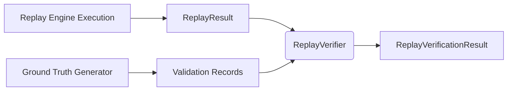

# Validation Engine

The Validation Engine exists to generate ground-truth data points and verify that any subsequent runs of the system perfectly match expectations.

## Ground Truth Generator

The `GroundTruthGenerator` acts as a passive observer. 

1. It subscribes to the `EventBus` to receive `ExecutionReport` objects.
2. Every time an execution report is emitted (Order Accepted, Rejected, Cancelled, Partially Filled, Filled), it triggers a state capture.
3. The engine generates `BookSnapshot`, `OrderSnapshot`, and `TradeSnapshot` instances, wrapping them into an `EngineSnapshot`.
4. This snapshot is bound to the event's sequence number as a `ValidationRecord`.

## Replay Verification Framework

The `ReplayVerifier` compares an untrusted `ReplayResult` against the trusted `ValidationRecord` sequence generated by the `GroundTruthGenerator`.

### Verification Checks

The verifier asserts the following invariants on the final state:

- **Order Books**: `best_bid`, `best_ask`, `bid_depth`, and `ask_depth` must exactly match the snapshots.
- **Order States**: Every order must have identical `status`, `leaves_qty`, and `cumulative_qty`. 
- **Trades**: Every trade must have the identical execution price and quantity.

Any deviation results in `is_valid = False` and an appended error description.
